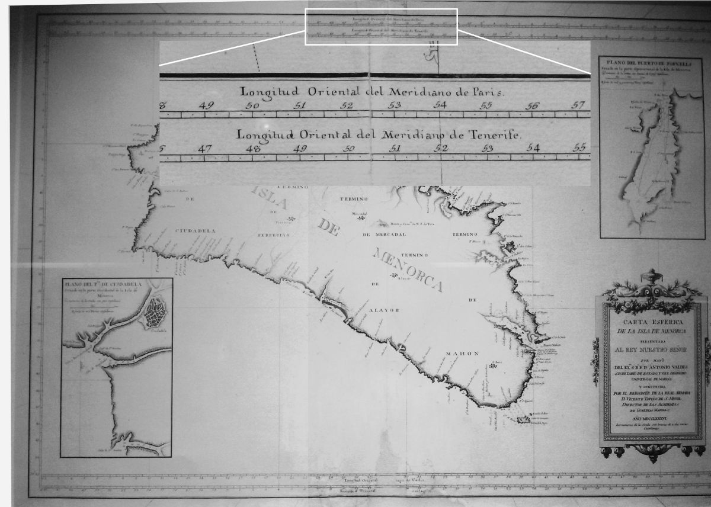

--- 
title: "GIS Einführung mit QGIS"
author: "Christoph Rinne"
email: crinne@ufg.uni-kiel.de
date: "`r format(Sys.time(), '%d. %B %Y')`"
license: "CC-BY 4.0"
header-includes: 
  \renewcommand{\contentsname}{Inhalt} 
  \renewcommand{\figurename}{Abb.}
  \renewcommand{\tablename}{Tab.}
bibliography: QGIS-cours-references.bib
csl: journal-of-archaeological-science.csl
papersize: a4
output:
  pdf_document:
    fig_caption: yes
    number_sections: yes
    toc: yes
    df_print: kable
  html_document:
    toc: yes
    toc_float: true
    df_print: paged
urlcolor: blue
link-citations: yes # make citations hyperlinks
linkcolor: blue
number_sections: yes
lang: de-DE
description: 'Gis-Kurs mit QGIS : Tutorial in Kapiteln'
---

# Vorwort {-}

Dieses Tutorial ist für Archäologen gedacht und will einen Einstieg in die einzelnen Aspekte und Bereiche der Arbeit mit und in einem geographischen Informationssystems bieten. Dabei werden immer wieder archäologische Aspekte und Fragen mit Raumbezug aufgegriffen, um damit zugleich auf die Entwicklung und Bedeutung im Fach hinzuweisen. Dies erfolgt auf der Basis von Daten für die Baleareninsel Mallorca, eine Insel mit großer kultureller Vielfalt und reichem Denkmalbestand. 

Die Kapitel sind einzelnen Aufgabenbereichen gewidmet und behandeln:  

1. Die Grundlagen und verfügbare freie Software, einschließlich des downloads und installation von QGIS.  
2. Allgemeines zu Datentypen, die Datenhaltung und Organisation von kleineren Projekten. Die ist der Einstieg in die Arbeit mit QGIS.    
3. Die erste Arbeit mit tabellierten Daten zu den Objekten führt dann auch schon in die Verwendung vorhandener Funktionen und die Arbeit mit dem Feldrechner ein.     
4. Es folgt eine erste Übung mit räumlichen Abfragen und einer ersten Quellenkritik zum Datenbestand.     
5. Ein wichtiger Aspekt ist die Verwendung von Datenbanken in QGIS, hier werden SpatiaLite und GeoPackages behandelt.     
6. Das Kapitel Raum & Distanz wiederholt Aspekte der drei vorangehenden Kapitel und führt in das Thema Umfeldanalyse ein.     
7. Raster oder Bilder sind ein ganz anderer und bisher nicht behandelter Datentyp. Die Werkzeuge zur Bearbeitung werden hier vorgestellt.     
8. Im letzten Kapitel wird das Erstellen von Karten behandelt.     

Dieses Tutorial ist keine Einführung in die Methoden und theoretischen Grundlagen räumlicher Analysen in der Archäologie. Es ist auch kein Ersatz für das umfangreiche Handbuch zu QGIS.

Die verwendete **QGIS-Version 3.22 LTR** und kann bei [https://qgis.org](https://qgis.org) heruntergeladen werden.

| Anmerkung zum Layout in diesem Text|
|----|
| - Ich verzichte weitgehend auf Bilder, vor allem der diversen Programmfenster. Das spart Platz, Text ist schneller editiert und fordert den Leser leider zum Lesen. |
| - Menüpfade oder Abfolgen von Fenstern werden mit schlichten Pfeilen dargestellt: "Datei > Speichern". |
| - Tastaturkürzel, die ich persönlich gerne Nutze, stehen in Spitzklammern je Taste: \<strg> + \<c>. |
| - Schalter auf Formularen werden in [] gesetzt: [OK] |
| - Zur Darstellung von Befehlen im Text nutze ich die in Markdown übliche Darstellung von Code oder eben Anweisungen an den Computer: ```anweisung```. |
| - Der Text enthält viele Links, die auf Papier nicht funktionieren. Sparen Sie bitte Papier und verzichten Sie auf den Ausdruck. |

# Einführung

## GIS

Ein **G**eographisches **I**nformations **S**ystem (und bitte nie "... ein GIS-System ...") soll folgende Aufgaben bewältigen: Raumdaten (z.B. Punkte und Vektoren) als auch Sachdaten verwalten, Analysen ermöglichen und Informationen visualisieren. Im Kern ist das also Datenbanksoftware, Statistiksoftware und Grafiksoftware in einem Paket. Das schafft bei der Nutzung performante Übergänge für die Informationen und erleichtert uns die Arbeit. 

Es gab und gibt aber auch deutliche Unterschiede zu den genannten IT-Bereichen. So haben GIS (pl.) im Desktop-Bereich über viele Jahre mit einzelnen Dateien (\*.shp) als Datenquelle gearbeitet und mit jedem Arbeitsschritt eine neue Datei produziert. Ein absolutes *no go* für ein Datenbanksystem. GIS [pl.] entdecken erst langsam den 2.5D oder echten 3D-Bereich, sie sind nicht wirklich mit CAD-Programmen vergleichbar. Die statistischen Optionen stehen den Möglichkeiten in R oder anderen Softwarepaketen deutlich nach. Dennoch, ein GIS ist für die meisten Aufgaben in der Archäologie ein unverzichtbares und oft einfach zu nutzendes Werkzeug. Und im Vergleich zu den Bereichen "Schreiben" und "Grafik" haben wir relativ viele gute freie Software zu Auswahl.

Diese Einführung ist kein Ersatz für das umfangreiche [Handbuch zu QGIS im Internet](https://docs.qgis.org/3.22/de/docs/user_manual/). Erläuterungen u.a. zu den diversen Werkzeug- bzw. Icon-Leisten finden Sie dort unter "[GUI](https://docs.qgis.org/3.22/de/docs/user_manual/introduction/qgis_gui.html)".    

## Software

Die folgende Liste ist nicht vollständig und der Versuch, jedes Programm mit einem knappen Satz angemessen zu beschreiben, ist zum Scheitern verurteilt. Dennoch:

- [QGIS / Quantum GIS](https://qgis.org): Ein seit Jahren weit verbreitetes GIS mit nutzerfreundlicher, leicht zugänglicher GUI und einer sehr großen *Community*.

- [Grass](https://grass.osgeo.org/): Ein seit den Anfängen von GIS etabliertes und sich entwickelndes System, in dem vermutlich alles möglich ist.

- [gvSIG](http://www.gvsig.org): Ursprünglich aus Spanien stammend (Sistema Informativo Geográphico) mit einem Derivat [gvSIG OAdigital](http://oadigital.net)  

- [SAGA](www.saga-gis.org): Dieses System ist aus den Anforderungen der Geowissenschaften entstanden und bietet vor allem in diesem Bereich sehr viele Analysemöglichkeiten.

- [ArcGIS](https://www.esri.de/produkte/arcgis) von Esri: der Marktführer im Bereich der proprietären Software. Nicht freie Programme sind auch von anderen Anbietern erhältlich.

## QGIS herunterladen und installieren

Quelle: https://qgis.org

Ich wähle den Download, nicht die Netzwerkinstallation, und hier die langfristige Version (LTR), die meist stabiler läuft. Bei der Installation folgend Sie im Zweifelsfall den Vorgaben. 

QGIS bietet eine Grundkonfiguration, dazu können viele Optionen aktiviert oder als zusätzliche Werkzeuge (Plugins) installiert werden. Wenn **Ihr Menü anders aussieht** als in meinem Beispiel, sind diese modularen Konfigurationsmöglichkeiten mit Sicherheit die Ursache. Die Einstellungen zu Optionen und Plugins werden im Nutzerprofil eingetragen und bei Updates der Software übertragen, es wird also leicht vergessen, ob etwas Standard ist oder nur schon Gewohnheit. <br>
Es wird viel installiert, u.a. auch Teile von Grass und SAGA. Der Grund ist einfach, es wird auf die jeweils gebotenen Werkzeuge zugegriffen, denn "das Rad zweimal zu erfinden" macht keinen Sinn. Dennoch ist Vieles doppelt vorhanden und mit leichten Variationen. Wenn Sie nachvollziehbar handeln wollen, notieren Sie bei Bedarf bitte Paket, Version und natürlich die verwendeten Parameter und Werte.

## QGIS Grundlegendes

Starten Sie "QGIS Desktop".


So oder so ähnlich sieht es aus. Ich persönlich sehe gerne viel Karte und wenig Werkzeug und blende entsprechend selten verwendete Fenster aus oder minimiere diese. 
Legen Sie als erstes ein neues Projekt an (z.B. \<strg> + \<n>). Es bleibt die Menüleiste, eine umfangreiche Sammlung an Werkzeugleisten, ein Layer-Fenster und der Daten-Browser auf der linken sowie die Werkzeugkiste auf der rechten Seite. Dazu unscheinbar die Fußleiste mit der sehr wichtigen Info zum Koordinatensystem (EPSG). Unmittelbar rechts daneben öffnet die Sprechblase ein Fenster mit Systemmeldungen. Die bisweilen schnell aufleuchtenden Meldungen von QGIS können hier in Ruhe nachgelesen werden.  Mindestens die Werkzeugkiste blende ich aus, gerne auch den Browser zugunsten der Sichtbarkeit der vielen Layer in meinen Projekten.

### Allgemeine Einstellungen

Unter "Einstellungen -> Optionen" werden Einstellungen für zukünftige Projekte gesetzt. Interessant sind folgende Bereiche:

- Allgemein: 
	- Hier können Sie u.a. schnell die Sprache von QGIS ändern (dazu als erstes die Option "System-Local übersteuern" aktivieren).
	- Projektdateien: Die Wilkommensseite ausstellen und direkt mit dem letzten oder einem neuen Projekt starten. **Vorgabepfade** sind *a priori* relativ, die Verweise auf darzustellende Daten werden also vom Speicherort der QGIS-Datei aus angegeben, z.B.: .\\data\\sitelist.csv.
- KBS: Das KBS (Koordinaten-Bezugs-System) für neue Projekte und neue Layer definieren. Dies kann jederzeit neu gesetzt werden, ist aber bisweilen hilfreich. Zu KBS später mehr.
- Datenquellen
	- Objektattribute und -tabellen: -> "Objekte Kopieren als:" </br>
	Sie können die Datentabelle zu einem Layer als Ganzes markieren und kopieren. Der Standard hier ist das Kopieren des Textes und der Geometrie als WKT (*well known text*). WKT ist bei Punkten noch überschaubar und bisweilen hilfreich, bei Polygonen eher unübersichtlich. Später einfach mal testen und entscheiden. Auch zu WKT gibt es später mehr. Ich selbst nutze die Tabellen zum Kopieren nur sehr selten, sondern arbeite mit der Datenbank SQLite. 

### Projekteinstellungen

Unter "Projekt -> Eigenschaften" legen Sie die Parameter des Projektes fest. Hervorzuheben ist:

- Allgemein: 	
	- Projektheimatverzeichnis: es definiert, von wo aus der relative Pfad zu Daten startet. Zudem können Sie entscheiden, ob die Pfade zu den Dateien in diesem Fall relativ oder absolut (s.o.) in der Projektdatei gespeichert werden. Auf dem Niveau des einzelnen Projektes kann "absolut", also vom Laufwerk bis zur Datei, ggf. Vorteile haben. 
	- Die präzise Distanzmessung auf dem Ellipsoid hängt von dem gewälten Ellipsoid ab. Eine Angabe zu den Abweichungen kann ich nicht bieten und rate bei mangelnden Informationen zum Vorgabewert.
	- Die Koordinatenanzeige ist üblich in der Karteneinheit. Sie können hier aber auch Grad erzwingen.
- Metadaten sind immer interessant und wichtig bei einer späteren Nachnutzung. Bei einem privaten Projekt mag das kurzfristig uninteressant erscheinen.
- **KBS / Koordiatenbezugssystem**: Ein sehr wichtiger Parameter. <br>
Das KBS muss dem Projektmaßstab und der Lage angemessen sein. WGS84 (EPSG 4326) passt weltweit, ist aber für ein kleinräumiges Projekt eher ungeeignet. Da ich mit Gradangaben bei Distanzen nicht wirklich etwas anfangen kann, wohl aber mit Metern, verwende ich meist ein  projiziertes KBS der jeweiligen Region, z.B. DHDN 3° Streifen Gauß-Krüger (GK) Zone 3 (EPSG 31467). Für ein Projekt in Norddeutschland, hier sind 2 bis 3 Zonen bei GK betroffen, wäre ein UTM sinnvoll. Der rosafarbene Rahmen zeigt die jeweilige Gültigkeit des gewählten Systems an und erleichtert die Entscheidung.<br>
Bei UTM müssen Sie noch zwischen ETRS89 und WGS84 als Ellipsoid wählen. Aktuell ist der Unterschied marginal. 

## KBS: Vom Geoid zur Karte

Ausgangspunkt für eine Karte ist ein reguläres Netz über einer Kugel, bzw. Elipsoid, als Modell unserer Erde. Der Diercke Weltatlas der Schule bietet auch eine digital Infoseite zur [Kartenprojektion](https://diercke.westermann.de/content/kartenprojektionen-978-3-14-100800-5-11-4-1), ansonsten auch Wikipedia, Stichwort [Kartennetzentwurf](https://de.wikipedia.org/wiki/Kartennetzentwurf). Die Punkte der Erde werden von einem Elipsoid als Modell der Erde nach bestimmten Regeln in eine Ebene projiziert. 

Es gibt also mindestens eine mathematisch definierte gewölbte Oberfläche (Elipsoid) als Modell zur Beschreibung der Lage auf der Erdoberfläche und bei Bedarf eine Projektionsanweisung in die Fläche zur kartografischen Darstellung.  Beide Parameter werden für jede Karte benannt und sind für jedes unserer Projekt und jeden Datensatz mit Koordinaten anzugeben. Das Thema Koordinatenbezugssystem (KBS) ist damit unabdingbar und grundlegend.  

Zwei wichtige Eigenschaften von Karten sind:

- Winkeltreu: Dies bedeutet, die Himmelsrichtungen und Winkel werden exakt wiedergegeben. Vom Nordpol 1 km nach Süden laufen, 1 km nach Osten (90°) laufen und 1 km nach Norden laufen (90°) führt (auf der Karte) nicht wieder zum Ausgangspunkt.
- Abstandstreu: Ist der Gegenentwurf, die winkel werden nicht getreu dargestellt, dafür aber die Abstände.

Die meisten unserer Karten sind eher abstandstreu wodurch es zu geneigten Längengraden kommt (z.B. [Diercke Deutschlandkarte](https://diercke.westermann.de/content/deutschland-verwaltungsgliederung-978-3-14-100850-0-24-1-1). Seekarten sind wegen der Navigation stets  winkeltreu. An den Kartenschnitten kommt es hierdurch zu Sprüngen und Sie müssen mit einem Zirkel abgegriffene Distanzen am jeweiligen Kartenrand bestimmen. Analog kommt es an den Übergängen zwischen Projektionen zu Veränderungen, die es zu bedenken gilt. Vor allem gilt eine Projektionsanweisung auch nur im definierten Bereich, außerhalb werden die Verzerrungen immer größer.

Ihr Arbeitsgebiet entscheidet also über das zu wählende KBS. Mit Grad, z.B. WGS84, sind Sie weltweit gut aufgestellt. Bei der Kartendarstellung für Schleswig-Holstein in Grad ergibt sich aber für viele Betrachter eine ungewohnte Verzerrung in der Darstellung. Die Datenerhebung und die Darstellung sind aber zweierlei und natürlich können Sie mit Gradangaben arbeiten und diese für die Darstellung in ein karthesisches System projizieren. Was bei Punkten gut und schnell möglich ist, kann bei der Arbeit mit Flächen, vor allem bei Rasterdaten aber schnell zu Problemen führen. Konstantes Umprojizieren bei einem heterogenen Datenbestand ist eher hinderlich. Insofern empfiehlt sich bei räumlich kleineren Projekten ein angemessenes, projiziertes und möglichst einheitlich angewendetes KBS. 

Wer die Wahl hat hat die Qual. <br> 
Mit Blick auf die späteren Beispieldaten folgende Info: In Spanien wurde früh auf das Elipsoid ED50 (European Datum 1950) umgestellt und die Abweichung zu dem aktuell üblichen ETRS89 sind immerhin gut 190 m, obwohl in beiden Fällen "UTM" als projizierte Darstellung gewählt wurde. Die deutsche Teilung hat ähnliche Problem mit dem Elipsoid als Modell der Erdoberfläche produziert, die bis heute nachwirken (Bessel/Rauenberg im Westen vs Krassowsky/Pulkovo im Osten). Sie merken KBS sind eine recht komplexe Angelegenheit. Mit den **EPSG-Codes** ist inzwischen wenigstens eine einheitliche Nomenklatur gegeben, die auch im Internet mit Informationen hinterlegt ist. Zu dem eigentlichen Datenbestand von [EPSG](https://epsg.org) gibt es diverse Online-Websiten, traditionell ist [SpatialReference.org](https://www.spatialreference.org) etwas neuer mit anderen Optionen ist [EPSG.io](https://epsg.io/). 


