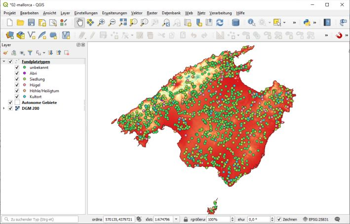

--- 
title: "GIS Einführung mit QGIS"
author: "Christoph Rinne"
email: crinne@ufg.uni-kiel.de
date: "`r format(Sys.time(), '%d. %B %Y')`"
license: "CC-BY 4.0"
header-includes: 
  \renewcommand{\contentsname}{Inhalt} 
  \renewcommand{\figurename}{Abb.}
  \renewcommand{\tablename}{Tab.}
bibliography: QGIS-cours-references.bib
csl: journal-of-archaeological-science.csl
output:
  pdf_document:
    fig_caption: yes
    number_sections: yes
    toc: yes
    df_print: kable
urlcolor: blue
link-citations: yes # make citations hyperlinks
linkcolor: blue
number_sections: yes
lang: de-DE
description: 'Gis-Kurs mit QGIS : Tutorial in Kapiteln'
---

# Daten laden und darstellen

## Daten 

Quelle: Internet. </br>
Bis auf die Fundplatzdaten stammen die Daten vom Spanischen [Instituto Geográfico Nacional](http://www.ign.es) und hier aus dem [*Centro de descargas*](http://centrodedescargas.cnig.es/CentroDescargas/#) unter "Productos" - "Información geográfica de referencia" und "Modelos Digitales de Elevaciones". Weitere Details sind über die Metadaten bei den Daten selbst zu finden. Die Verfügbarkeit von diesen Daten ist in [INSPIRE](https://inspire.ec.europa.eu/) begründet. Eine kurze Einführung zu diesem Thema finden Sie auf der Seite der deutschen Geodateninfrastuktur [GDI-DE](https://www.gdi-de.org/DE/GDI-DE/INSPIRE/inspire.html?lang=de).
Beachten Sie bitte, dass freie Zugänglichkeit (CC-BY) nicht gleichbedeutend ist mit rechtsfreiem Raum. Das Mindeste ist zitieren, Genaueres entnehmen Sie bitte den jeweiligen &copy;-Hinweisen. 

### mallorca-sites.txt

Sehen Sie sich die Daten einmal in einem Editor an (z.B. [Notepad++](https://notepad-plus-plus.org/) oder wählen Sie im Kontextmenü (rechter Mausklick) "Öffnen mit" und dann "Editor"). 

```
Quelle: www.arqueobalear.es/inventario.php (2010)
Nr;Nombre_yac;Regio;Tipo;Tipo_yacim;Periodo;Descubrido;x_utm;y_utm;Calc;Pretal;
Tal;Rom;Islam;perioden
4;Almedrà;Alaró;0;Sense estructures visibles;Romà;J. Aramburu-Zabala;
485780;4401350;0;0;0;1;0;rom,
```

Beachten Sie bitte Folgendes: Die erste Zeile enthält einen Verweis auf die Quelle, die zweite Zeile enthält Spaltennamen, die Spalten selbst sind mit einem ";" getrennt und wir dürfen erwarten, dass in "x_utm" und "y_utm" entsprechende Koordinaten des jeweiligen Fundplatzes als **Punkt** stehen. Versierte Nutzer kontrollieren eben auch noch die Zeichenkodierung: UTF-8.

Die Webseite existiert nicht mehr (die Webadresse schon!). Die Daten wurden fast ausnahmslos von J. Aramburu zusammengestellt, die Begriffe sind sowohl auf Spanisch und Katalanisch und die utm-Koordinaten haben in zahlreichen Fällen einen Fehler von bis zu 200 m überwiegend N-S wegen eines nicht dokumentierten Wechsels zwischen ED50 und ETR89. Zudem ist die Liste nicht vollständig, wichtige Fundorte, insbesondere der jüngeren Forschung, fehlen. Für unsere Übung ignorieren wir diese Probleme und nehmen die Daten wie sie sind.

### Líneas límite municipales

Quelle: http://centrodedescargas.cnig.es/CentroDescargas

Verwaltungsgrenzen als **Polygone**: Autonome Regionen, Provinzen und Munizipien (organisatorisch absteigende Reihe). Beachten Sie bitte, dass es sich um politische Grenzen handelt, Portugal und Gibralta fehlen, dafür sind aber Ceuta und Melilla mit dabei.

Format: **Shape-Datei(en)**. SHP ist ein sehr weit verbreitetes Format für Geodaten. Shapefiles bestehen aus mindestens drei, oft aber auch mehr Dateien. Ich verweise allgemein auf  [Wikipedia](https://de.wikipedia.org/wiki/Shapefile) will hier aber kurz hervorheben: \*.shp ist binär und enthält die Geometrie, \*.dbf ist ein dBase-Datei, ein sehr altes Datenbankformat und quasi ein Standard, welches mal abgesehen von Excel auch heute noch in jedem guten Datenbank- und Tabellen-System gelesen werden kann. \*.cpg steht für Codepage, in dieser datei steht die Zeichenkodierung. \*.prj steht für Projection, hier finden Sie die Projektionsanweisung. Diese ist *a priori* maschinenlesbar, aber  der Inhalt ist für uns lesbar und bedingt verständlich. Sie sollten die Teildateien immer als Ganzes betrachten. 

### Líne de costa

Quelle: http://centrodedescargas.cnig.es/CentroDescargas

**Linien** getrennt nach natürlicher Küste und überbauten Linien im Bereich der Hafenanlagen. Auch hier ohne Portugal und Gibralta. Format: shp (s.o.). 

### Modelo Digital del Terreno - MDT200

Quelle: http://centrodedescargas.cnig.es/CentroDescargas

Höhendaten der Balearen als **Rasterdatensatz**.  Jede Rasterzelle enthält für 200 m x 200 m einen gültigen Höhenwert oder einen Leerwert. Die Anzahl der Zeilen und Spalten definiert die Dimension und die Koordinaten der linken untere Ecke die Lage. Es gibt hierzu Alternativen, z.B. werden bei Surfer-Dateien, die Koordinaten der gegenüberliegenden Ecken und die Anzahl von Spalten und Zeilen definiert, woraus sich die Auflösung je Zelle ergibt. Nach dem sogenannten *header* folgen dann die Daten, die als Matrix oder auch als einfache Liste geschrieben sein können aber stets in der linken oberen Ecke des Rasters beginnen (wie wir lesen). Neben diesem Datenformat ist GeoTIF weit verbreitet.

```
NCOLS 1544
NROWS 985
XLLCENTER 318200
YLLCENTER 4265400
CELLSIZE 200
NODATA_VALUE -999
-999 -999 -999 -999 -999 -999 -999 -999 -999 -999 -999 -999 -999
```

Da die Endung \*.asc lautet (steht für ASCII, ist in Wirklichkeit aber UTF-8 und in diesem Fall ohne Bedeutung), könnten Sie sich die Daten ansehen, es lohnt sich aber nur für die ersten 6 Zeilen (s.o.). Beachten Sie bitte den Dateinamen, der wichtige Informationen vermittelt: "ETRS89" verweist auf das Geoid und "HU31" auf die UTM-Kachel 31 Nord. Anders als bei einem GeoTIFF sind diese Angaben in der Rasterdatei nicht hinterlegt, dies könnte aber als Kommentar geschehen.

## Planen Sie ihr Projekt

Legen Sie für Ihr Projekt einen Ordner an. Verwalten Sie innerhalb dieses Ordners die projektbezogenen Daten. Ich selbst trenne oft nach Dateiformaten (shp, raster, analoge_Karten, text, datenbank), daneben gelegentlich aber auch nach Anbieter. Zudem arbeite ich bisweilen mit digitalen Verweisen ([mklink](https://docs.microsoft.com/de-de/windows-server/administration/windows-commands/mklink)) auf andere Ordner.  

Egal wofür Sie sich entscheiden, seien Sie möglichst stringent auch bei den Dateinamen. Projekte können schnell unübersichtlich werden.

## Starten Sie QGIS

Starten Sie QGIS und legen Sie ein neues Projekt an (\<strg> + \<n>). 

Definieren Sie als erstes das **Koordinatenbezugssystem** (KBS) für Ihr Projekt. Der schnellste Weg ist ein Klick auf die Weltkugel oder "EPSG" rechts in der Fußzeile des QGIS-Fensters. Filtern Sie bitte nach "25831" und wählen Sie dieses aus. Die Definition und der Gültigkeitsraum dieses KBS wird Ihnen zur Kontrolle angezeigt. 

### Daten einfügen
 
Mit \<strg> + \<l> starten Sie die **Datenquellenverwaltung** ( "Layer -> Datenquellenverwaltung").

Die Fundpunkte (mallorca-sites.txt) können mit "**Getrennte Texte**" eingelesen werden. <br>
In dem neuen Fenster bitte Folgendes eintragen: 

  1. Dateiname: rechts mit den [...] die Datei *mallorca-sites.txt* wählen. 
  2. Layername: Fundplätze, 
  3. Kodierung: "UTF-8", 
  4. Dateiformat - Benutzerdefiniert, 
  5. Semikolon (als Trennzeichen), 
  6. Anzahl der zu überspringenden Kopfzeilen: 1,
  7. Erster Datensatz enthält Feldnamen, 
  8. Feldtypen bestimmen, 
  9. Dezimalseparator ist Komma, 
  10. Geometriedefinition - Punkkoordinaten, 10. für x- und y-Feld bitte x_utm und y_utm auswählen, 
  11. Geometrie-KBS: Projekt-KBS: EPSG 25831, 
  12. Beispieldaten visuell kontrollieren und abschließend [Hinzufügen].

Mit "**Vektor**" können Polygone und Linien geladen werden.<br>
Wählen Sie als Quelle bitte: *recintos_autonomicas_inspire_peninbal_etrs89.shp* und bestätigen Sie mit [Hinzufügen].

Mit **Raster** laden wir als nächstes noch das Höhenraster
*PNOA_MDT200_ETRS89_HU31_Baleares.asc*. [Hinzufügen] und [Schließen].

Im **Layer-Fenster** am linken Rand können Sie schnell auf die jeweiligen Daten zugreifen und mit diesen arbeiten. 

Speichern Sie das Projekt auf der obersten Ebene in ihrem Projektordner (z.B. als mallorca.qgz).

### Layer darstellen und organisieren

Die Arbeit mit den Layern (Daten) erfolgt am schnellsten im Layer-Fenster.

Layer werden immer in der Reihenfolge im Layer-Fenster dargestellt. Fassen Sie mit der Maus einen einzelnen Layer und verschieben diesen. Üblich ist eine Reihenfolge von Punkt - Linie - Polygon - Raster. Verschieben Sie die aktuellen Layer in diese Reihenfolge.

Das Kontextmenü zu jedem Layer (rechter Mausklick) bietet diverse Optionen.

1. Kontextmenü Fundplätze (Punkte) -> Auf den Layer zoomen.
2. Kontextmenü recintos_ ... (Polygon) -> Layer umbenennen: "Autonome Gebiete".
3. Ebenso bitte PNOA_... umbenennen auf "DGM 200" (MDT steht für *modelo digital terreno*).

Neben dem Raster "DGM 200" sollten Sie ein "?" sehen. "*Mouse over*" öffnet den Hinweis auf ein fehlendes KBS. Klicken Sie auf das "?" und wählen Sie auch für diesen Layer EPSG 25831: ETRS89 und UTM31N (das geht auch über die Layereigenschaften). 

Mit einem Doppelklick auf "Autonome Gebiete" öffnen Sie  die Layereigenschaften und wechseln Sie zu **Symbolisierung**, um die Darstellung zu ändern. Das *drop down* am oberen Fensterrand belassen Sie auf "Einzelsymbol". Im Fenster darunter sehen Sie die **Füllung** als hierarchische Abfolge weiterer Elemente, z.Z. nur eine "Einfache Füllung". Markieren Sie "Einfache Füllung" und ändern Sie für dieses Element "Füllstil" auf "keine Füllung" und  setzen Sie die "Strichfarbe" auf "Schwarz" (Die Farbauswahl ist vielgestaltig, lassen Sie sich etwas Zeit). Klicken Sie erst auf [Anwenden] und wenn Sie den Eindruck haben, die Umsetzung ist OK auf [Schließen].

Nun ändern Sie die **Symbolisierung für den Raster-Layer** "DGM 200" und testen Sie die diversen Optionen. Klicken Sie nach jeder oder einigen Änderungen stets auf [Anwenden], um das Ergebnis zu sehen. 

Variante 1: Darstellungsart: **Einkanalgraustufen**, Grauer Kanal: Kanal 1 (ist aber egal, da kein Farbbild vorliegt, z.B. **R**ot**G**rün**B**lau), Farbverlauf: Weiß nach Schwarz, Min: -0.1, Max: 800, Kontrastverbesserung: Strecken auf MinMax. [Anwenden]. Beachten Sie die Serra de Tramuntana im Nordwesten, wenn Sie die Einstellung auf "Strecken und Zuschneiden" wechseln. Anmerkung: Sie haben 256 Grauwerte von Weiß bis Schwarz, aktuell werden diese zwischen -0.1 und 800 stetig verteilt, alles darüber wird Schwarz, alles darunter Weiß und eben nicht abgeschnitten. Klappen Sie das folgende Menü Min/Max-Werteeinstellungen für weitere Optionen auf, u.a. für ein Zurücksetzen auf Min/Max der Daten.

Variante 2: Darstellungsart: **Einkanalpseudofarben**. Diese Einstellung hat sehr viele Optionen, diese lasse ich hier beiseite. Zwei wichtige Hinweise: 

- Die Klassengrenzen werden präzise bestimmt und ensprechend auch in der Legende angezeigt: drei oder mehr Stellen nach dem Komma sind vielfach übertrieben und suggerieren bei den hier vorliegenden Werten eine falsche Präzision. Sie sollten  die Werte als auch Beschriftung mit einem Doppelklick markieren und runden. 
- Ergänzen Sie hier bei Beschriftungssuffix ein "m" oder besser direkt beim Layernamen "m über NN". Einheiten und Bezug sind wichtig. (Anmerkung: Es gibt auch Unterschiede bei der Meereshöhe, in Deutschland gelten der Amsterdammer, der Danziger oder Hamburger Pegel, in Spanien der von Alicante. Weitere Infos bei [Wikipedia](https://de.wikipedia.org/wiki/H%C3%B6he_%C3%BCber_dem_Meeresspiegel)).

Das Mittelmeer ist rot, das geht nun gar nicht. Natürlich könnten wir die Skala unten beschneiden, das aber auch die Legende beeinflussen würde. Wechseln Sie zu **Transparenz**. Im *header* der Datei stand ```NODATA_VALUE -999```, entsprechend sehen wir hier -999. Das ist offensichtlich aber nicht sehr genau eingetragen und wir behelfen uns wie folgt: Das Icon "grünes Plus" am rechten Rand ergänzt einen weiteren Transparenzbereich, bei dem wir "Von" "-999" "Nach" "0" eintragen. [Anwenden],  [OK]. Wenn Sie das Ergebnis kontrollieren erkennen Sie zwei Dinge: 1. Im Nordwesten, im feuchten Niederungsgebiet des Raiguer, sind einzelne Zellen nun leer und 2. wird die Küste mit Rasterzellen von 200 m x 200 m nur ungenau nachgezeichnet. Ein Trick für Letzteres: Sie ergänzen bei den autonomen Gebieten eine weitere Füllung, schieben diese nach unten, ändern diese auf einfache Linie, setzen Sie weiß, Strichbreite auf 10 mm und Versatz auf -5. Ist nicht wirklich schön. Wenn's wirklich schön werden soll, hilft nur eins, ein Polygon für das Mittelmeer erzeugen und als Maske oben drauf legen.

Die Optionen der Symbolisierung des Layers Fundplätze (Punkte) ist weitgehend identisch mit Linien- und Polygon-Layern. Wählen Sie im *drop down* am oberen Fensterrand statt "Einzelsymbol" "Kategorisert", Wert: Tipo, klicken Sie auf [Klassifizieren], beschriften Sie wie folgt: 0 - unbekannt, 100 - Abri, 200 - Siedlung, 300 - Hügel, 400 - Höhle/Heiligtum, 410 - Kultort und löschen Sie das letzte Symbol, indem Sie es markieren und unten auf das Icon "rote Minus" klicken. [OK] zum Schließen des Fensters.   
Nennen Sie nun diesen Layer "Fundplatztypen".   

Textbasierte Quellen wie in diesem Fall können in QGIS nicht editiert werden, für die nachfolgende Arbeit exportieren wir diese Daten deshalb in eine Shape-Datei. Dafür wählen Sie im Kontextmenü des Layers "Fundplatztypen" Exportieren -> Objekt speichern als. Ich lege dafür in meinem Projektordner einen neuen Ordner "shp" an und speichere Sie dort im shp-Format mit den Namen "mallorca-sites", KBS: 25831, Kodierung: UTF-8, Geometrie: automatisch und [x] Gespeicherte Daten zur Karte hinzufügen, [OK].

Dem neuen Layer weise ich den bereits erstellten Stil zu. Hierzu Kontextmenü Layer "Fundplatztypen" Stile -> Stil kopieren -> Alle Stilkategorien, Kontextmenü des neuen Layers Stile -> Stil einfügen -> Alle Stilkategorien. Fertig. Löschen Sie den alten Layer "Fundplatztypen" und benennen Sie den neuen Layer genau so.

Die Karte ist nun wunderbar bunt und sowohl visuell als auch didaktisch und methodisch noch eine Katastrophe. 


