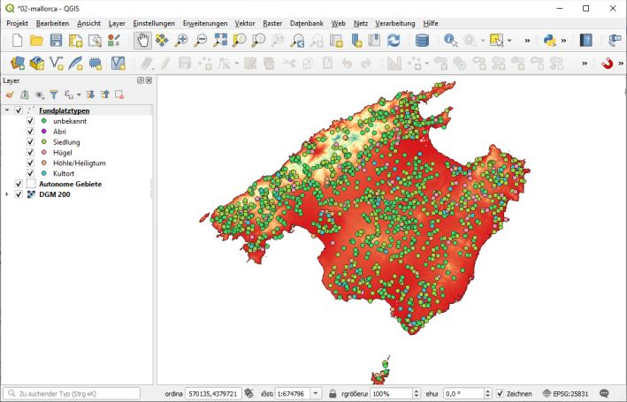

--- 
title: "GIS Einführung mit QGIS"
author: "Christoph Rinne"
email: crinne@ufg.uni-kiel.de
date: "`r format(Sys.time(), '%d. %B %Y')`"
license: "CC-BY 4.0"
header-includes: 
  \renewcommand{\contentsname}{Inhalt} 
  \renewcommand{\figurename}{Abb.}
  \renewcommand{\tablename}{Tab.}
bibliography: QGIS-cours-references.bib
csl: "../styles/journal-of-archaeological-science.csl"
papersize: a4
output:
  html_document:
    toc: yes
    toc_float: true
    number_sections: yes
    df_print: paged
    css: "../styles/tutorials.css"
    theme: readable
  pdf_document:
    fig_caption: yes
    number_sections: yes
    toc: yes
    df_print: kable
urlcolor: blue
link-citations: yes 
linkcolor: blue
number_sections: yes
lang: de-DE
description: "Gis-Kurs mit QGIS : Tutorial in Kapiteln"
---

# Daten laden und darstellen

## Daten

| Anmerkung |
|:----|
| Dateiendungen informieren über das Dateiformat und die nutzbare Software. Buchstaben (Schrift) sind eine großartige Errungenschaft der Menschheit und hier besser als kleine Bilder (Icon). **Schalten Sie die Dateiendungen sichtbar**. |

### Datenquelle Internet

Die Übung beruht auf Daten aus dem Internet und bis auf die Fundplatzdaten stammen die Daten vom Spanischen [Instituto Geográfico Nacional](http://www.ign.es) und hier aus dem [*Centro de descargas*](http://centrodedescargas.cnig.es/CentroDescargas/#) unter "Productos" - "Información geográfica de referencia" und "Modelos Digitales de Elevaciones". Weitere Details sind über die Metadaten bei den Daten selbst zu finden. Die Verfügbarkeit von diesen Daten ist in [INSPIRE](https://inspire.ec.europa.eu/) begründet. Eine kurze Einführung zu diesem Thema finden Sie auf der Seite der deutschen Geodateninfrastuktur [GDI-DE](https://www.gdi-de.org/DE/GDI-DE/INSPIRE/inspire.html?lang=de).
Beachten Sie bitte, dass freie Zugänglichkeit (CC-BY) nicht gleichbedeutend ist mit rechtsfreiem Raum. Das Mindeste ist zitieren, Genaueres entnehmen Sie bitte den jeweiligen &copy;-Hinweisen. 

Zwei unterschiedliche Nutzungsformen für Daten aus dem Internet stehen zur Verfügung:

| Nutzung | Vorteil | Nachteil |
|:---------|:----|:----| 
| *Download* der Daten mit anschließender lokaler Verwendung | stets verfügbar, erweitert nutzbar | statisch, veralten |
| Webdienst (*wms*, *wcs*, *wfs*), die Daten werden bei Bedarf dynamisch von einem Server abgerufen | stets aktuell | Serveradressen und Angebote können sich ändern oder entfallen | 

In QGIS können Webdiensten unterschiedlich eingebunden und genutzt werden: Sie haben eine Serveradresse von einem Anbieter aus dem Internet und tragen diese z.B. bei den "WMS/WMTS" in der Datenquellenverwaltung ein. Sie nutzen ein entsprechendes Plugin, z.B. [QuickMapServices](https://nextgis.com/blog/quickmapservices/),  um dynamisch auf öffentliche Daten zuzugreifen (hier auf die Karten von *O*pen *S*treet *M*ap). Oder Sie nutzen ein Plugin wie [QuickOSM](https://docs.3liz.org/QuickOSM/), um die Daten zu recherchieren und herunterzuladen. 

Im Kapitel der Rasterverarbeitung werden wir Orthofotos als *wms* einbinden, einen Ausschnitt herunterladen und auswerten. Beim *Servei Informació Territorial Illes Balears* finden Sie einen [Umfangreichen Katalog zu Diensten](http://ideib.caib.es/cataleg/srv/cat/catalog.search#/home), u.a. eine [Basiskarte für die Balearen](http://ideib.caib.es/cataleg/srv/spa/catalog.search#/metadata/AABE16F1-D7CC-40C3-8A74-D910CD8DE03F). Die dort genannte WMS-Adresse: "https://ideib.caib.es/geoserveis/services/public/GOIB_MapaBase_IB/MapServer/WMSServer?request=GetCapabilities&service=WMS" tragen  Sie in der Datenquellenverwaltung (\<strg> + \<l>)  -> WMS/WMTS, [Neu] unter URL ein und geben Sie dem neuen Eintrag einen sinnvollen Namen, z.B. SP-Balearen Basiskarte.

### mallorca-sites.txt

Sehen Sie sich die Daten einmal in einem Editor an (z.B. mit [Notepad++](https://notepad-plus-plus.org/) oder wählen Sie im Kontextmenü von Windows (rechter Mausklick) "Öffnen mit" und dann "Editor"). 

```
Quelle: www.arqueobalear.es/inventario.php (2010)
Nr;Nombre_yac;Regio;Tipo;Tipo_yacim;Periodo;Descubrido;x_utm;y_utm;Calc;Pretal;
Tal;Rom;Islam;perioden
4;Almedrà;Alaró;0;Sense estructures visibles;Romà;J. Aramburu-Zabala;
485780;4401350;0;0;0;1;0;rom,
```

Beachten Sie bitte Folgendes: Die erste Zeile enthält einen Verweis auf die Quelle, die zweite Zeile enthält Spaltennamen, die Spalten selbst sind mit einem ";" getrennt und wir dürfen erwarten, dass in "x_utm" und "y_utm" entsprechende Koordinaten des jeweiligen Fundplatzes als **Punkt** stehen. Versierte Nutzer kontrollieren eben auch noch die Zeichenkodierung: UTF-8.

Die Webseite existiert nicht mehr (die Webadresse schon!). Die Daten wurden fast ausnahmslos von J. Aramburu zusammengestellt, die Begriffe sind sowohl auf Spanisch und Katalanisch und die utm-Koordinaten haben in zahlreichen Fällen einen Fehler von bis zu 200 m überwiegend N-S wegen eines nicht dokumentierten Wechsels zwischen ED50 und ETR89. Zudem ist die Liste nicht vollständig, wichtige Fundorte, insbesondere der jüngeren Forschung, fehlen. Für unsere Übung ignorieren wir diese Probleme und nehmen die Daten wie sie sind. Wir arbeiten später ausschließlich mit den Talaiots

### municipio-comarca.txt
Die einzelnen Munizipien (Gemeinden) werden größeren Regionen zugewiesen, die weitgehend naturräumlichen Einheiten entsprechen. 

### pop-balears.txt - pop_balears.csv
Die Quelle ist das [Instituto Nacional de Estadística](https://www.ine.es), die Dateien listen die Einwohnerzahlen für die Baleareninseln nach Gemeinden und Zensus. Für die Übung wurden die originalen Daten der Felder "Población de Hecho" (faktisch) und "Población de Derecho" (rechtlich) gemittelt. Die Dateien (.txt, .csv) unterscheiden sich minimal im Namen und den Spaltenbezeichnungen aber mit erheblichen Konsequenzen in der Anwendung.

### Límites municipales, provinciales y autonómicos

Quelle: http://centrodedescargas.cnig.es/CentroDescargas

Hier unter: Información geográfica de referencia. Verwaltungsgrenzen als **Polygone**: Autonome Regionen, Provinzen und Munizipien (organisatorisch absteigende Reihe). Beachten Sie bitte, dass es sich um politische Grenzen handelt, Portugal und Gibralta fehlen, dafür sind aber Ceuta und Melilla mit dabei.

Format: **Shape-Datei(en)**. SHP ist ein sehr weit verbreitetes Format für Geodaten. Shapefiles bestehen aus mindestens drei, oft aber auch mehr Dateien. Ich verweise allgemein auf  [Wikipedia](https://de.wikipedia.org/wiki/Shapefile) will hier aber kurz hervorheben: \*.shp ist binär und enthält die Geometrie, \*.dbf ist eine dBase-Datei, ein sehr altes Datenbankformat und quasi ein Standard, welches mal abgesehen von Excel auch heute noch in jedem guten Datenbank- und Tabellen-System gelesen werden kann, z.B. Calc von [Libre Office](https://de.libreoffice.org/). \*.cpg steht für *codepage*, in dieser Datei steht die Zeichenkodierung, z.B. UTF-8. \*.prj steht für *projection*, hier finden Sie die Projektionsanweisung. Diese ist *a priori* maschinenlesbar, aber  der Inhalt ist für uns lesbar und bedingt verständlich. Sie sollten die Teildateien immer als Ganzes betrachten. 

### Línea de costa

Quelle: http://centrodedescargas.cnig.es/CentroDescargas

Hier unter: Información geográfica de referencia. **Linien** getrennt nach natürlicher Küste und überbauten Linien im Bereich der Hafenanlagen. Auch hier ohne Portugal und Gibralta. Format: shp (s.o.). 

### Modelo Digital del Terreno - MDT200

Quelle: http://centrodedescargas.cnig.es/CentroDescargas

Hier: Modelos Digitales de Elevaciones > MDT200 > Suche "Todos" > "Balears, Illes". Wählen Sie die kleinere Datei (PNOA_MDT200_ETRS89_HU31_Baleares). Inzwischen wird ein GeoTIFF angeboten. Früher war es eine Textdatei mit normierter Struktur (s.u.). Der sogenannte *header* liefert die  Anzahl der Zeilen und Spalten sowie die Zellgröße und die Lage der linken unteren Ecke. Es folgen die Zellwerte, meist als Matrix, was wegen der Angabe zur Anzahl der Zeilen und Spalten im *header* aber nicht notwendig ist. Die Daten beginnen stets oben links im Raster (wie wir lesen). Es gibt hierzu Alternativen, z.B. werden bei [Surfer-Dateien](https://www.goldensoftware.com/products/surfer), die Koordinaten der gegenüberliegenden Ecken und die Anzahl von Spalten und Zeilen definiert, woraus sich die nicht zwingend quadratische Auflösung je Zelle ergibt. QGIS kann diese Formate direkt lesen. Weitere Infos zu Rasterdaten, speziel GeoTIFF finden Sie bei [gaia-gis.it](https://www.gaia-gis.it/fossil/librasterlite2/wiki?name=useful_tools).

```
NCOLS 1544
NROWS 985
XLLCENTER 318200
YLLCENTER 4265400
CELLSIZE 200
NODATA_VALUE -999
-999 -999 -999 -999 -999 -999 -999 -999 -999 -999 -999 -999 -999
```

**GeoTIFF** (\*.tif) unterscheiden sich von "normalen" Rasterbilddateien durch 1. den Wertebreich der Zellen (keine Farbwerteskala, z.B. 0 bis 255) und 2. die Informationen zum Raumbezug (Lage, EPSG, Auflösung) im *header* der Datei. TIF-Dateien können verlustfrei komprimiert werden und GeoTIFF sind heute quasi ein Standard für Rasterdaten. Editieren Sie GeoTIFF nicht mit einem Grafikprogramm.

## Planen Sie ihr Projekt

Legen Sie für Ihr Projekt einen Ordner an. Verwalten Sie innerhalb dieses Ordners die projektbezogenen Daten. Ich selbst trenne oft nach Dateiformaten (shp, raster, analoge_karten, text, datenbank), daneben gelegentlich aber auch nach Anbieter, um Urheberrechte einfacher zu erkennen. Zudem arbeite ich bisweilen mit digitalen Verweisen ([mklink](https://docs.microsoft.com/de-de/windows-server/administration/windows-commands/mklink)) auf andere Ordner.  

Egal wofür Sie sich entscheiden, seien Sie möglichst stringent auch bei den Dateinamen. Projekte können schnell unübersichtlich werden.

## Starten Sie QGIS

Starten Sie QGIS und legen Sie ein neues Projekt an (\<strg> + \<n>). 

Definieren Sie als erstes das **Koordinatenbezugssystem** (KBS) für Ihr Projekt. Der schnellste Weg ist ein Klick auf die Weltkugel oder "EPSG" rechts in der Statuszeile des QGIS-Fensters. Filtern Sie bitte nach "25831" (ETRS89 / UTM zone 31N) und wählen Sie dieses aus. Die Definition und der Gültigkeitsraum dieses KBS wird Ihnen zur Kontrolle angezeigt. 

### Daten einfügen
 
Mit \<strg> + \<l> starten Sie die **Datenquellenverwaltung** ( "Layer -> Datenquellenverwaltung").

Die Fundpunkte (mallorca-sites.txt) können mit "**Getrennte Texte**" eingelesen werden. In dem neuen Fenster bitte Folgendes eintragen: 

  1. Dateiname: rechts mit den [...] die Datei *mallorca-sites.txt* wählen. 
  2. Layername: Fundplätze, 
  3. Kodierung: "UTF-8", 
  4. Dateiformat - Benutzerdefiniert, 
  5. Semikolon (als Trennzeichen), 
  6. Anzahl der zu überspringenden Kopfzeilen: 1,
  7. Erster Datensatz enthält Feldnamen, 
  8. Feldtypen bestimmen, 
  9. Dezimalseparator ist Komma, 
  10. Geometriedefinition - Punkkoordinaten, für x- und y-Feld bitte x_utm und y_utm auswählen, 
  11. Geometrie-KBS: Projekt-KBS: EPSG 25831, 
  12. Beispieldaten visuell kontrollieren und abschließend [Hinzufügen] und [Schließen].

Mit "**Vektor**" können Polygone und Linien geladen werden.<br>
Wählen Sie als Quelle bitte: *recintos_autonomicas_inspire_peninbal_etrs89.shp* und bestätigen Sie mit [Hinzufügen]. Ergänzen Sie auch die anderen Verwaltungsgrenzen.

Mit **Raster** laden wir als nächstes noch das Höhenraster
*PNOA_MDT200_ETRS89_HU31_Baleares.tif*. [Hinzufügen] und [Schließen].

Im **Layer-Fenster** am linken Rand können Sie schnell auf die jeweiligen Daten zugreifen und mit diesen arbeiten. 

Speichern Sie das Projekt auf der obersten Ebene in ihrem Projektordner (z.B. als mallorca.qgz).

### Layer darstellen und organisieren

Die Arbeit mit den Layern (Daten) erfolgt am schnellsten im Layer-Fenster.

Layer werden immer in der Reihenfolge des Layer-Fensters dargestellt. Fassen Sie mit der Maus einen einzelnen Layer und verschieben Sie diesen. Üblich ist eine Reihenfolge von Punkt - Linie - Polygon - Raster. Verschieben Sie die aktuellen Layer in diese Reihenfolge.

Das Kontextmenü zu jedem Layer (rechter Mausklick) bietet diverse Optionen.

1. Kontextmenü Fundplätze (Punkte) -> Auf den Layer zoomen.
2. Kontextmenü recintos_ ... (Polygon) -> Layer umbenennen: "Autonome Gebiete". Entsprechendes bitte auch für die anderen Verwaltungsgrenzen.
3. Ebenso bitte PNOA_... umbenennen auf "DGM 200" (MDT steht für *modelo digital terreno*).

Neben dem textbasierten Raster "DGM 200" war früher ein "?" zu sehen. Mit "*Mouse over*" öffnete sich der Hinweis auf ein fehlendes KBS. Mit dem Klicken auf das "?" öffnet sich ein Fenster für die weitere Problemlösung, hier ehemals die Auswahl des KBS. 

Mit einem Doppelklick auf "Autonome Gebiete" öffnen Sie  die Layereigenschaften und wechseln Sie zu **Symbolisierung**, um die Darstellung zu ändern. Das *dropdown* am oberen Fensterrand belassen Sie auf "Einzelsymbol". Im Fenster darunter sehen Sie die **Füllung** als hierarchische Abfolge weiterer Elemente, z.Z. nur eine "Einfache Füllung". Markieren Sie "Einfache Füllung" und ändern Sie für dieses Element "Füllstil" auf "keine Füllung" und  setzen Sie die "Strichfarbe" auf "Schwarz" (Die Farbauswahl ist vielgestaltig, lassen Sie sich etwas Zeit). Klicken Sie erst auf [Anwenden] und wenn Sie den Eindruck haben, die Umsetzung ist OK auf [Schließen]. Im Kontextmenü des Layers können Sie mit "Stile -> Stile kopieren -> Alle Stilkategorien" den Stil des ersten geänderten Polygon-Layers auf die andere Verwaltungsgrenzen übertragen indem Sie nachfolgend jeweils "Stiele -> Stile einfügen -> ..." wählen.

Nun ändern Sie die **Symbolisierung für den Raster-Layer** "DGM 200" und testen Sie die diversen Optionen. Klicken Sie nach jeder oder einigen Änderungen stets auf [Anwenden], um das Ergebnis zu sehen. 

Variante 1: Darstellungsart: **Einkanalgraustufen**, Grauer Kanal: Kanal 1 (ist aber egal, da kein Farbbild vorliegt, z.B. **R**ot**G**rün**B**lau), Farbverlauf: Weiß nach Schwarz, Min: -0.1, Max: 800, Kontrastverbesserung: Strecken auf MinMax. [Anwenden]. Beachten Sie die Serra de Tramuntana im Nordwesten, wenn Sie die Einstellung auf "Strecken und Zuschneiden" wechseln. Anmerkung: Sie haben 256 Grauwerte von Weiß bis Schwarz, aktuell werden diese zwischen -0.1 und 800 stetig verteilt, alles darüber wird Schwarz, alles darunter Weiß und eben nicht abgeschnitten.

Klappen Sie mal das folgende Menü Min/Max-Werteeinstellungen für weitere Optionen auf, u.a. für ein Zurücksetzen auf Min/Max der Daten. 

Es folgt die Layerdarstellung. Wenn das DGM 200 über der eingangs geladenen WMS-Grundkarte (mapa base) liegt können Sie hier den Mischmodus verändern: Wechseln Sie z.B. von "Normal" auf "Multiplizieren". Diese eher visuelle Kombination von Ebenen kann auf unterschiedliche Weise genutzt werden, z.B. bei der verschmelzung von "Hot-Spot-Analysen" oder auch "Raster -> Analyse -> Perspektive" um die hier suggerierte Verschattung in einer Karte darzustellen.  

Variante 2: Darstellungsart: **Einkanalpseudofarben**. Diese Einstellung hat sehr viele Optionen, diese lasse ich hier beiseite. Zwei wichtige Hinweise: 1. Die Klassengrenzen werden je nach Ihrer Vorgabe präzise berechnet und ensprechend auch in der Legende angezeigt. Drei oder mehr Stellen nach dem Komma suggerieren aber bei den vorliegenden Werten eine falsche Präzision. Sie sollten im Feld Beschriftungsgenauigkeit eine "0" eintragen. 2. Ergänzen Sie hier bei Beschriftungssuffix ein "m" oder beim Layernamen "m über NN". 

Bei Variante 2 is das Mittelmeer rot, das geht nun gar nicht. Natürlich könnten wir die Skala unten beschneiden, was aber auch die Legende beeinflussen würde. Wechseln Sie zum Bereich **Transparenz**. Im *header* der Textdatei stand ```NODATA_VALUE -999```, bei der TIFF-Datei steht hier -32767. Das ist offensichtlich aber nicht sehr genau eingetragen und wir behelfen uns wie folgt: Das Icon "grünes Plus" am rechten Rand ergänzt einen weiteren Transparenzbereich, bei dem wir "Von" "-32767" "Nach" "0" eintragen, [Anwenden] und  [OK]. Wenn Sie das Ergebnis kontrollieren erkennen Sie zwei Dinge: 1. Im Nordwesten, im feuchten Niederungsgebiet des Raiguer, sind einzelne Zellen nun leer und 2. wird die Küste mit Rasterzellen von 200 m x 200 m nur ungenau nachgezeichnet. Ein Trick für Letzteres: Sie ergänzen bei den autonomen Gebieten mit dem grünen "+" eine weitere Füllung, schieben diese nach unten, ändern diese auf einfache "Rand:Linie", setzen Sie weiß, Strichbreite auf 10 mm und Versatz auf -5. Wenn's wirklich schön werden soll müssen Sie ein Polygon für das Mittelmeer erzeugen und als Schnittmaske oben drauf legen. Variante 1 hat offensichtlich deutlicher Vorteile, sie ist insgesamt ruhiger und 

Die Symbologie für Punktlayer ist weitgehend identisch mit Linien- und Polygon-Layern. Wählen Sie für die Fundpunkte im *dropdown* am oberen Fensterrand statt "Einzelsymbol" "Kategorisert", Wert: Tipo, klicken Sie auf [Klassifizieren], beschriften Sie in der Spalte Legende wie folgt: 0 - unbekannt, 100 - Abri, 200 - Siedlung, 300 - Hügel, 400 - Höhle/Heiligtum, 410 - Kultort und löschen Sie das letzte Symbol mit dem "roten Minus", [OK]. Nennen Sie nun diesen Layer "Fundplatztypen". 

Die Reihenfolge der Symologie entspricht der Darstellung in der Karte, "0 - unbekannt" liegt immer oben drauf und verdeckt ggf. deutlich wichtigere Punkte. Sie können hier jeden Eintrag markieren und dann in der Reihenfolge verschieben. Schieben Sie "0 - unbekannt" nach ganz unten. 

Textbasierte Quellen wie in diesem Fall können in QGIS nicht editiert werden, für die nachfolgende Arbeit exportieren wir diese Daten deshalb in eine Shape-Datei. Dafür wählen Sie im Kontextmenü des Layers "Fundplatztypen" Exportieren -> Objekt speichern als. Ich lege dafür in meinem Projektordner einen neuen Ordner "shp" an und speichere Sie dort im shp-Format mit den Namen "mallorca-sites", KBS: 25831, Kodierung: UTF-8, Geometrie: automatisch und [x] Gespeicherte Daten zur Karte hinzufügen, [OK].

Dem neuen Layer weise ich den bereits erstellten Stil zu. Hierzu Kontextmenü Layer "Fundplatztypen" Stile -> Stil kopieren -> Alle Stilkategorien, Kontextmenü des neuen Layers Stile -> Stil einfügen -> Alle Stilkategorien. Fertig. Löschen Sie den alten Layer "Fundplatztypen" und benennen Sie den neuen Layer genau so. 

Die Karte ist nun wunderbar bunt und sowohl visuell als auch didaktisch und methodisch noch eine Katastrophe. Anmerkung: Der Consell de Mallorca (Rat) unterhält einen eigenen Webdienst u.a. mit Archäologischen Fundplätzen (*Jacimientos arqueológicos*). [Visor Patrimonio Histórico](http://www.conselldemallorca.info/sit/phistoric/index_es.html). 



### Darstellung Inselkarte

Eine **Inselkarte**  ist natürlich keine Karte von einer Insel, vielmehr geht es um die Darstellung des Gültigkeitbereiches. Bei den verwendeten Verwaltungsgrenzen des [Instituto Geográfico Nacional](http://www.ign.es) handelt es sich um Inselkarten, die z.B. das Gebiet von Portugal ausklammern. Sie kenne dies auch von Wetterkarten, das Gebiet außerhalb der Vorhersage wird  ausgegraut oder abgedunkelt dargestellt. 

Auch in der Archäologie müssen wir bei Kartierungen von Befunden oder Funden den Gültigkeitraum (Erhebungsraum) abgrenzen und dies visuell deutlich machen, nur so ist die Darstellung korrekt. Dies ist in GIS z.B. durch einen weiteren Layer einer Polygonkarte möglich, in der die nicht erhobenen Flächen grau, die erhobenene Flächen aber Transparent dargestellt werden. Damit sind nur die Inhalte im erfassten Bereich sichtbar und der Arbeitsraum unverkennbar visualisiert.

Beim Thema Kartendarstellung gibt es viel zu beachten, u.a. ob jeder Punkt sichtbar, ob dies im dargestellten Maßstab von Belang ist oder ob einzelne Punkte durch andere Verdeckt sind.