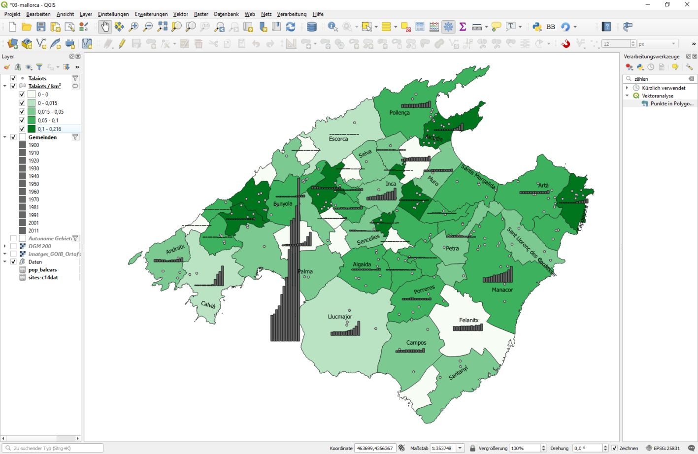

--- 
title: "GIS Einführung mit QGIS"
author: "Christoph Rinne"
email: crinne@ufg.uni-kiel.de
date: "`r format(Sys.time(), '%d. %B %Y')`"
license: "CC-BY 4.0"
header-includes: 
  \renewcommand{\contentsname}{Inhalt} 
  \renewcommand{\figurename}{Abb.}
  \renewcommand{\tablename}{Tab.}
bibliography: QGIS-cours-references.bib
csl: "../styles/journal-of-archaeological-science.csl"
papersize: a4
output:
  html_document:
    toc: yes
    toc_float: true
    number_sections: yes
    df_print: paged
    css: "../styles/tutorials.css"
    theme: readable
  pdf_document:
    fig_caption: yes
    number_sections: yes
    toc: yes
    df_print: kable
urlcolor: blue
link-citations: yes 
linkcolor: blue
number_sections: yes
lang: de-DE
description: "Gis-Kurs mit QGIS : Tutorial in Kapiteln"
---

# Raumabfragen und Quellenkritik

## Vorbemerkung

Ziel ist die Einführung in Abfragen, in einfache räumliche Abfragen, die grafische Umsetzung und eine resultierende Deutung aufgrund einer Fragestellung. Auch hier gilt: es geht nicht um die umfassende Darstellung aller Funktionen unter dem Menüpunkt "Vektor", vielmehr möchte ich mit weitgehend typischen Fragestellungen und möglichen Lösungswegen auf die Arbeitsweise in einem GIS eingehen. Auch ist der Weg bisweilen das Ziel und das Ergebnis durchaus auch anders zu erreichen.

Die Fragen beginnen mit der Verteilung der Talaiots in den Gemeinden. Das ist so schlicht archäologisch natürlich uninteressant und muss mindestens gegen die Fläche geprüft werden. Für die Frage des Denkmalerhaltes müssten wird noch gegen die überbaute Fläche oder alternativ die Anzahl der Einwohner prüfen. Diese Vorarbeit nennen wir **Quellenkritik**. Ein Klassiker der Quellenkritik bei Verbreitungskarten in Deutschland ist die Verteilung von erhaltenen (!) Grabhügeln im Wald [vgl. @eggersEinfuhrungVorgeschichte1986, 268-270]. Erst danach dürfen  wir prüfen, ob die vorliegende Verteilung erkennbare Regeln und z.B. Bezüge zu geomorphologischen Parametern zeigt. Ist dies signifikant, dürfen wir hieraus dann Aussagen über menschliches Verhalten in der Vergangenheit ableiten. Aber: verweigern Sie nicht eine Deutung wegen eines unzureichenden Signifikanzniveaus (p-Wert) oder nicht zahlreich vorhandener Daten. Die archäologischen Daten sind immer lückenhaft. Wir behandeln auf der Grundlage einer Stichprobe einer toten Kultur, das ursprünglich gewollte Ideal einer dann realisierten, ehemals lebenden Kultur [vgl. @ihmStatistikArchaologie1978, 10].  

## Daten 

Es wird vorrangig mit dem Punktdatensatz der Fundplätze (mallorca-sites.shp) und dem Geländemodell (DGM 200) gearbeitet. Hinzu kommen die Gemeinden als kleine regionale Verwaltungseinheiten (recintos_municipales_inspire_peninbal_etrs89). Ergänzen Sie diesen letztgenannten Layer bitte, nennen Sie ihn "Gemeinden" und setzen Sie die Symbolik auf "keine Füllung". Später ergänzen wir noch Daten zur Bevölkerungsentwicklung.    

### Attribut filtern

Ziel ist es, aus der großflächigen Menge der Autonomen Gebiete nur die Balearen (Illes Balears) und aus den sehr zahlreichen Gemeinden nur die von Mallorca zu filtern und darzustellen. Für die Autonomen Gebiete Spaniens geht das natürlich am schnellsten über den Namen oder ein anderes spezifisches Feld der Attributtabelle (hier CODNUT2: ES53). Rufen Sie die Eigenschaften des Layers "Autonome Gebiete" auf: Register "Quelle", Bereich "Objektfilter auf Datenanbieter" und klicken Sie auf [Abfrageerstellung] unten rechts. Tragen Sie unter "Datenanbieter spezifischer Filter" folgenden Ausdruck ein ```"CODNUT2" = 'ES53'```. Alternativ können Sie sich den Ausdruck mit den angebotenen Listen und Schaltern auch zusammenklicken. Wählen Sie [Testen] und bei Erfolg bestätigen Sie [OK] für die Abfrage und [OK] für die Eigenschaften. Zoomen Sie über das Kontextmenü auf den Layer "Autonome Gebiete".

Erstellen Sie auf die gleiche Weise einen Attributfilter für die Fundplätze mit folgender Bedingung: ```"Tipo_yacim" LIKE '%Talaiot%'```. Und passen Sie den Layernamen an: "Talaiots".

Gefilterte Datenbestände haben mehrere Besonderheiten bzw. Vorteile:

- reduzierte Daten ohne die Datenquelle zu ändern oder einen neuen, redundanten Datensatz zu erzeugen und
- spezifische Informationen einer Datenquelle können als getrennte Layer mehrfach eingefügt und in der Abfolge der Darstellung eindeutig priorisiert werden (inzwischen hinfällig, s. Kap. 2).  
- Gefilterte Datenbestände werden für das Editieren gesperrt.

## Räumliche Abfragen

### Vektoren zu Vektoren

Räumliche Abfragen sind eine  Kernaufgabe eines GIS, für Vektordaten finden Sie dies unter "Vektor -> Forschungswerkzeuge -> Nach Position selektieren". Ziel ist es, nur die Gemeinden der Balearen zu erhalten, also alle Gemeinden innerhalb der entsprechenden Polygone des Layers "Autonome Gebiete".

Es gibt zwei mögliche Wege: 1. "Autonome Gebiete (gefiltert)" "enthält" "Gemeinden" (Munizipien) und 2. "Gemeinden" "sind innerhalb" "Autonome Gebiete (gefiltert)". Das Ergebnis ist ein gefilterter Datenbestand oder verändert die vorhandene Auswahl. Beides führt zum Ziel, Variante 1 nach < 0,15 Sekunden, Variante 2 nach < 4 Sekunden (Zeit variiert nach Rechnerleistung). Diese Info finden Sie im Protokoll auf dem zweiten Reiter des zugehörigen Fensters. Der Unterschied ist bemerkenswert, die Gründe kenne ich aber nicht. Merke: Prüfe erst mit einem kleinen Datensatz und dann mit dem großen.

Für die weitere Arbeit könnten wir diese Daten in eine neue shp-Datei exportieren, das schafft aber redundante Daten. Zudem sind da noch Formentera, Evissa und Menorca dabei. Ich filter lieber den originalen Datenbestand der Gemeinden auf ```"CODNUT3" = 'ES532'```.

### Werkzeugkiste

Öffnen Sie nun die Werkzeugkiste (*toolbox*) mit "Verarbeitung -> Werkzeugkiste" oder \<strg>+\<alt>+\<t>. Hier finden Sie alle Funktionen und ganz oben die "kürzlich verwendeten". Ich persönlich "verlaufe" mich in den Menüs regelmäßig. Mit den "kürzlich verwendeten", der Suche oder der angebotenen hierarchischen Ablage komme ich viel schneller zum Ziel.  

### Punkte in Polygon

Wir zählen zuerst die Talaiots je Munizipium: "Vektor -> Analyse Werkzeuge -> Punkte in Polygon zählen" oder in der *toolbox* 'zählen' suchen. 

In **Punkte in Polygon zählen** sind die Angaben für Polygon = Gemeinden und Punkte = Talaiots klar. **Gewichtungsfeld** ist interessant, statt Punkte zu zählen wird die Summe des angegeben Feldes berechnet. Als Gedankenspiel: wir haben Gräberfelder und gewichten (summieren) die jeweils aufgeführten Gräber oder Bestatteten. **Klassenfeld** ist auch interessant, dann wird die Vielfalt in dem ausgewählten Feld gezählt, nicht die Menge. In der Archäologie kennen wir das z.B. als einen Index für die Bewertung von 'Reichtum' bei Gräbern [u.a. @siklosiTracesSocialInequality2013, 31-40]. Den Zählfeldnamen ändern wir in "Talaiots". Das Ergebnis wird als temporärer Layer erzeugt und kann bei Bedarf als neue Datei gespeichert werden.
     
**Anmerkung zur Datenhaltung**: An diesem Punkt wird die Arbeit mit shp-Dateien aus der Sicht der Datenbank unelegant oder sogar gefährlich. Will ich das Ergebnis sichern, muss ich speichern und schaffe so einen neuen, also größtenteils redundanten Datensatz. In einer SQL Datenbank würde die gesamte bisherige Arbeit als Abfrage (Anweisung) gespeichert, nicht das Ergebnis. Daraus resultiert kein neuer Datenbestand und ein stets aktuelles Ergebnis auf Grundlage der aktuellen Ausgangsdaten.

**Unsere Frage** zielte auf die Verteilung und die Repräsentanz unseres Datenbestandes. Wir setzen deshalb die Zählung ins Verhältnis zur Fläche und Visualisieren das Ergebnis.
    
Nennen Sie den neuen Layer "**Talaiots je Gemeinde**". Da das Ergebnis noch keine Bedeutung hat, machen wir direkt weiter. Öffnen Sie die Attributtabelle und dort den Feldrechner (Abakus). Erstellen Sie ein neues Dezimalfeld (numeric) mit 3 Nachkommastellen (Genauigkeit), nennen es "Talaits_qkm" (Talaiots je Quadratkilometer) und verwenden folgende Anweisung: ```"Talaiots" /($area/1000000)```. Erläuterung: Die Einheit unseres Kooridnatensystems ist Meter, die Fläche ist demnach m², durch die Division erhalten wir km², das Hundertfache des sonst so beliebten ha (Hektar). Wählen Sie bei der Eigenschaft des Layers -> Symbolisierung "Abgestuft", als Wert das neue Feld "Talaiots_qkm" und den Farbverlauf im *dropdown* auf Blues (Rot-Grün-Schwäche bei ca. 9% der Männer). Wählen Sie "Gleiche Anzahl (Quantile)", bei Klassen "4" und dann ggf. noch [Klassifizieren] (passiert inzwischen automatisch). Wechseln Sie auf den Reiter "Histogramm", bestätigen Sie [Werte laden] und betrachten Sie die Häufigkeitsverteilung. Ändern Sie auch mal die Anzahl der "Histogrammkästen" auf "50".

| Anmerkung zur **Statistik** |
|:----|
| Vier Quantile (= Quartile) sind eine allgemeine (pauschale) Teilung in 25%-Schritte von mindestens ordinal skalierten Werten, um Verteilungen vergleichen zu können. |
</br>

Ich will die Daten nicht vergleichen sondern darstellen und finde diese pauschalen Klassengrenzen trennen meine Daten nicht angemessen. Deshalb setzen ich den Haken bei "Klassengrenzen verbinden" und ändere die Grenzen auf die erkennbaren Brüche in den Daten: <0.015 für eigentlich keine, <0.05 wenige, <0.1 ordentliches Mittelfeld, > 0.1 die "Reichen". Der Farbverlauf ist für den hohen Wert sehr dunkel und schwarzen Text wird nicht lesbar sein. Ich klicke deshalb auf den Farbverlaufsbalken und ändere den Ton für Farbe 1 und Farbe 2  auf ein sehr helles und ein mittleres Blau und schließen alle Fenster mit [OK].  

Die **Beschriftung** aller Gemeinden in der Karte kann die Darstellung überfluten, deshalb will ich nur einen Teil beschriften. Zwei Optionen: 1. Nur bestimmte Gemeinden sollen beschriftet werden oder 2.  nur die größere Hälfte. Ich wähle für beide Varianten oben im *dropdown* die "Regelbasierte Beschriftung" und ergänze mit dem grünen [+] nacheinander Folgendes.

1. Beschreibung: Namensliste, Filter: ```"NAMEUNIT" in ('Alcúdia', 'Alaró', 'Artà')```, [Test], [v] Beschriftung Wert "NAMEUNIT" und ergänzen Sie ggf. weitere Parameter wie die Schriftgröße, Puffer, Maske etc. im unteren Abschnitt des Fensters. Dieser Filter ist die Bedingung einer *if*-*else*-Anweisung für das nachfolgend benannte Feld "NAMEUNIT". Haben Sie kurze ID's für die Einträge können Sie auch "ID" in (1,4,23,112) schreiben.

2. Die zweit Variante nutzt bewusst eine *if*-*else*-Anweisung, um in diese Syntax einzuführen. Grünes [+] für eine neue Regel, Beschreibung: Große Hälfte und bei [v] Beschriftung das [E] für den Ausdrucksgenerator.  Hier tragen Sie im Ausdruck folgendes ein: 

```
if(
  $area>
    array_mean(array_agg($area)),
  "NAMEUNIT", "") 
```

"Die größere Hälfte", was hätten Sie von Hand gemacht? 1. Wir erfassen alle Werte, bilden den Mittelwert und vergleichen dann jeden Wert mit letzterem. Genau das passiert im vorangehenden Code. Diese *array*-Funktionen sind äußerst praktisch bei der Auswertung von Daten.  

- array_agg(*$area*) : schreibt alle Flächengrößen in eine Liste (*array*). Diese Funktion finden Sie in der mittleren Spalte leider nicht unter "Array", sondern ausschließlich unter "Aggregate".
- array_mean (*array*) : liefert den Mittelwert des *array*.
- if(*Bedingung*,*WAHR*, *FALSCH*) : Prüft die jeweilige Flächengröße und liefert entweder den Namen ("NAMEUNIT") oder NULL, da ein nameloses Feld ("") nicht existiert.

Bestätigen Sie den Ausdruckseditor mit [OK]. Wechseln Sie noch zur Platzierung und wählen hier "Horizontal". Der große Vorteil der regelbasierten Beschriftung ist die einfache Auswahl in der Liste der definierten Regeln. Sollten die Beschriftungen nicht wie erwartet angezeigt werden, testen Sie mal unter "Beschriftung > Darstellung > Überlappende Beschriftung" unterschiedliche Modi. 

Schieben Sie den Punktlayer "Talaiots" über den neuen Layer. 

Eine **erste Deutung** einzelner Auffälligkeiten ist möglich. Die Gemeinden sind überwiegend kleine *a priori* politische Einheiten, Sie sind aber zugleich abhängig von einer traditionellen, teils naturräumlichen Gliederung (*comarcas*). Wechseln Sie dafür zwischen DGM (Höhenmodell) und Dichtekarte hin und her. Natürlich fällt das Hochgebirge mit über 1000 m Höhe um den Puig Major (1445 m) aus. Am östliche Abhang der Tramuntana und im Übergang zur Ebene (Raiguer) sehe ich mehrere Agglomerationen, ich vermute einen Zusammenhang zur Hydrologie oder dem Baumaterial (als Fragen für später notieren!). Die nördliche Mitte (Pla de Mallorca) ist recht regelhaft belegt, wogegen der südliche Abschnitt (Migjorn), insbesondere die sehr große Gemeinde Llucmajor, trotz flacher Landschaft erstaunlich leer ist (Frage notieren: Moderne Landwirtschaft?). Palma hat erstaunlicherweise geringfügig mehr Talaiots als Llucmajor: Die hohe Bevölkerungszahl und der hier erfolgte Landesausbau sind kein Problem? **Die Frage** zur Bevölkerungsentwicklung und -dichte wird als nächstes thematisiert.

## Übung zum Vorangehenden

Sie sollen das Vorangehende wiederholen und mehr über Mallorca lernen. Deshalb kommen jetzt die *comarcas* (Landschaftszonen) ins Spiel. Lesen Sie dazu z.B. den entsprechenden Abschnitt bei [Wikipedia](https://de.wikipedia.org/wiki/Mallorca#R%C3%A4umliche_Einteilung_in_Landschaftszonen).

1. Importieren Sie die Tabelle "municipio-comarca.txt", nachdem Sie sich die Struktur der Datei angesehen haben.
2. Stellen Sie eine Verbindung (join) zwischen dem Layer "Gemeinden" und der zuvor importierten Tabelle her (NAMEUNIT, municipio).
3. Verändern Sie die Symbologie für den Layer auf "Kategorisiert", Wert ist das neue Feld "municipio-comarca_comarca" (hätten Sie beim *join* umbenennen können!) und zufällige Farben.

Wiederholen Sie das ganze für die Tabelle zu den Bevölkerungszahlen (pop-balears.txt). Betrachten Sie erst die Rohdaten und importieren Sie die Daten. Fallen Ihnen Unstimmigkeiten auf? Suchen Sie in der txt-Datei nach den Ursachen und beheben Sie diese.[^1] Finden Sie selbständig die Felder für den *join*. Verwenden Sie diesesmal die Option "Benutzerfeldnamenpräfix" ("pop_").

[^1]: Ein Leerzeichen in zahlreichen Zensus-Feldern führt zur Detektion von "Text (string)" statt "Zahl". Zugestanden fies, aber Fehlersuche ist Alltag.  

## Karte mit Diagramm - Die Bevölkerungsentwicklung       

### Anmerkung zur Forschungsgeschichte

Der Erhalt archäologischer Denkmale, zumal dieser monumentalen, obertägig gut sichtbaren Talaiots, ist vor allem durch den Menschen gefährdet. Die Bevölkerungszahl und deren Entwicklung ist demnach durchaus ein wesentlicher Faktor bei der Bewertung des Denkmalbestandes. Daneben ist es aber auch das Bewusstsein für den Denkmalcharakter und die Verknüpfung zur eigene Identität, die den Erhalt beeinflusst. Auf den Balearen beginnt eine erste systematische Erfassung der Archäologie in der ersten Hälfte des 20. Jh. Es sind z.B. die Arbeit von Josep Colomines und Luis Amorós. Das politische Umfeld in dieser Zeit ist von gewaltigen Umbrüchen geprägt, der 2. Spanischen Republik, dem Bürgerkrieg und der frühen Franco-Diktatur. Ab der Mitte des Jahrhunderts prägt dann die zentralistische Organisation der etablierten Diktatur auch die Archäologie und die Entwicklung eines zentralen Registers, Denkmal- und Grabungsamtes. Die zentrale Figur dieser Zeit ist Rosseló Bordoy. Der Tourismus entwickelt sich ab den 1950er Jahren deutlich, er hat auch Auswirkung auf einen zunehmenden Bauboom bis in die 1970er Jahre. Ein massiver Straßenausbau geht damit einher, denn die Eisenbahn des ausgehenden 19. Jh. setzt sich nicht durch. Beachten Sie hierzu die publizierten Fotos der Ausgrabung des DAI auf der Talaiot-Siedlung von S'Illot in den Madrider Mitteilungen und den heutigen Zustand z.B. in Google Earth (39.5687,3.372), es ist nur ein Beispiel von vielen [@freyTalayotSiedelungBeiSIllot1964].  Alternativ können Sie im [IDEIB WebGIS](https://ideib.caib.es/visor/)  1. nach s'Illot suchen (Talaiot de s'Illot) und 2. bei den Layern (Lista de Capes) ergänzen Sie (Afegir dades) das "Ortofoto 1956".  Warum das? Es ist wichtig für die Bewertung des Denkmalbestandes und unser ganzheitliches Verständnis von Geschichte, Mensch und Umwelt.

### Die Bevölkerungsentwicklung

**Die Bevölkerungsentwicklung** der Balearen reflektiert den Landesausbau, ein wichtiger Aspekt für den Denkmalerhalt, und weist auf die zuvor nicht genannten Unterschiede in der Entwicklung zwischen den Inseln hin, insbesondere Mallorca und Menorca. Beachten Sie die gewaltigen Zuwachsraten (%) und Unterschiede für die Zensus von 1940 bis 1981. Diese Entwicklung beeinflusst Mallorca noch heute und soll nachfolgend grafisch umgesetzt werden.

Insel|1900|1910|1920|1930|1940|1950|1960|1970|1981|1991|2001|2011
----|----:|----:|----:|----:|----:|----:|----:|----:|----:|----:|----:|----:|----
Mallorca|211263|4,6|6,5|9,0|12,6|5,1|7,8|25,5|23,4|6,4|14,8|26,8
Menorca |39178|4,1|2,7|5,7|2,9|0,3|-0,6|16,1|10,9|15,0|15,9|35,7
</br>

Tabelle zur Bevölkerungsentwicklung. Einwohner für 1900 und nachfolgende Steigerung (%) zum jeweils vorangehenden Zensus. Quelle der Rohdaten: [INE](https://www.ine.es).

Falls noch nicht geschehen, stellen Sie eine Verknüpfung (Join) zwischen den Gemeinden und der importierten Tabelle der Bevölkerungszahlen (pop_balears.txt) her. 

Im Register **Diagramme** wähle ich oben im *dropdown* Histogramm und bei den Attributen ergänze ich die Felder pop_1900 bis pop_2011 mit dem [grünen Plus] bei "Zugewiesene Attribute". Die Farbe und der Legendeneintrag sind jetzt leidige Handarbeit. Die Farbe wird automatisch zufällig zugewiesen und stört, ich setze alles auf ein mittleres Grau (40%) und übertrage die HTML-Notation "#808080" auf die anderen Balken. Die Legendenbeschriftung kürze ich auf das Jahr des Zensus. Unter Darstellung setze ich die Balkenbreite auf 0,8 und die Balkenzwischenräume auf 0,2. Der erste Wert ist frei wählbar und ergibt sich aus dem verfügbaren Platz. Der zweite Wert wird vom Skalenniveau der Werte bestimmt. Die Jahre der Erhebungen sind geordnet, weisen aber keine gleichmäßigen Abstände auf, sind also nur ordinalskaliert. Deshalb sollte ein kleiner Abstand zwischen den Balken bestehen.  Wichtig wird jetzt der Bereich **Größe**. Anders als bei Kreisdiagrammen (Durchmesser) kann das Histogramm keine feste Größe bekommen sondern wird anhand des größten Wertes eines Attributes skaliert. Wählen Sie das Attribut pop_2011 und wichtig(!) klicken Sie auf [Suchen], weisen Sie der Balkenlänge "100" zu. Wegen der großen Unterschiede im Datenbestand ist diese Skalierung insgesamt schwierig. Wir könnten eine logarithmische Skalierung erwägen, das ginge bei der Zuweisung der Attribute zu Beginn mit dem [E] über dem grünen Plus. Den Ausdrucksgenerator haben Sie schon kennengelernt, der Ausdruck ```log10("pop_2011")``` bereitet Ihnen also keine Probleme. Das muss aber für alle Attribute wiederholt werden. Zudem ist unsere Sehweise für logarithmische Skalierung nicht gut ausgeprägt und zerstört obendrein die Dramatik der Zahlen, deshalb nehme ich davon Abstand. Beim Ergebnis stört mich die eigentlich wichtige Achsendarstellung. Da diese unbeschriftet ist und die Balkenhöhe eher emotional als mit den konkreten Werten wirkt, schalte ich diese unter Diagramme > Darstellung > Achse anzeigen aus.

Stile, auch einzelne Komponenten wie für diese Diagramme, können mit [Stile] am unteren Fensterrand gespeichern und geladen werden. Es handelt sich um strukturierte Textdateien (XML), die mit einem Editor, z.B. [Notepad++](https://notepad-plus-plus.org), editiert werden können. Die nervige Handarbeit (s.o.) kann also auch mit Suchen-Ersetzen erledigt werden. 



</br>
Einige Gemeinden haben keine Bevölkerungsdaten und werden deshalb nicht dargestellt. Ich blende das DGM aus, die Autonomen Gebiete für die Küstenlinie ein und ergänze auch noch den Punktlayer der Talaiots. Leider liegen die Balkendiagramme immer oben drauf und überdecken einige Punkte der Talaiots. Die Grafik visualisiert Bevölkerungsentwicklung und Denkmalbestand ganz brauchbar. Zusammen mit einer Tabelle der Zahlen oder einer Karte der Geomorphologie ist sie ein möglicher Einstieg in einen Vortrag. Ein statistischer Beleg ist dieses Karte nicht.

Eine erste **Erläuterung und Deutung**. Wir erkennen nun leicht, dass nicht alle bevölkerungsarmen Gemeinden viele Denkmale haben, es gibt auch bevölkerungsreiche Gemeinden mit vielen Denkmalen (z.B. Alcúdia im Norden). Nun könnten wir ja behaupten, Alcúdia ist als bekannter Touristenort erst ab den 1970er stark gewachsen, da wurde auf Denkmale bereits geachtet. (Letzteres ist übrigens eine unbewiesene Behauptung, bei der einige Archäologen auf der Insel nicht emotionslos bleiben werden.) Wir haben alternativ auch Calvià im Südwesten mit wenigen Talaiots und einer ebenfalls ab den 1970ern explodierenden Bevölkerung. Die Gemeinden Felanitx, Campos und Porreres liegen dicht beieinander und zeigen eine eher moderate Bevölkerungsentwicklung bei sehr unterschiedlichem Denkmalbestand. Mein Fazit ist klar, die Bevölkerungsentwicklung und damit vermutlich der Landesausbau seit 1900 ist kein wesentliches oder bestimmendes Element für den Denkmalerhalt und die heutige Verteilung. Dies ist eine pauschale Beurteilung, natürlich gibt es zahlreiche Einzelfälle, wo Denkmale zerstört oder stark beschädigt wurden. Palma möchte ich ausklammern, hier reicht die Entwicklung weiter zurück und der Verlauf ist sicher anders.  

| Anmerkung |
|:----|
| Der Kontrast zwischen Ballungszentren, wie z.B. Palma de Mallorca, und  den ländlichen Regionen ist in Spanien (Festland) außergewöhnlich groß. Die Ursprünge dieser Entwicklung, ihre kulturellen und politischen Konsequenzen werden sehr aktuell beschrieben [@molinoLeeresSpanienReise2022].  |
| Harry Graf Kessler, ein illustrer Zeitzeuge des frühen 20. Jahrhunderts, lebt ab November 1933 für ca. 2 Jahre auf Mallorca und beschreibt u.a. eine dekadent abgehobene Gesellschaft von Zugezogenen und die frühen Anfänge der zuvor dargestellten Entwicklung [@kesslerTagebuchHarryGraf2010]. |
  
## Polygone auflösen: Die Landschaftszonen

Ich möchte nun die Umweltaspekte betrachten und beginne mit den *comarcas* als Landschaftseinheiten. Da mir eine entsprechende Karte fehlt, generiere ich diese aus den Gemeinden durch das Auflösen nach Attribut. Diese Attribute haben Sie als Übung im vorangehende Kapitel selbständig verknüpft (s.o., Tabelle municipio-comarca). 

Wählen Sie "Vektor -> Geoverarbeitungswerkzeuge -> Auflösen", Eingabelayer: Gemeinden, Feld(er) auflösen: "com_comarcas" (das Präfix "com_" hatte ich gesetzt), temporär erzeugen und mit [Starte] ausführen. Das Ergebnis ist erneut nur temporär vorhanden, zeigt überflüssige Spalten mit falschen Werten (jeweils den Wert des 1. Datensatzes),  müsste bereinigt und bei Bedarf als eigener, eigentlich redundanter Datensatz (shp) gespeichert werden. Nennen Sie den Layer "comarcas", das dt. Wort ist mir zu lang, wählen Sie eine klassifizierte Symbologie und eine Beschriftung aller Polygone mit dem Feld "com_comarcas". Die neue (technische) GIS-Aufgabe ist damit erledigt.

Die zweite (aktuelle) **Frage** bezog sich auf einen allgemeinen Zusammenhang zwischen der Geomorphologie und der Verteilung der Talaiots. Das will ich eben noch prüfen und zwar mit einem Chi²-Test. Also erneut "Punkte in Polygon zählen" (Zählfeldname: Talaiots) und die Fläche (km²) ergänzen (Feldrechner, neues Feld: a_qkm, $area/1000000). Wir brauchen nachfolgend nur drei Spalten: com_comarca, Talaiots, a_qkm. Das geht über viele Wege. Ich lösche alle überflüssigen Spalten, kopiere die Attributtabelle in die Zwischenablage (\<strg>+\<c>), füge diese in einer Office-Tabelle (Excel) ein und lösche die erste Spalte und kopiere das Ergebnis erneut. Mit einer Datenbank (SQLite) geht das viel einfacher (s.u.).

comarca|Talaiots|a_qkm
----|----:|----:|
Llevant|42|580
Pla de Mallorca|47|738
Palma|6|209
Serra de Tramuntana|42|832
Migjorn|13|811
Raiguer|29|472

**Exkurs Statistik**: 

Wenn Sie dies selbst auch nacharbeiten wollen, müssen Sie [R](https://www.r-project.org/) und  [R-Studio](https://rstudio.com/) als Nutzeroberfläche installieren. Es geht aber auch in einer Tabellenkalkulation (Excel/Calc), übertragen Sie hierfür die bei @siegmundStatistikArchaeologieAnwendungsorientierte2020, S. 195-206 erläuterten Rechenschritte in Ihre Datentabelle.

Statistiker hätten *a priori* mit R als Programm mit vielen Paketen (vereinfacht Funktionssammlungen) gearbeitet und hier GIS als auch Statistik in einem Arbeitsumfeld gehabt. Wir müssen nun wechseln. Der Chi²-Test prüft Abhängigkeiten in einer Kreuztabelle. Mathematisch ist er einfach und bei entsprechenden Daten robust. Geprüft wird der Unterschied in den Feldern gegenüber einer unabhängigen (gleichen) Verteilung. In unserem Fall natürlich unter Berücksichtigung der jeweiligen Flächengröße [u.a. @shennanQuantifyingArchaeology2001, 65-70].

Wenn Sie RStudio gestartet haben, öffnen Sie ein neues R-script "File -> New File -> R-script" und fügen folgenden Code ein. Viel erklärt sich aus den engl. Namen der Funktionen, ergänzend nur folgende Hinweise: 

- cbind = column bind, 
- c = concatenate, 
- p steht für die *probability* im Test, hier der Flächenanteil der *comarcas*, 
- ds ist der frei wählbare Name des Datensatzes und 
- ds$Talaiots ist die Variable Talaiots in dem Datensatz ds.

```
# Einlesen der Daten 
ds<-data.frame(
  cbind(
    c(42,47,6,42,13,29),
    c(580,738,209,832,811,472)
  )
)
# Zuweisen von Spalten- und Zeilennamen
colnames(ds)<-c("Talaiots","a_qkm")
rownames(ds)<-c("Llevant","Pla de Mallorca","Palma","Serra de Tramuntana",
                "Migjorn","Raiguer")
# Berechnen der Flächenanteile in Prozent
ds$a_percent<-ds$a_qkm/sum(ds$a_qkm)
# Ausführen des Ch²-Tests
chisq.test(ds$Talaiots, p=ds$a_percent))
```

Das Ergebnis lautet:

```
	Chi-squared test for given probabilities
data:  ds$Talaiots
X-squared = 30.918, df = 5, p-value = 9.724e-06
```

Der Prüfwert p ist sehr klein (0,000009724), die Nullhypothese für keine Unterschiede oder eine zufällige Verteilung dürfen wir ablehnen. Unser Ergebnis ist also kein Zufall, sondern es gibt einen Zusammenhang, den wir weiter hinterfragen können. Ab hier wird es spannend. Auf meinem Papier standen noch die Fragen  nach einem Zusammenhang mit der Verfügbarkeit von Wasser und Baumaterial. Ergänzend möchte ich auch auf die runde und eckige Bauform bei den Talaiots hinweisen, auch hier gibt es in der räumlichen Verteilung Unterschiede. 

## Literatur
