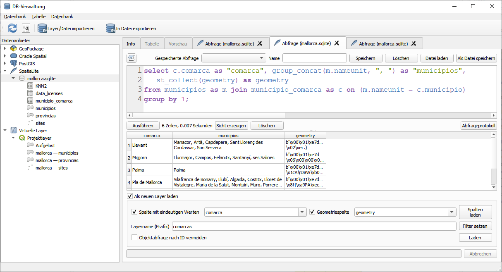
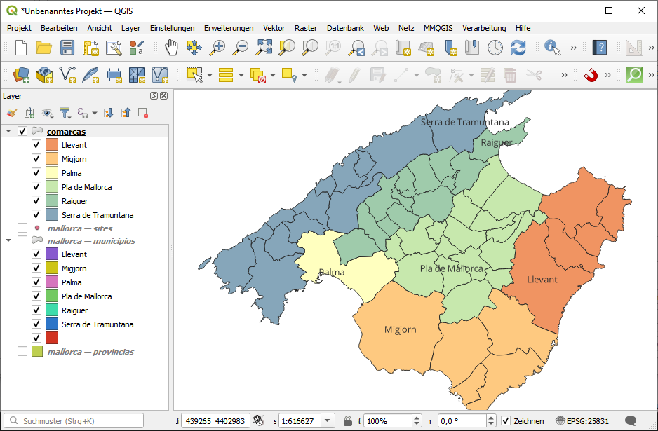
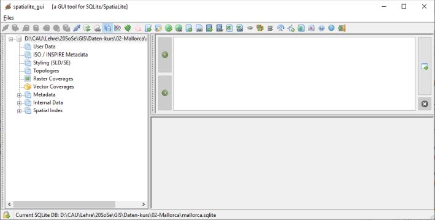

--- 
title: "GIS Einführung mit QGIS"
author: "Christoph Rinne"
email: crinne@ufg.uni-kiel.de
date: "`r format(Sys.time(), '%d. %B %Y')`"
license: "CC-BY 4.0"
header-includes: 
  \renewcommand{\contentsname}{Inhalt} 
  \renewcommand{\figurename}{Abb.}
  \renewcommand{\tablename}{Tab.}
bibliography: QGIS-cours-references.bib
csl: "../styles/journal-of-archaeological-science.csl"
papersize: a4
output:
  html_document:
    toc: yes
    toc_float: true
    number_sections: yes
    df_print: paged
    css: "../styles/tutorials.css"
    theme: readable
  pdf_document:
    fig_caption: yes
    number_sections: yes
    toc: yes
    df_print: kable
urlcolor: blue
link-citations: yes 
linkcolor: blue
number_sections: yes
lang: de-DE
description: "Gis-Kurs mit QGIS : Tutorial in Kapiteln"
---

# Datenbanken

```{r R-script-load-library-setup-connection, include=FALSE}
library(RSQLite)
t1db<-dbConnect(RSQLite::SQLite(), dbname = ":memory:")
```

```{r 'Set up the tables and data', message=FALSE, warning=FALSE, include=FALSE}
dbExecute (t1db, "DROP TABLE IF EXISTS 'pop_balears';")
dbExecute (t1db, "DROP TABLE IF EXISTS 'comarcas';")
dbExecute (t1db, "CREATE TABLE 'pop_balears' (PK_UID INTEGER PRIMARY KEY AUTOINCREMENT, 'codigo' INTEGER, 'municipio' TEXT, 'zensus_1842' TEXT, 'zensus_1857' TEXT, 'zensus_1860' TEXT, 'zensus_1877' TEXT, 'zensus_1887' TEXT, 'zensus_1897' TEXT, 'zensus_1900' TEXT, 'zensus_1910' TEXT, 'zensus_1920' TEXT, 'zensus_1930' INTEGER, 'zensus_1940' INTEGER, 'zensus_1950' INTEGER, 'zensus_1960' INTEGER, 'zensus_1970' INTEGER, 'zensus_1981' INTEGER, 'zensus_1991' INTEGER, 'zensus_2001' INTEGER, 'zensus_2011' INTEGER);")
dbExecute (t1db, "insert into 'pop_balears' values (0,34040707001,'Alaró',4112,4588,4879,5317,5877,5838,5982,6044,6061,4323,3900,3807,3718,3659,3253,5023,4050,5273), (1,34040707002,'Alaior',4722,4605,4282,4982,5163,5070,4909,4992,5073,5013,4891,5082,4978,5217,5656,5027,7108,9450), (2,34040707003,'Alcúdia',1120,1563,1500,2294,2645,2726,2711,3050,3405,3592,3977,3565,3465,3969,5395,8016,12500,18914), (3,34040707004,'Algaida',2806,3666,3675,3962,4234,4043,4091,4153,4047,4142,3930,3905,3698,3218,2830,3167,3749,5272), (4,34040707005,'Andratx',4609,5092,5663,6676,6483,6924,7014,6838,6600,6333,5323,4036,4259,5967,6319,6883,7753,11234), (5,34040707006,'Artà',4001,6225,4634,5133,5865,5813,5824,5729,5955,5810,6061,5496,5406,5461,5625,5694,6176,7562), (6,34040707007,'Banyalbufar',488,533,550,571,639,720,708,758,881,913,732,667,580,507,492,448,517,559), (7,34040707008,'Binissalem',3027,3182,3273,3620,3891,3836,3934,4180,4234,4294,4316,4132,4156,4268,5040,4679,5166,7640), (8,34040707009,'Búger',1145,1187,1228,1221,1230,1116,1160,1181,1142,1198,1085,1010,1027,1019,1022,907,950,1014);")
```

```{sql 'Intro', connection=t1db, tab.cap = 'Einfache Abfrage für ausgewählte Felder einer Tabelle, die ersten  Einträge.'}
select codigo, municipio, zensus_1842, zensus_1900, zensus_1950,  zensus_2011 
from 'pop_balears' limit 6;
```

## Vorbemerkung

In dieser Übung zu GIS mit QGIS sind (mir) bisher zwei besonders störende Probleme aufgefallen:

- Aus Abfragen generierte Sichten oder Darstellungen von Daten müssen als neue Datei mit redundanten Daten gespeichert werden, sonst gehen diese temporären Layer verloren und
- die Datentabellen können nur als Ganzes kopiert, nicht aber mit ausgewählten Attributen kopiert und somit schnell anderweitig verwendet werden.

Die Verwendung von Datenbanken, GeoPackages oder SpatiaLite löst diesen Missstand.

### Datenbankmanagementsysteme (DBMS) im Data Source Manager 

Es gibt zwei grundlegende Unterschiede bei DBMS: 

1. DBMS für den Desktop und die Nutzung durch eine Person oder einen begrenzten Nutzerkreis in einem eher lokalen Netzwerk.
2. DBMS für Server als Dienst im Netzwerk für viele Nutzer. 

Dies ist keine scharfe Grenze, denn Sie können einen Server auf ihrem PC für persönliche Zwecke betreiben oder eine Access-Datenbank erfolgreich im Netzwerk eines mittelständischen Betriebes einsetzen. Ein wesentlicher Aspekt neben dem System ist auch der Aufbau der Datenbank. Die Nutzung von SQL ist lokal und auf dem Server  möglich und wegen der guten Nachnutzbarkeit vorzuziehen (vgl. [FAIR](https://www.go-fair.org/fair-principles/){target="_blank"}). Der Betrieb eines Servers erfordert *know how* und einen hohen Aufwand bei der Wartung als auch bei der Sicherheit des Systems. 

- Geopackage: Ein freies und offenes DBMS auf der Basis von [SQLite](https://sqlite.org){target="_blank"} für den Desktop. Gegenüber [SpatiaLite](https://www.gaia-gis.it/fossil/libspatialite/index){target="_blank"}, an das es angelehnt ist, kann es zudem auch Rasterdaten verwalten. Der Nutzer sieht nur eine Datei, die alle Daten beinhaltet.
- [SpatiaLite](http://www.gaia-gis.it/gaia-sins/){target="_blank"}: Ist ein auf SQLite basierendes DBMS mit GIS-Integration speziell für den Desktop. [SQLite](https://sqlite.org){target="_blank"} ist frei nutzbar (*public domain*), die GIS-Funktionalität von SpatiaLite ist frei verwendbar und *open-source*. Ältere Versionen des Programmes hatten eine **GUI** (graphical user interface), die offensichtlich aber nicht weiter entwickelt wird. Die Datenbank beinhaltet alle Vektordaten und nur die Rasterdaten müssen getrennt verwaltet werden. 
- PostgreSQL: Ein freies DBMS für Server und *open source*. Durch die Erweiterung PostGIS ist es im besonderen Maß für die Arbeit mit Geodaten geeignet. Es ist deshalb in größeren Forschungsprojekten und -verbünden beliebt. Die Wartung des Servers (Hardware), des Postgres-Servers (Dienst) und abgestimmt darauf der PostGIS-Version, sollten in ihrem Aufwand nicht unterschätzt werden. Eine Analyse des Bedarfs, der vorhandenen Kompetenz und Ressourcen ist angebracht.
- MS SQL-Server: Microsoft SQL Server auch mit kostenfrei nutzbaren Versionen.
- Oracle: Ein traditionsreicher Anbieter von DBMS für Server, auch kostenfrei nutzbaren Versionen. 
 
### Geopackage oder SpatiaLite / 

Den tabellarischen Vergleich früherer Versionen habe ich entfernt, meine Kenntnis zu GeoPackages ist unzureichend. Die eigene Entscheidung für ein System hängt sicher auch vom Nutzungskonzept und der eigenen Erfahrung bzw. den Vorlieben ab. Nachfolgend meine Sicht auf SpatiaLite. 

|pro SpatiaLite|contra SpatiaLite|
|:----------|:----|
|- Eine Datei für Vektordaten.|- Keine Rasterdaten möglich.
|- Gute GUI, u.a. mit *spatialview*-Generator.||
|- SQLite kann mit vieln freien GUI's genutzt werden.||
|- SQLite bzw. SQL kann in R über das DBI-Paket umfangreich angesprochen werden. || 
|- Integration von GIS-Funktionen.||
|- Integrierte Importfunktionen, auch ganzer Ordner mit Dateien (dxf, shp, asc, excel).|
|- Anhängen externer Daten (virtuelle Daten).||
|- Bibliotheken für Rasterdaten, Netzwerk, Routing etc.||
</br>

Für mich ist die Arbeit mit Abfragen, speziell *spatial view* wichtig und die [*type affinity*](https://sqlite.org/datatype3.html#type_affinity) ist eine feine Sache bei spontan auftretenden Buchstaben an einer Befundnummer. Rasterdaten liegen oft als eine Datei vor, sind als GeoTIF oder ASC/GRD-Datei leicht austauschbar und werden mit dem Raster-Calculator in QGIS effizient bearbeitet, wobei das Ergebnis jeweils leider in eine neue Datei geschrieben wird. Das Einbinden der Rasterdaten in ein GeoPackage bringt mir hier keinen Vorteil. Damit ziehe ich SpatiaLite zur Zeit vor. Einen deutlich eingehendere Darstellung zu Gepackages finden Sie auf folgender Website: [www.geopackages.org](http://www.geopackage.org/guidance.html){target="_blank"}. 

## QGIS DB-Verwaltung

Nachfolgend erstellen und nutzen wir eine SpatiaLite Datenbank (DB). Das Vorgehen ist für GPKG und SQLITE in der DB-Verwaltung identisch.

### Erstellen der Datenbank

Eine **neue Datenbank anlegen** (GeoPackage (GPKG) oder SpatiaLite) erfolgt im QGIS-Browser im Kontextmenü zu dem jeweiligen Eintrag mit "Datenbank erzeugen". Alernativ können eine GPKG oder eine SQLITE durch den Export eines Layers über "Layer > Layer erstellen" zusammen mit einem ersten Layer erstellt werden. Ist der Dateiname nicht vorhanden, wird die Datenbank zugleich angelegt, ansonsten wird der neue Layer in dieser Datei als neue Tabelle erstellt. Alternativ ist auch der Export eines Layers in die ggf. dann zugleich erstellte DB über das Kontextmenü des Layers möglich "Exportieren > Objekt speichern als".  

Bitte exportieren Sie:
- *provincias* (gefiltert auf ```codnut2 = 'ES53'```), Format: SpatiaLite, Dateiname [...]: im Projektordner "mallorca.sqlite", Layername: provincias, KBS: EPSG 25831 (da auf die Balearen gefiltert ist dürfen wir in das metrische KBS des Projektes umprojizieren), Felder und auch den Rest unverändert übernehmen und [OK].
- *municipios* (gefiltert auf ```codnut3 = 'ES532'```),  Format: SpatiaLite, Dateiname: s.o., Layername: municipios, KBS: 25831 (s.o.), Rest unverändert lassen und [OK].
- *mallorca-sites* (ungefiltert), Format: SpatiaLite, Datei: s.o., Layername: sites (das "-" wurde automatisch entfernt, es führt zu Problemen, s.u.), KBS: EPSG 25831 (Vorgabe), Rest unverändert übernehmen und [OK].
- *municipio-comarca* , Format: SpatiaLite, Datei: s.o., Layername: Municipio_comarca (mit "_"), KBS: Ungültige Projektion belassen, Geometrie: "Ohne Geometrie", "[] Gespeicherte Datei zur Karte hinzufügen" den Haken entfernen, Rest belassen [OK].

Löschen Sie in unserem Projekt nachfolgend alle alten Layer und speichern Sie es unter einem neuen Namen.

### Arbeit mit der DB-Verwaltung 

Öffnen Sie die DB-Verwaltung ("Datenbank > DB-Verwaltung"). Für die Nutzung einer Datenbank muss erst eine Verbindung zu dieser eingerichtet werden. In QGIS gibt es zwei Wege: 1. über die **Datenquellenverwaltung** > SpatiaLite > [Neu] und 2. über die **DB-Verwaltung** im Kontextmenü von "SpatiaLite" (oder einem anderen DBMS). Unsere DB ist schon verbunden und kann in der DB-Verqwaltung links "geöffnet" werden Alle vorhandenen Verbindungen werden angezeigt und durch das Öffnen verbunden. Zu jeder Tabelle werden rechts in drei Registern Informationen angezeigt. Die Tabellen KNN2 und data_licenses wurden durch das System erstellt. Über das Kontextmenü > "Zur Karte hinzufügen" werden die Daten in das Projekt übernommen.

Mit "Tabelle > Layer/Datei importieren" können Layer aus dem aktiven Projekt, ggf. auch nur die markierten, oder mit [...] externe Dateien mit Vektoren, z.B. shp, importiert werden.  

Die Darstellung in der Datenquellenverwaltung (\<strg>+\<l>) weicht hiervon ab und bietet weniger Optionen. Im *dropdown* oben können gespeicherte Verbindungen ausgewählt und mit [Verbinden] aktiviert werden. Am unteren Fensterrand können geometrielose Tabellen für die Anzeige aktiviert werden. Oberhalb der Liste findet sich ein konfigurierbarer Filter für die ggf. unzähligen Tabellen im Projekt. Eine Auswahl wird mit [Hinzufügen] in das Projekt übernommen.

### Einfache SQL-Anweisungen

In der DB-Verwaltung öffnen Sie mit \<F2> oder "Datenbank -> SQL-Fenster"  ein Fenster für SQL-Anweisungen. In der oberen Hälfte werden Anweisungen geschrieben und in der unteren Hälfte sehen Sie das Ergebnis. Das kleine Icon [SQL] oben links öffnet den SQL-Anweisungseditor, der die Konstruktion komplexerer Anweisungen erleichtern soll. Dieses Fenster bitte wieder schließen. Kopieren Sie folgende SQL-Anweisungen vollständig in die obere Hälfte des SQL-Fensters (Register Abfrage), markieren Sie nacheinander jeweils eine Anweisung (*select* bis einschl. ";") und betätigen Sie jeweils [Ausführen]:

```{sql 'sql einfuehrung', eval=FALSE, message=FALSE, connection=t1db, include=TRUE, tab.cap = 'Drei einfache SQL-Anweisungen zur Einführung.'}
-- Auswahl aller Fundplätze
select * from sites;
-- Auswahl der Talaiots
select nombre_yac, regio, aswkt(geometry) as WKT from sites 
  where tipo_yacim like 'Talaiot%'; 
-- Zählen der Talaiots je Region
select regio as Region, count(*) as 'Anzahl der Talaiots' from sites 
  where tipo_yacim like 'Talaiot%' group by 1;
```

Das muss nicht wirklich erklärt werden, nur folgende Hinweise: *count(\*)* zählt alle Datenzeilen und *group by 1* gruppiert nach der ersten Spalte.

Bitte kopieren Sie nun die folgenden Anweisungen und führern Sie diese ebenfalls nacheinader aus. Es soll sie für gute und schlechte  Namen für Tabellen und Felder sensibilisieren.

```{sql 'sql feldnamen', eval=FALSE, message=FALSE, connection=t1db, include=TRUE, tab.cap = 'Eine Tabelle mit schlechten Namen.'}
-- Testtabelle erstellen
create table "t-est" (region text, "1900" integer, "1920" integer);
-- Daten einfügen
insert into "t-est" (region, "1900", "1920")
  values ("Raum 1", 500, 520), ("Raum 2", 1200, 1400);
-- Problem
select region, '1900', 1920 from "t-est";
```

| Achtung |
|:----|
| Ein "-" im Namen wirkt wie ein Leerzeichen und bedingt "".  Namen als Zahl sind immer und mit einer Ziffer am Anfang oft ein Problem. Vermeiden Sie bei Namen auch Funktionsnamen, in SQL z.B. count (s.o.) oder auch Alter ( = *alter* für ändern). |
| \<Strg> + \<R>  führt die SQL-Anweisung ebenfalls aus. Allerdings das gesamte Fenster und es darf immer nur eine Anweisung geben. |
</br>

Was haben Sie gelernt?

1. SQL-Anweisungen sind nicht grundsätzlich kompliziert, aber es gibt wichtige Syntaxregeln und Namenskonventionen. Wenig beachtet, aber das ";" steht am Ende der Anweisung.
2. Wir können Daten filtern, die Syntax entspricht auffallend den Anweisungen bei Layern in QGIS.
3. Wir können gezielt Spalten (Attribute) auswählen und "schöne" Spaltennamen vergeben.
4. Es gibt Funktionen, die unsere Daten verändern.

## Anzahl der Talaiots je *comarca*

Ich komme nochmal auf die Frage nach der Anzahl der Talaiots je Naturraum zurück. Wie immer gibt es viele Wege zum Ziel. Hier zwei Optionen mit SpatiaLite.

1. Wir verbinden implizit die Rauminformation der Municipios mit der Tabelle der *sites* gefiltert auf die Talaiots. Nachfolgend müssen wir das ganze noch auf die *comarcas* aggregieren. Beachten Sie die Unterabfrage in Klammern mit dem Filter auf die Talaiots deklariert als "t", die ergänzende Auswahl von den municipien, deklariert als "m" und die Verbindung der jeweiligen Geometrien durch die Funktion *st_within()*.  

```{sql 'aggregiert falsche flaeche', eval=FALSE, message=FALSE, connection=t1db, include=TRUE, tab.cap = 'Aggregierte Tabelle, Municipios ohne Talaiots fehlen.'}
select m.nameunit as "Municipium", 
       round(sum(st_area(m.geometry))/100000, 1) as "Fläche (km²)", 
       count(t.nr) as "Anzahl Talaiots"
from (select * from sites where tipo_yacim like 'Talaiot%') as t,
   municipios as m
where st_within(t.geometry, m.geometry) 
group by 1;
```

**Halt!** Netter Versuch, aber sehen Sie sich das Ergebnis dieser Abfrage an. Alle Municipien haben mindestens einen Talaiot, die ohne werden nicht aufgeführt und werden dann in der Summe der Flächen fehlen. Für unsere Fragestellung müssen wir einen inklusiven *join* (*left join*) von Municipien zu Talaiots explizit erklären und dann aggregieren. Das ist nicht wirklich dramatisch, aber ich gehe mal den zweiten Weg.

2. Wir aggregieren unsere Municipien auf die *comarcas*, diese Abfrage ist sicher immer mal wieder hilfreich, und stellen dann die räumliche Verbindung zu unseren Talaiots her. Anmerkung: Ich ignoriere die Spalte "municipio_comarca_comarca" des letzten *join* und räume auch gleich mal auf.

```{sql 'aggregiert comarcas', , eval=FALSE, message=FALSE, connection=t1db, include=TRUE, tab.cap = 'Aggregieren der Municipien zu *comarcas*'}
select c.comarca as "comarca", group_concat(m.nameunit, ", ") as "municipios", 
   st_union(geometry) as geometry
from municipios as m join municipio_comarca as c on (m.nameunit = c.municipio)
group by 1;
```
</br>

<table>
<tr>
<td>

</td><td>

</td></tr></table>
</br>

Führen Sie die vorangehende Abfrage mit [Ausführen] aus, wählen Sie unterhalb [x] "Als neuen Layer laden". [Spalten laden], [x] "Spalte mit eindeutigen Werten": comarca, [x] "Geometriespalte": geometry, "Layername (Präfix)": comarcas und **[Laden]**. Wechseln Sie dann in das Projektfenster und erstellen Sie dort für die Spalte "comarcas" eine kategorisierte Symbologie und  beschriften auch mit dieser Spalte.

Zur vorangehende SQL-Anweisung folgende Informationen: die Funktion *group_concat()* liefert eine Liste der aggregierten Werte mit ", " als Trennzeichen und die Funktion *st_collect()* aggregiert hier die Geometrien zu einem Multipolygon. Letzteres wird in der Darstellung anhand der weiterhin vorhandenen Binnengrenzen der Municipien und der "unschönen" Lage der Beschriftung deutlich. Für unsere Fragestellung ist dies aber ausreichend.  Mit **[Sicht erzeugen]**, Name: "comarcas_multi" speichern Sie diese Abfrage als *view* (DB Kontextmenü > "Neu verbinden").

| Anmerkung |
|:----|
| Oberhalb der SQL-Anweisung können Sie Abfragen speichern und dann auch wieder auswählen. Diese Abfragen werden in der Projektdatei (*.qgz) gespeichert. |
| Sichten (*views*) werden als SQL-Anweisung in der Datenbank gespeichert. Der Befehl "*create view test as ...*" vor einer Abfrage speichert diese als *view* mit dem Namen "test" (identisches Egebnis). |
| Gespeicherte *views* haben eine gültige Geometrie (*st_area(geometry* ist gültig), sie können aber nicht direkt kartiert werden. |
| Der nach der Abfrage erstellte Layer ("Als neuen Layer laden") wird im Projekt gespeichert und ist nach dem Neustart wieder vorhanden. |
| Bei Bedarf führen Sie eine Abfrage auf die *view* aus (*select \* from comarcas_multi*) und fügen das aktuelle (!) Ergebnis erneut als Layer hinzu. | 
</br>

Und analog zur ersten Abfrage noch fix Die Daten für den Chi²-Test zu den Talaiots in den *comarcas* als schöne Tabelle.

```{sql 'comarcas und talaiots', eval=FALSE, message=FALSE, connection=t1db, include=TRUE, tab.cap = 'Schöne Tabelle mit *comarcas, Fläche und Anzahl der Talaiots.'}
select c.comarca as "Naturraum", 
       round(st_area(c.geometry)/1000000, 1) as "Fläche (km²)", 
       count(t.nr) as "Anzahl Talaiots"
from (select * from sites where tipo_yacim like 'Talaiot%') as t,
   comarcas_multi as c
where st_within(t.geometry, c.geometry)
group by 1;
```

</br>

| Naturraum | Fläche (km²) | Anzahl Talaiots |
| --------- | ---------:| -----------:|
| Llevant | 579.3 | 41 |
| Migjorn | 809.9 | 13 |
| Palma | 208.6 | 6 |
| Pla de Mallorca | 737.2 | 47 |
| Raiguer | 471.4 | 29 |
| Serra de Tramuntana | 831.0 | 42 |


## SpatiaLite und SpatiaLite-GUI

Wie eingangs erläutert, beruht SpatiaLite ebenfalls auf SQLite, es kann keine Rasterdaten speichern, hat eine deutlich längere Entwicklung hinter sich und bietet eine eigene GUI (graphical user interface). SpatiaLite-Datenbanken können wie GPKG durch den Export von Layern in QGIS erzeugt, gefüllt und nach der Verbindung mit QGIS-Bordmitteln genutzt werden. Bis zu diesem Punkt ergibt sich kein Mehrwert bei der Nutzung. SpatiaLite erlaubt es von anbeginn, ***spatial views*** zu erstellen. Das ist in QGIS nun mit "[x] Als neuen Layer laden" ebenfalls möglich. Daneben bitet SpatiaLite, nachfolghend mit der zugehörigen GUI genutzt einige Vorteile.

| Anmerkung |
|:----|
| Die Unterschiede zwischen der QGIS DB-Verwaltung und der SpatiaLite GUI bei der Erstellung und Darstellung der jeweiligen Dateien werden am Ende kurz erläutert. | 

### SpatiaLite installieren

Laden Sie sich bitte von der [Website](http://www.gaia-gis.it/gaia-sins/){target="_blank"} die Dateien für SpatiaLite herunter. Unten links sehen Sie die "MS Windows binaries".

1. Wählen Sie hier bei "**latest version supporting spatialite GUI**", je nach System 32bit oder 64bit. Nur bei dieser Version ist die GUI dabei. Offensichtlich hat die Entwicklung dieser GUI keine Priorität.
2. Sie sehen  drei gepackte Dateien (.7z), die Sie herunterladen.
3. Legen Sie im Ordner "Program Files" (64bit) oder "Program Files (x86)" einen neuen Ordner "spatialite" an und kopieren Sie alles dort hinein (Adminrechte). Da die Datei proj.db in jeder der gepackten Dateien vorliegt, belasse ich ... modules... und ...tools... in ihrem jeweiligen Unterordner. Das Programm wird nicht installiert, d.h. im Betriebssystem eingebunden, der Ordner "SpatiaLite" kann also überall liegen.
5. Wenn Sie es zukünftig öfter nutzen wollen und mehr Komfort wünschen, können Sie die Datei "spatialite_gui.exe" mit dem Eintrag "An Start anheften" über das Kontextmenü in das Startmenü der Programme eintragen. Oder erstellen Sie einen Link in "c:\\ProgramData\\Microsoft\\Windows\\Start Menu\\Programs\\"

Zu SpatiaLite gibt es zahlreiche ergänzende Infos:

- SpatiaLite: [http://www.gaia-gis.it/gaia-sins/](http://www.gaia-gis.it/gaia-sins/){target="_blank"}
- SpatiaLite Funktionsliste: [https://www.gaia-gis.it/gaia-sins/spatialite-sql-5.1.0.html](https://www.gaia-gis.it/gaia-sins/spatialite-sql-5.1.0.html){target="_blank"}
- SpatiaLite Doku: [https://www.gaia-gis.it/fossil/libspatialite/wiki?name=misc-docs](https://www.gaia-gis.it/fossil/libspatialite/wiki?name=misc-docs){target="_blank"} (sehr alt)
 
### SpatiaLite GUI

Starten Sie die SpatiaLite-GUI und erstellen Sie mit "Menue > MEMROY DB > Creating a New ...". Diese Datenbank wird unmittelbar geöffnet und verändert die GUI (s. u.). In der Iconleiste sind einige Symbole ausgegraut, wenn Sie nicht alle Teilanwendungen (Dateien) heruntergeladen haben. 



Importieren Sie einmalig eine shp-Dateien, z.B. (autonomias): "Menu -> Advanced -> Load Shapfile". Nach der Auswahl der shp-Datei erscheint ein Fenster, in dem Sie jeweils angepasst folgende Parameter setzen: Table name: autonomias, GeomColumn name: geom, SRID: Vorgabe sollte stimmen, Charset Encoding: UTF-8 (wird leider nicht automatisch ausgelesen, steht am Ende des Liste für Charset Encoding, die Info finden Sie in der Datei \*.cpg), der Rest bleibt nach Vorgabe.

Der Import von Text-Tabellen ist leider nicht so komfortabel wie in QGIS, z.B. können Geometrien beim Import nicht direkt erstellt werden und zu überspringende Zeilen am Dateianfang gibt es ebenfalls nicht. 

Dazu bietet die GUI einen sehr effizienten Import für einzelne DXF-Dateien oder den desamten Inhalt eines Ordners (z.B. CAD-Pläne von Ausgrabungen). Dies erfolgt deutlich effizienter und meist erfolgreicher als bei QGIS. Die übernommen Daten werde *a priori* nach der Geometrie getrenn, z.B. line_layer_2d, polyg_layer_3d, und die Herkunft wird in entsprechenden Spalten für den Datei- und Layernamen hinterlegt. Während die CAD-Datei noch einen wust an Layern besessen haben, ist es hier deutlich übersichtlicher (s. [Tutorial Brics-CAD](https://zenodo.org/records/10614695)).

### Unterschiede QGIS & Spatialite GUI

Der wesentliche Unterschied für uns als Nutzer, ist die jeweils gebotene Funktionalität. Je nach Bedarf können Sie also wählen, ob Sie lieber mit dem einen oder anderen System arbeiten. Die unmittelbare Darstellung von Abfragen in der Karte (s. "Als neuen Layer Laden") bei QGIS ist wirklich praktisch. Die GUI von SpatiaLite bietet für mich mit dem DXF-Import einen wichtigen Vorteil.

Verfügbare **Funktionen** wie *st_collect* können bei der SpatiaLite GUI in der Iconleiste ganz rechts, das linke von den beiden (?) als neues Fenster angezeigt werden. Die Performanz und Funktionalität ist hier aber eingeschränkt, weshalb ich immer auf die Version im Netz zugreife: [https://www.gaia-gis.it/gaia-sins/spatialite-sql-5.1.0.html](https://www.gaia-gis.it/gaia-sins/spatialite-sql-5.1.0.html). In der DB-Verwaltung finden Sie im SQL-Abfrageeditor ([SQL]-Icon) *dropdown* für diverse Bereiche, so auch die Funktionen. Allerdings fehlt hier z.B. *st_collect* und es wird auch keine Erläuterung zu den Parametern und der Rückgabe geboten.

Ein großer unterschied besteht bei den automatisch generierten und jeweils angezeigten Tabellen und Sichten. Neben der Tabelle KNN2 und unseren "persönlichen" Tabellen tauchen noch diverse Tabellen mit einem "idx_..." am Anfang des Namens auf. Diese dienen der Verwaltung der Geometrien. Dafür wird hier die Tabelle *data_licenses* ausgeblendet, ist aber vorhanden: ```select * from data_licenses;```
