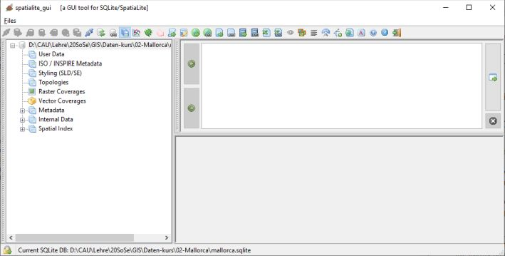

--- 
title: "GIS Einführung mit QGIS"
author: "Christoph Rinne"
email: crinne@ufg.uni-kiel.de
date: "`r format(Sys.time(), '%d. %B %Y')`"
license: "CC-BY 4.0"
header-includes: 
  \renewcommand{\contentsname}{Inhalt} 
  \renewcommand{\figurename}{Abb.}
  \renewcommand{\tablename}{Tab.}
bibliography: QGIS-cours-references.bib
csl: journal-of-archaeological-science.csl
papersize: a4
output:
  pdf_document:
    fig_caption: yes
    number_sections: yes
    toc: yes
    df_print: kable
  html_document:
    toc: yes
    toc_float: true
    df_print: paged
urlcolor: blue
link-citations: yes # make citations hyperlinks
linkcolor: blue
number_sections: yes
lang: de-DE
description: 'Gis-Kurs mit QGIS : Tutorial in Kapiteln'
---

# Datenbanken

```{r R-script-load-library-setup-connection, include=FALSE}
library(RSQLite)
t1db<-dbConnect(RSQLite::SQLite(), dbname = ":memory:")
```

```{sql basic-table-drop, connection=t1db, include=FALSE}
DROP TABLE IF EXISTS 'pop_balears';
DROP TABLE IF EXISTS comarcas;
```

```{sql basic-table-create, connection=t1db, include=FALSE}
CREATE TABLE 'pop_balears' (
PK_UID INTEGER PRIMARY KEY AUTOINCREMENT,
"codigo" INTEGER,
"municipio" TEXT,
"zensus_1842" TEXT,
"zensus_1857" TEXT,
"zensus_1860" TEXT,
"zensus_1877" TEXT,
"zensus_1887" TEXT,
"zensus_1897" TEXT,
"zensus_1900" TEXT,
"zensus_1910" TEXT,
"zensus_1920" TEXT,
"zensus_1930" INTEGER,
"zensus_1940" INTEGER,
"zensus_1950" INTEGER,
"zensus_1960" INTEGER,
"zensus_1970" INTEGER,
"zensus_1981" INTEGER,
"zensus_1991" INTEGER,
"zensus_2001" INTEGER,
"zensus_2011" INTEGER);
CREATE TABLE 'comarcas' (
"PK_UID" INTEGER PRIMARY KEY AUTOINCREMENT,
"c_comarca" TEXT, "geom" MULTIPOLYGONE);
```

```{sql basic-table-insert, connection=t1db, include=FALSE}
insert into 'pop_balears'
values (0,34040707001,"Alaró",4112,4588,4879,5317,5877,5838,5982,6044,6061,4323,3900,3807,3718,3659,3253,5023,4050,5273),
(1,34040707002,"Alaior",4722,4605,4282,4982,5163,5070,4909,4992,5073,5013,4891,5082,4978,5217,5656,5027,7108,9450),
(2,34040707003,"Alcúdia",1120,1563,1500,2294,2645,2726,2711,3050,3405,3592,3977,3565,3465,3969,5395,8016,12500,18914),
(3,34040707004,"Algaida",2806,3666,3675,3962,4234,4043,4091,4153,4047,4142,3930,3905,3698,3218,2830,3167,3749,5272),
(4,34040707005,"Andratx",4609,5092,5663,6676,6483,6924,7014,6838,6600,6333,5323,4036,4259,5967,6319,6883,7753,11234),
(5,34040707006,"Artà",4001,6225,4634,5133,5865,5813,5824,5729,5955,5810,6061,5496,5406,5461,5625,5694,6176,7562),
(6,34040707007,"Banyalbufar",488,533,550,571,639,720,708,758,881,913,732,667,580,507,492,448,517,559),
(7,34040707008,"Binissalem",3027,3182,3273,3620,3891,3836,3934,4180,4234,4294,4316,4132,4156,4268,5040,4679,5166,7640),
(8,34040707009,"Búger",1145,1187,1228,1221,1230,1116,1160,1181,1142,1198,1085,1010,1027,1019,1022,907,950,1014);
```


```{sql 'Intro', connection=t1db, tab.cap = 'Einfache Abfrage für ausgewählte Felder einer Tabelle, die ersten  Einträge.'}
select codigo, municipio, zensus_1842, zensus_1900, zensus_1950,  zensus_2011 
from 'pop_balears' limit 6;
```

## Vorbemerkung

In dieser Übung zu GIS mit QGIS sind (mir) zwei besonders störende Probleme aufgefallen:

- Aus Abfragen generierte Sichten oder Darstellungen von Daten müssen als neue Datei mit redundanten Daten gespeichert werden, sonst gehen diese Layer verloren und
- die Datentabellen können nur als Ganzes kopiert, nicht aber mit ausgewählten Attributen kopiert und somit schnell anderweitig verwendet werden.

Dieses Kapitel beginnt mit Übungen zu GeoPackages, SpatiaLite und der DB-Verwaltung in QGIS, am Ende steht dann die Arbeit mit der SpatiaLite-GUI.

### Datenbanksysteme im Data Source Manager 

Insgesamt stellt sich mir die Arbeit mit den Daten in QGIS im Vergleich zu Datenbankmanagementsystemen (DBMS) als unbefriedigend dar. Natürlich gibt es nicht nur ein DBMS und QGIS bietet bei der Datenquellenverwaltung einige Schnittstellen an. Zur Ergänzung sei erwähnt, dass ESRI (ArcGIS) auf Geodatenbanken (*geodatabases*) für den Desktop setzt, die mit MS Access kompatibel sind. 

Es gibt zwei grundlegende Unterschiede bei DBMS: 1. Die für den Desktop und die Nutzung durch eine Person oder einen begrenzten Nutzerkreis in einem eher lokalen Netzwerk gedachten Systeme und davon deutlich unterschieden 2. die für Server als Dienst im Netzwerk für viele Nutzer konzipierten Systeme. Dies ist keine scharfe Grenze, denn Sie können einen SQL-Server auf ihrem PC für persönliche Zwecke betreiben oder eine Access-Datenbank erfolgreich in einem mittelständischen Betrieb einsetzen. Ein wesentlicher Aspekt neben dem System ist auch der Aufbau der Datenbank. Für GIS sind oft spezielle Ergänzungen notwendig, die nicht immer integriert sind, z.B. PostgreSQL mit PostGIS. SQL ist die Programmiersprache für das Strukturieren, Verwalten und Verändern von Daten. SQL ist textbasiert und in dieser Form auch von Menschen lesbar, gut archivierbar und trotz zahlreicher Varianten insgesamt gut interoperabel (vgl. [FAIR](https://www.go-fair.org/fair-principles/){target="_blank"}).

- Geopackage: Ein freies und offenes DBMS auf der Basis von [SQLite](https://sqlite.org){target="_blank"} für den Desktop. Gegenüber [SpatiaLite](https://www.gaia-gis.it/fossil/libspatialite/index){target="_blank"}, an das es angelehnt ist, kann es zudem auch Rasterdaten verwalten. Der Nutzer sieht nur eine Datei, die alle Daten beinhaltet.
- [SpatiaLite](http://www.gaia-gis.it/gaia-sins/){target="_blank"}: Ist ein auf SQLite basierendes DBMS mit GIS-Integration speziell für den Desktop. [SQLite](https://sqlite.org){target="_blank"} ist frei nutzbar (*public domain*), die GIS-Funktionalität von SpatiaLite ist frei verwendbar und *open-source*. Zur Arbeit mit SpatiaLite bietet QGIS eine integrierte Anwendung, eine ergänzende [SpatiaLite GUI](http://www.gaia-gis.it/gaia-sins/){target="_blank"} ist aber empfehlenswert. Im Ergebnis sieht der Nutzer nur eine Datei für Vektordaten und nicht bis zu fünf Dateien je shp-Datei. Rasterdaten müssen aber getrennt verwaltet werden. 
- PostgreSQL: Ein freies DBMS für Server und *open source*. Durch die Erweiterung PostGIS ist es im besonderen Maß für die Arbeit mit Geodaten geeignet. Es ist deshalb in größeren Forschungsprojekten und -verbünden beliebt. Die Wartung des Servers (Hardware), des Postgres-Servers (Dienst) und abgestimmt darauf der PostGIS-Version, sollten in ihrem Aufwand nicht unterschätzt werden. Eine Analyse des Bedarfs, der vorhandenen Kompetenz und Ressourcen ist angebracht.
- MSSQL: Microsoft SQL Server auch mit kostenfrei nutzbaren Versionen.
- Oracle: Ein traditionsreicher Anbieter von DBMS für Server, auch kostenfrei nutzbaren Versionen. 
- DB2: Ist ein DBMS von IBM auch mit einer Community Edition (CE), die  kostenfrei nutzbar ist.  

### Geopackage vs SpatiaLite

Nachfolgend ein knapper Vergleich der beiden genannten Systeme, die eigene Entscheidung hängt sicher auch vom Nutzungskonzept und der eigenen Erfahrung bzw. den Vorlieben ab. Ich konzentriere mich auf die unmittelbaren Aspekte der Anwendung, technische Details werden nicht bewertet. Zudem ist mit einer Weiterentwicklung der Systeme zu rechnen.

|pro Geopackage | contra Geopackage|
|:--------|:--------|
|- Etwas kompaktere Dateigröße, wobei GeoTIF oft größer ist als textbasierte Raster (ASC, GRD). | - Eingeschränkte Funktionalität der SpatiaLite GUI, da Vektordaten nur als *view* zur Verfügung stehen.|
|- Rasterdaten: MBTiles sind weit verbreitet.| - *type affinity* von SQLite wird in QGIS beim Export nicht unterstützt. |
|- Import von dxf-Dateien möglich, leider keine Spezifikation hinterlegt.||
|- Eine Datei für alles.||
|- Nutzt *Write Ahead Logging* (WAL) von SQLite für simultanen Nutzerzugriff auf die integrierte SQLite-DB. WAL- und SHM-Dateien werden nach dem sauberen Beenden von QGIS vom System wieder gelöscht. ||

|pro SpatiaLite|contra SpatiaLite|
|:--------|:--------|
|- Eine Datei für Vektordaten.|- Keine Rasterdaten möglich.
|- Gute GUI, u.a. mit *spatialview*-Generator.||
|- Integration von GIS-Funktionen.||
|- Integrierte Importfunktionen, auch ganzer Ordner mit Dateien (dxf, shp, asc, excel).|
|- Anhängen externer Daten (virtuelle Daten).||
|- Bibliotheken für Rasterdaten, Netzwerk, Routing etc.||

Für mich ist die Arbeit mit Abfragen, speziell *spatial view* wichtig und die *type affinity* ist eine feine Sache bei spontan auftretenden Buchstaben an einer Befundnummer. Rasterdaten liegen oft als eine Datei vor, sind als GeoTIF oder ASC/GRD-Datei leicht austauschbar und werden mit dem Raster-Calculator effizient bearbeitet, wobei das Ergebnis jeweils leider in eine neue Datei geschrieben wird. Das Einbinden der Rasterdaten in ein GeoPackage bringt hier keinen Vorteil. Damit ziehe ich SpatiaLite zur Zeit vor. Einen deutlich eingehendere Darstellung zu Gepackages finden Sie auf der folgender Website: [www.geopackages.org](http://www.geopackage.org/guidance.html){target="_blank"}. 

## GeoPackages in QGIS

### Erstellen der GPKG-Datei

Die GPKG-Datei wird leicht durch den Export von Layern aus QGIS erstellt. Wir exportieren nachfolgend die gefilterten shp-Dateien (Balearen, "CODNUT2" = 'ES53') und die Tabellen mit Daten in eine GPKG. Achten Sie jeweils auf die Angaben zum Namen und die Projektion. Abschließend folgt das DGM200 (mdt200) mit einem typischen Problem.

Aus dem Kontextmenü des Layer "Autonome Gebiete" (autonomias) wählen Sie "Exportieren -> Objekt speichern als" und im neuen Fenster setzen Sie folgende Parameter: 

- Format: GeoPackage, 
- Dateiname [...]: im Projektordner "mallorca.gpkg", 
- Layername: autonomias (**bitte nicht die Vorgabe**), 
- KBS: EPSG 4258 (original der shp), 
- FID: fid (feature id), 
- Geometry_Name: geom. 

Die **Nomenklatur für die *feature id* (fid) und vor allem die Geometrie (geom) sollte in der Datenbank einheitlich, kurz und aussagekräftig sein**, das erleichtert die spätere Arbeit ungemein. Wiederholen Sie den Vorgang für die Provinzen (Layername: provincias), Gemeinden (Layername: municipios) und die selbst generierten Dateien comarcas der Landschaftszonen (Layername: comarcas) und mallorca-sites (Layername: sites). Exportieren Sie auch die Datentabelle pop-balears in die GPKG, bei Geometrie wählen Sie hier "keine Geometrie".

Exportieren Sie zuletzt die Rasterdatei des Höhenmodelles mdt200 bzw. DGM200 in das Geopackage mallorca. Sie sollten eine Fehlermeldung erhalten:

```
Konnte Raster nicht schreiben. Fehlercode: Datenquellenerstellung
Cannot create new dataset  D:\CAU\Lehre\20SoSe\GIS\Daten\mallorca\mallorca.gpkg:
Only Byte, Int16, UInt16 or Float32 supported
```

Öffnen Sie die Eigenschaften -> Informationen zu diesem Layer, dort finden Sie u.a. "Daten Typ	Float32 - 64 Bit Fließkommazahl". Das scheint auf den ersten Blick korrekt, ist aber das Problem. Float32 (Gleitkommazahl) kann als 64 Bit oder als 32 Bit vorliegen. Die aktuellen Daten sind 64 bit, der Import ist aber nur für 32 bit Daten möglich, in der Konsequenz müssen wir also erst konvertieren. Öffnen Sie die Werkzeugkiste ("Verarbeitung -> Werkzeugkiste" oder \<strg>+\<alt>+\<t>) und suchen Sie "konvertieren". Wählen Sie aus den GDAL-Tools "Umwandeln (Format konvertieren)": Eingabelayer: DGM200, Fortgeschrittene Parameter -> Ausgabedatentyp: Float32, Umgewandelt: In temporäre Datei. Weisen Sie der temporären Rasterdatei noch die richtige Projektion zu ("Projektion zuweisen", 25831). Wiederholen Sie den Export in die GPKG mit dieser Datei und achten Sie auf den Layernamen: mdt200.

### Arbeit mit GPKG in QGIS

Für die Nutzung einer Datenbank muss stets erst eine Verbindung zu dieser eingerichtet werden. In QGIS gibt es zwei Wege: 1. über die **Datenquellenverwaltung** und 2. über die **DB-Verwaltung** ("Datenbank -> DB-Verwaltung"). Bei 1. können Sie mit [Neu] eine DPKG auswählen und anbinden, im *drop-down* vorhandene Verbindungen selektieren und mit [Verbinden] öffnen. Bei 2. wird über das Kontextmenü (rechter Mausklick) zum DBMS eine neue Verbindung eingerichtet. Alle vorhanden Verbindungen werden angezeigt und durch das Öffnen verbunden. Der gleichzeitige Zugriff über beide Wege ist möglich. In beiden Fällen können Daten aus der DPKG in das Projekt übernommen werden, bei 1. durch [Hinzufügen], bei 2. durch *drag 'n drop* oder mit Doppelklick. Damit enden die Gemeinsamkeiten. 

**DB-Verwaltung von QGIS** ("Datenbank -> DB-Verwaltung") bietet schneller mehr Informationen zum jeweiligen Datenbestand und erlaubt zudem das Importieren neuer Daten sowie die Arbeit mit SQL-Anweisungen. Bei der Datentabelle "pop-balears" fallen zwei Punkte auf: 1. Nach den "Allgemeinen Informationen" sind die Spalten 1842 bis 1920 als Text und nicht als Zahl gespeichert. 2. Das "-" im Namen führt zu Missverständnissen, bedingt Anführungszeichen und führt somit zu mehr Tipparbeit. Dazu folgende Übungen.

### Einfache SQL-Anweisungen

Mit \<F2> oder "Datenbank -> SQL-Fenster" öffnen Sie ein Fenster für SQL-Anweisungen. In der oberen Hälfte werden Anweisungen geschrieben und in der unteren Hälfte sehen Sie das Ergebnis. Das kleine Icon [SQL] oben links öffnet den SQL-Anweisungseditor, der die Konstruktion komplexerer Anweisungen erleichtern soll. Diesen Editor nutzen wird jetzt nicht. Schreiben Sie folgende SQL-Anweisungen nacheinander in die obere Hälfte des SQL-Fensters und betätigen Sie jeweils [Ausführen]:

- ```select * from sites;``` 
- ```select * from 'pop-balears';```
- ```select municipio, 1950, '2011' from 'pop-balears';```

Die letzte Abfrage liefert folgendes Ergebnis:

| municipio | 1950 | '2011' |
|----|----|----|
| Alaró | 1950 | 2011 |
| Alaior | 1950 | 2011 | 
| Alcúdia | 1950 | 2011 | 

Ohne Hochkomma um den Tabellennamen "pop-balears" führt die zweite Anweisung wegen des "-" zu einer Fehlermeldung. Wir können einzelne Felder wie "municipio" direkt abfragen, nur bei den Zensus die mit dem jeweiligen Jahr benannt sind bekommen wir als Ergebnis die Zahl selbst, egal ob mit oder ohne Hochkomma. Erst mit ```select municipio, 1950, 'pop-balears'.'2011' from 'pop-balears';``` bekommen wir für 2011 die eigentlichen Zahlen.

Um erfolgreich weiterzuarbeiten löschen Sie bitte "pop-balears" über das Kontextmenü in der Datenbank. Importieren Sie über "Tabelle -> Layer/Datei importieren" die Datei "pop_balears.csv", achten Sie auch auf den Namen in der Datenbank "pop_balears" und setzen Sie einen Haken für die Zeichencodierung "UTF-8". Führen Sie danach folgende Abfrage aus:

```{sql 'SQL Abfrage mit where', connection=t1db, message=FALSE, tab.cap = 'Abfrage für einzelne Attribute der Tabelle, Bedingung: Gemeindename beginnt mit A.'}
select codigo, municipio, zensus_1842, zensus_1900, zensus_1950,  zensus_2011 
from pop_balears 
where municipio like 'A%';
```

Und zum Abschluss:  

```{sql 'Geometriefunktion',  connection=t1db,  eval=FALSE, message=TRUE, warning=FALSE, include=TRUE, tab.cap = 'Beispiel für eine Abfrage mit GIS-Funktionen.'}
select m_comarca, st_area(st_transform(geom, 25831))/100000 as a_qkm 
from comarcas;
```

Was haben Sie gelernt?

1. SQL-Anweisungen sind nicht grundsätzlich kompliziert, aber es gibt wichtige Syntaxregeln und Namenskonventionen, z.B. Ziffern am Anfang von oder "-" in Namen sind schlecht. Wenig beachtet, aber das ";" steht am Ende der Anweisung.
2. Wir können Daten filtern, die Syntax entspricht auffallend den Anweisungen bei Layern in QGIS.
3. Wir können gezielt Spalten (Attribute) auswählen.
4. Es gibt Funktionen, die unsere Daten verändern.

Dies sind allgemein gültige Regeln, nicht nur für die Datenbankverwaltung in QGIS. Wechseln wir nun aber zu SpatiaLite und zur SpatiaLite-GUI.

## SpatiaLite und SpatiaLite-GUI

Wie eingangs erläutert, beruht SpatiaLite ebenfalls auf SQLite, es kann keine Rasterdaten speichern, hat eine deutlich längere Entwicklung hinter sich und bietet eine eigene GUI (graphical user interface). SpatiaLite-Datenbanken können wie GPKG durch den Export von Layern in QGIS erzeugt, gefüllt und nach der Verbindung mit QGIS-Bordmitteln genutzt werden. Bis zu diesem Punkt ergibt sich kein Mehrwert für die Nutzung. SpatiaLite erlaubt es, ***spatial views*** zu erstellen, das sind gespeicherte Abfragen mit Geometrie, die wie andere Objekte in QGIS genutzt werden können. **Das redundante Erstellen neuer Daten und der Verlust von temporär erstellten Daten wird damit vermieden**.

### SpatiaLite installieren
Laden Sie sich bitte von der [Website](http://www.gaia-gis.it/gaia-sins/){target="_blank"} die Dateien für SpatiaLite herunter. Unten links sehen Sie die "MS Windows binaries".

1. Wählen Sie hier bei "**previous stable version**", je nach System 32bit oder 64bit. Nur bei dieser Version ist die GUI dabei.
2. Sie sehen  drei gepackte Dateien. Laden Sie alle herunter, auch wenn wir aktuell nicht alle brauchen.
3. Zum Entpacken dieser Dateien empfehle ich die freie Software [7-zip](https://www.7-zip.de/){target="_blank"}. 
4. Legen Sie im Ordner "Program Files" (64bit) oder "Program Files (x86)" einen neuen Ordner "spatialite" an und kopieren Sie alles dort hinein (Adminrechte). Da die Datei proj.db in jeder der gepackten Dateien vorliegt, belasse ich ... modules... und ...tools... in ihrem jeweiligen Unterordner. Das Programm wird nicht installiert, d.h. im Betriebssystem eingebunden, der Ordner "SpatiaLite" kann also überall liegen.
5. Wenn Sie es zukünftig öfter nutzen wollen und mehr Komfort wünschen, können Sie die Datei "spatialite_gui.exe" mit dem Eintrag "An Start anheften" über das Kontextmenü in das Startmenü der Programme eintragen. Oder erstellen Sie einen Link in "c:\\ProgramData\\Microsoft\\Windows\\Start Menu\\Programs\\"

Zu SpatiaLite gibt es zahlreiche ergänzende Infos:

- SpatiaLite: [http://www.gaia-gis.it/gaia-sins/](http://www.gaia-gis.it/gaia-sins/){target="_blank"}
- SpatiaLite-GUI: [https://www.gaia-gis.it/fossil/spatialite_gui/index](https://www.gaia-gis.it/fossil/spatialite_gui/index){target="_blank"}
- SpatiaLite Wiki: [https://www.gaia-gis.it/gaia-sins/spatialite_topics.html](https://www.gaia-gis.it/gaia-sins/spatialite_topics.html){target="_blank"}
- SpatiaLite Cookbook: [http://www.gaia-gis.it/gaia-sins/spatialite-cookbook-5/index.html](http://www.gaia-gis.it/gaia-sins/spatialite-cookbook-5/index.html){target="_blank"}
 
### SpatiaLite GUI

Starten Sie die SpatiaLite-GUI und erstellen Sie mit "Menue -> Creating a New ..." eine neue SQLite Datenbank im Projektordner, Name: mallorca.sqlite. Diese Datenbank wird unmittelbar geöffnet und verändert die GUI (s. u.). In der Iconleiste sind einige Symbole ausgegraut, wenn Sie nicht alle Teilanwendungen (Dateien) heruntergeladen haben. 



Importieren Sie nacheinander die shp-Dateien der Verwaltungsgrenzen (autonomias, municipios) und die des Projektes (sites, comarcas): "Files -> Advanced -> Load Shapfile" (nutzen Sie nachfolgend das entsprechende Icon in der Iconleiste). Nach der Auswahl der shp-Datei erscheint ein Fenster, in dem Sie jeweils angepasst folgende Parameter setzen:

- Autonimias: Table name: autonomias, GeomColumn name: geom, SRID: Vorgabe sollte stimmen, Charset Encoding: UTF-8 (wird leider nicht automatisch ausgelesen, steht am Ende des Liste für Charset Encoding, die Info finden Sie in der datei \*.cpg), der Rest bleibt nach Vorgabe.
- Municipios (Gemeinden): Table name: municipios, GeomColumn name: geom, SRID: 4258, Charset Encoding: UTF-8
- Comarcas (Landschaftszonen): Table name: comarcas, GeomColumn name: geom, SRID: 25831, Charset Encoding: UTF-8.
mallorca-sites: Table name: sites, GeomColumn name: geom, SRID: 25831, Charset Encoding: UTF-8.

Der Import von Text-Tabellen ist leider nicht so komfortabel wie in QGIS, z.B. bei zu überspringende Zeilen am Dateianfang. Nutzen Sie deshalb die neue Datei "pop_balears.csv" für den Import: Table Name: pop_balears, First line ....: Haken setzen, Text separator quotes: None, Column separator: Comma, Charset encoding: UTF-8 und [OK]. 
Falls Sie möchten, können Sie die Abfragen von oben wiederholen, achten Sie aber auf die veränderten Namen: ```select municipio, zensus_1842, zensus_1930 from pop_balears```.

Sollten die Zahlen von "zensus_1842" linksbündig stehen, ist diese Spalte wegen der <Leerzeichen> bei fehlenden Daten als Text importiert worden. Die schnellste Variante: ändern Sie die CSV-Datei und importieren Sie die Daten nach dem löschen der alten Tabelle (Kontextmenü Maintenance) erneut.

### *view* & *spatial view* 

Kommen wir zum zweiten wichtigen Aspekt für die Verwendung von SpataLite: gespeicherten Abfragen (*view*) mit Geometrie. Ich greife auf die frühere Abfrage zurück, wobei ich die Geometrie zur Darstellung weglasse: Wieviele Talaiots befinden sich in jeder Gemeinde? 

Ich beginne mit der **Auswahl der Gemeinden von Mallorca** (codnut3='ES532'). Dazu nutze ich dieses Mal den "Qerry/View Composer" (Menue -> Advanced -> Querry/V...") oder das Icon mit dem Stift. Register Main: Main Table: municipios, darunter bitte alle Felder markieren, Register Filter: Filter #1, Enable, Column to be filtered: codnut3, Comparison operator: =, Value: ES532, Reiter View: Create Spatial View, View name: municipios_532, Geometry Column: geom und [OK]. Im Ergebnis sollten Sie einen neuen Eintrag in Ihrer DB haben, wenn nicht, führen Sie über das Kontextmenü zu "User data" ein "refresh" durch. 

Erstellen Sie in QGIS im Data Source Manager für Datenquelle "SpatiaLite" eine neue Verbindung zu dieser Datenbank "mallorca.sqlite" oder verbinden Sie diese ggf. erneut. Wählen Sie "municipios_532" und [Hinzufügen]. Die zuvor erstellte SQL-Anweisung erzeugt nicht nur die gefilterte Sicht auf den Datenbestand, sondern trägt zugleich die notwendigen Informationen in den Tabellen zur Verwaltung der Geometrien ein (unter Internal Data). Erst dadurch wird die *view* zur *spatial view* und in QGIS nutzbar.

Ich wiederhole den Vorgang in der SpatiaLite GUI für meine Fundplätze und **Filter auf 'Talaiot...'**. Main table: sites und darunter alle Spalten markieren, Filter # 1 enable, Column to be filtered: Tipo_yacim, Comparison operator: like, Value: Talaiot%, View type: Create Spatial View, View_name: talaiots, Geometry column: geom und [OK]. 

Nun müssen wir beiden Datenbestände räumlich verbinden, die Funktion dafür lautet: st_within(). Leider geht dies nicht mit dem *composer*.

```{sql 'Spatial View', eval=FALSE, message=FALSE, connection=t1db, include=TRUE, tab.cap = 'Abfrage mit *spatial join* und Gruppierungsfunktion.'}
create view talaiots_in_municipios as
select m.pk_uid, m.nameunit, count(t.nr) as talaiots 
from municipios_532 as m
join talaiots as t on st_within(t.geom, st_transform(m.geom, 25831))
group by m.pk_uid;
```

1. Zeile: Erstellen der *view* talaiots_in_municipium als
2. Zeile: Es wird eine Auswahl an Feldern getroffen, dabei steht "m." für Felder aus *municipios* und "t." steht für Felder aus *talaiots*. Die Funktion count() zählt die Menge der eingetragenen Datensätze und erhält die Spaltenüberschrift "talaiots".
3. Zeile: Als primäre Datenquelle wird *municipios_532* angegeben, die als "m" abgekürzt bezeichnet wird.
4. Zeile: Beschreibt die Verknüpfung der primären Datenquelle (m) zu *talaiots*, etikettiert als "t", mit der Funktion "st_within(t.geom, m.geom)". Dies verbindet alle Fundplatzeinträge (sites) mit der Gemeinde (municipios) in der diese liegen. Da unterschiedliche KBS vorliegen, muss vorab eine Transformation für m(unicipios) durchgeführt werden: "st_transform(m.geom, 25831)".
5. Zeile: Dieser Ausdruck gruppiert das Ergebnis nach der ID (pk_uid) der Gemeinden und bewirkt das Zählen der Funktion count() über 1 hinaus bis zur entsprechenden Menge an Talaiots je Gemeinde.

Die Abfrage wird erst ausgeführt, wenn sie diese neue view abfragen. Aktualisieren Sie "User data" (Kontextmenü refresh) und führen Sie folgende Abfrage aus: ``select * from talaiots_in_municipios```. Diese Abfrage braucht etwas Zeit (bei mir 6 Sek.), bitte warten Sie. Bis hierher hätte das auch in einem Rutsch ohne die ersten beiden *views* ausgeführt werden können. Die beiden *views* sind aber durchaus auch sinnvoll anderweitig einsetzbar. Da das Ergebnis nur eine Tabelle ist, müssen wir diese erneut mit unseren *municipios* und deren Geometrie verbinden und als *spatial view* speichern. Starten Sie den *composer*. Main table: talaiots_in_municipios und darunter alle Felder auswählen, Table #2 enable: municipios, Felder: PK_UID und geom (\<Strg> + Maus), [Inner] Join, Join match #1: PK_UID zu PK_UID, View: Create Spatial View, View name: talaiots_municipios, Geometry Column Table #2 geometries: geom.
 
Verbinden Sie die DB in QGIS erneut, fügen Sie die Daten zum Projekt hinzu und warten Sie bis der Vorgang abgeschlossen ist (ca. 20 Sek. bei mir). Das ist natürlich ärgerlich, zumal dies auch bei der Zuweisung der Symbologie (kategorisiert) erneut auftritt. Die Daten sind aber 1. nicht redundant hinterlegt, 2. wirken sich Änderungen an den Fundplätzen direkt auf das Ergebnis aus, die Darstellung ist also stets aktuell und 3. ist die Anweisung in der DB dauerhaft gespeichert und damit dokumentiert. 

Natürlich können Sie statt der Anweisung ```create view <name> as``` auch ```create table <name> as``` verwenden. Damit haben Sie zwar ebenfalls redundante Daten geschaffen, da die Abfrage aber als Anweisung gespeichert werden kann ist dieser Vorgang 1. dokumentiert und 2. jederzeit bei einem aktualisierten Datenbestand erneut durchführbar. Es ist also durchaus eine Verbesserung gegenüber dem Erstellen einer neuen shp-Datei. 

Um die *spatial view* "talaiots_municipios" als feste Tabelle zu erzeugen gehen Sie wie folgt vor:
1. Wählen Sie aus dem Kontextmenü zur view "talaiots_municipios" show CREAT statement und kopieren Sie die angezeigte SQL-Anweisung.
2. Fügen Sie diese Anweisung oberhalb im Abfragefeld ein, ändern Sie die erste Zeile zu: "CREATE TABLE "talaiots_municipios_tbl" AS" und führen Sie diese aus.
3. Die resultierende Tabelle "talaiots_municipios_tbl" hat keine Weltkugel im Icon, wird also nicht als Geometrietabelle erkannt. Die vorhandene Spalte "geom" muss als Geometrie erst neu registriert werden. Wählen Sie dazu aus dem Kontextmenü zur Spalte "geom"  "Recover Geometry Column". In dem folgenden Fenster tragen Sie ein: SRID: 4258, Dim: XY, Geometry Type: MULTIPOLYGON und [OK]. Diese Informationen erhalten Sie, wenn Sie für die Geometrie der ursprünglichen Datenquelle (municipios.geom) im Kontextmenü "Check geometries" aufrufen.
