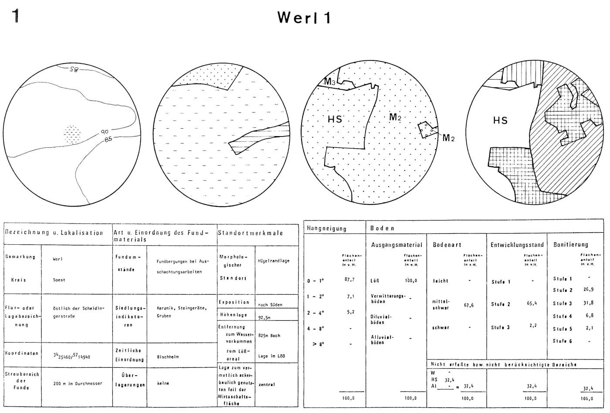

--- 
title: "GIS Einführung mit QGIS"
author: "Christoph Rinne"
date: "`r format(Sys.time(), '%d. %B %Y')`"
output:
  html_document:
    toc: true
    toc_float: true
    number_sections: true
    fig_caption: true
    df_print: paged
    css: ../styles/tutorials.css
    theme: readable
  pdf_document:
    fig_caption: true
    number_sections: true
    toc: true
    df_print: kable
  bookdown: null
license: "CC-BY 4.0"
header-includes: \renewcommand{\contentsname}{Inhalt} \renewcommand{\figurename}{Abb.}
  \renewcommand{\tablename}{Tab.}
bibliography: "QGIS-cours-references.bib"
csl: "../styles/journal-of-archaeological-science.csl"
papersize: a4
email: "crinne@ufg.uni-kiel.de"
urlcolor: blue
link-citations: true
linkcolor: blue
number_sections: true
lang: "de-DE"
description: "Gis-Kurs mit QGIS : Tutorial in Kapiteln"
---

```{r R-script-load-library-setup-connection, include=FALSE}
library(RSQLite)
t1db<-dbConnect(RSQLite::SQLite(), dbname = ":memory:")
```

# Raum & Distanz

## Einleitung

Analysen zu archäologischen Fundplätzen und ihrem Umfeld hat es auch vor der *Computer-Revolution* in der Archäologie in den 1980ern und den modernen GIS, ab den 1990ern, gegeben. Ein schönes Beispiel für klassische Techniken der Umfeldanalyse ist die Arbeit von @linkeFruhesBauerntumUnd1976. Die Ursprünge in unserem Fach liegen in der **Siedlungsarchäologie**, in der Fundstellen, das Umfeld und Informationen zur Vegetation oder dem Klima verknüpft und möglichst quantitativ in ihrer Bedingtheit analysiert werden. Hier gibt es eine umfangreiche Literatur, von der ich nur eines nennen will [@jankuhnEinfuhrungSiedlungsarchaologie1977]. Die uns heute geläufigen theoretischen Grundlagen (zum Beispiel zur Zentralität), die Methoden und auch die Technik kommen aber aus der Geographie, insbesondere der Kultur- und Sozialgeographie [@christallerZentralenOrteSuddeutschland1933; @haggettEinfuhrungKulturUnd1973]. Mit Blick auf Raum und Distanz möchte ich aus der "Findungsphase" im Fach mit Bezug auf das Thema "Raum um die Fundplätze" auf Arbeiten von Zimmermann verweisen [@zimmermannWieVieleBandkeramiker2003; @zimmermannLandschaftsarchaologieIIUberlegungen2004] und für Analysen auf der Basis der Distanz auf etwas ältere Arbeiten [@siegmundTriangulationAlsMethode1992; @zimmermannTesselierungUndTriangulation1992]. Die Verfügbarkeit von Hard- und Software hat zu einem großen Spektrum diverser Interpolationsverfahren geführt, die Punktinformationen in die Fläche übertragen. Eine gute Zusammenfassungen zu diesem Themenkomplex  finden Sie bei  @herzogSimulationsexperimenteZurSiedlungsdichte2007. Daneben gibt es zahlreiche spezielle Entwicklungen und Phasen spezifischer Fragestellungen im Fach (z.B. **Aktivitätsareale** , **Archäoprognose**, **Least cost**), auf die ich hier nur hinweisen möchte [@kunowArchaoprognoseBrandenburgII2007; @czieslaSiedlungsdynamikAufSteinzeitlichen1990; @herzogBerechnungOptimalenWegen2013]. Nach einer Etablierung der Technik  im Fach ist meiner Ansicht nach aktuell wieder eine Beschleunigung zu erkennen, die durch bessere technischen Möglichkeiten, neue Methoden der Informationsverarbeitung und mit der Programmiersprache R der Archäologie neue Perspektiven eröffnet [@nakoinzModellingHumanBehaviour2016].  Dieser extrem verkürzte Abriss zu GIS in der Archäologie blendet zahlreiche Fragestellungen und vor allem die internationale, oft englischsprachige Literatur aus. Letztere finden Sie aber mit etwas Routine und spezifischen Stichworten in den Repositorien der Fachliteratur.

## Umkreisanalyse

### Vorbemerkungen

Der Gedanke, das Umfeld einer Siedlung als Aktivitäts- und Nutzungsareal für soziale und ökonomische Bedürfnisse zu betrachten, liegt auf der Hand. Damit ergibt sich als erstes die Frage nach dem Radius um die Siedlung. Weitere Fragen ergeben sich aus dem verfügbaren Raum und den möglichen Nachbarn: Wie viel Platz habe ich eigentlich? Welche Siedlung ist gleichzeitig? Diese und weitere, eher archäologische Fragen werden bereits von Linke diskutiert [@linkeFruhesBauerntumUnd1976, 24]. Weitere Fragen ergeben sich aus der Geographie, z.B. durch Berge und Flüsse, die unsere Mobilität beeinflussen, diese beschleunigen und begrenzen können. Diese Fragen sind nicht neu und inzwischen oft behandelt worden [u.a. @herzogBerechnungOptimalenWegen2013]. Die jeweilige Antwort beeinflusst als grundlegende Entscheidung das Ergebnis der Analyse. Diese Voraussetzungen (Parameter) sollten anhand der jeweils vorliegenden Daten und der eigenen Fragestellung angemessen als auch nachvollziehbar dargelegt werden.



</br>
Um die Technik der Umkreisanalyse von Linke auf unsere Daten anzuwenden, will ich die Frage zur Lage der Talaiots im Geländerelief betrachten: ist diese exponiert, im mittleren Hangbereich oder eher in Tallage? Mein Ansatz ist der Vergleich der Höhenlage des Talaiot zum Umfeld. Dabei sind folgende Angaben zu ermitteln: 1. Die Reliefenergie im Umfeld und 2. die Lage des Talaiot zum Umfeld. Für die Frage der Kreisgröße berücksichtige ich als erstes die Auflösung unseres DGM von 200 m je Rasterzelle und entscheide mich, mangels einfach zu begründender Maße für einen Start mit r = 1 km.

### Umsetzen in QGIS

Als Daten verwende ich den originalen Rasterdatensatz des DGM 'PNOA_MDT200_ETRS89_HU31_Baleares.tif' aber mit einem auf "DGM 200" verkürztem Layaernamen und einem auf die Talaiots gefilterten Bestand aus der der Tabelle *sites* in der SpatiaLite Datenbank: ```Tipo_yacim like 'Talaiot%'```. Wie Sie das Umsetzen: 1. im QGIS Layer bei Quelle > [Abfrageerstellung], 2. in der DB-Verwaltung mit einer Abfrage und der Option "Als neuen Layer laden" oder 3. als *spatial view* in der SpatiaLite GUI, ist hier egal. Nachfolgend verwende ich Variante 2 mit dem Layernamen "Talaiots".

Die Berechnung und Darstellung des Umkreises kann 1. in QGIS erfolgen, wahlweise in eine temporäre Datei oder in eine neue shp-Datei, oder 2. in SpatiaLite. Ersteres ist schnell und einfach, letzteres kann wegen der veränderten Geometrie (Punkt zu Polygon) nicht mehr als *spatial view* in der SpatiaLite GUI ausgeführt werden, sondern führt mit ```create table <name> as select ...``` ebenfalls zu redundanten Daten. Wesentlicher Vorteil: die Erstellung ist mit der SQL-Anweisung unmissverständlich nachvollziehbar. Die Analyse ist ansonsten identisch.

#### Puffer erstellen

Im Menü von QGIS wählen Sie "Vektor -> Geometrieverarbeitungswerkzeuge -> **Puffer**" oder suchen in der *toolbox* nach 'puffer' womit Sie auch weitere Varianten finden. Wir nutzen den einfachen 'Puffer', setzen Sie hier folgende Parameter: "Eingabelayer": Talaiots, "Abstand": 1000 (Meter), belassen Sie den Rest auf den Vorgaben und erstellen einen temporären Layer. Wiederholen Sie den Vorgang, setzen Sie diesmal aber Segmente auf 100. Vergleichen Sie das Ergebnis bei einer großen Auflösung und lesen Sie dazu die Erläuterung rechts im Fenster zum Algorithmus. Starten Sie zum Vergleich auch nochmals die Funktion 'Vektoren puffern' aus der GDAL *toolbox*. Beachten Sie die ergänzenden Optionen "Nach Attribut auflösen", d.h. Überlappende Puffer werden nicht pauschal aufgelöst sondern nur bei identischem Attribut verschmolzen, und "Erzeuge Objekt ... Geometriesammlung", wodurch bei Multi-Objekten (z.B. jeden Pfosten des Objektes Haus) ein eigener Puffer gezeichnet wird. Die Segmentierung des Kreises wird hier nicht erwähnt, erfolgt aber auch. 

| Anmerkung |
|----|
| Trotz identischen Namens bieten und liefern die Tools der diversen Pakete Unterschiede. Und die angewendeten Parameter sind alle wichtig, wenn das Ergebnis nachvollziehbar bleiben soll. |
| Das Feld **"Gemometriespaltenname" wird pauschal ausgefüllt** und muss eigenständig korrekt ausgefüllt werden. |

#### Rasterstatistik je Vektor (Kreis)

Im Ergebnis haben wir viele Kreise. Suchen Sie in der *toolbox* nach '**Zonenstatistik**' (zonal stat) und starten Sie diese. Wählen Sie folgende Parameter: "Eingabelayer": der Puffer, "Rasterlayer": das Geländemodell (DGM 200 alias mdt 200), "Rasterkanal": Kanal 1, "Ausgabespaltenpräfix": s_ (die Vergabe ist frei wählbar, sollte kurz sein und nicht mit einer Zahl starten) und bei "Zu berechnende Statistken": Wählen Sie bitte alle aus, bis auf 'Summe'. Im Ergebnis haben Sie bei der Attributtabelle des Verktolayers für jede gewählte Statistik eine neue Spalte. Hier werden dann die englischen Begriffe verwendet. Die **Reliefenergie** ist per Definition die Höhendifferenz in einer Flächeneinheit, Sie ist damit unabhängig von der absoluten Höhe über dem Meer. Zu den ermittelten Werten nachfolgend eine sehr knappe Erläuterung:
  
- Anzahl / count: Anzahl der betroffenen Zellen
- Summe (abgewählt): Summe der Zellwerte
- Mittelwert / mean: der Durchschnitt der gültigen Zellwerte (Zentralwert)
- Median / median: Der Wert in der Mitte der aufsteigend sortierten Zellwerte (Zentralwert)
- Standardabweichung / stdev: Der Durchschnitt der Differenz jedes Zellwertes zum  Mittelwert aller Zellwerte (Streuungsmaß).
- Minimalwert / min: der kleinste Wert in einer Zelle
- Maximalwert / max: der größte Wert in einer Zelle
- Bereich / range: Differenz zwischen den beiden vorgenannten Min. und Max. (Streuungsmaß, die Reliefenergie nach Definition)
- Minderheit / minority: am seltensten vorkommende Wert 
- Mehrheit / majority: am häufigsten auftretende Wert
- Varietät / variety: Anzahl der unterschiedlichen, eindeutigen Werte
- Varianz / variance: das Quadrat der Standardabweichung (Durchschnitt der quadrierten Differenzen jedes Wertes zum Mittelwert, Teil der Berechnung der Standardabweichung, Streuungsmaß).

Es gibt hier zahlreiche Werte, die einen Hinweis auf die Reliefenergie geben, vor allem:
  
- Bereich: Die Differenz zwischen dem kleinsten und größten Wert, wobei ein einzelner Gipfel das Ergebnis deutlich  beeinflusst (z.B. der Kilimandscharo). In so einem Fall liegen der Mittelwert und der Median weiter auseinander.
- Standardabweichung: Gibt es viele Hügel und Täler sind viele Werte über ein breites Mittelfeld verteilt, die Standardabweichung ist demnach groß bzw. breit.
- Eindeutige Werte (variety), Vorausgesetzt wir haben Meterangaben oder sogar klassifizierte Werte in Einheiten von 5 Metern ist eine Ebene eher "langweilig", eine leicht schräge Steilwand aber hoch dramatisch. Eine hügeliges Bergvorland, mit vielen Tälern und einem konstanten Anstieg bietet auch viele Unterschiede.

Wollten wir uns einen Überblick über ein Attribut, also eine der zuvor erläuterten Zahlen, von allen Umkreisen verschaffen, können wir aus dem Menü mit "Vektor -> Analyse-Werkzeuge -> Grundstatistik .." grundlegende statistische Angaben für das jeweils gewählte Attribut abfragen. Das Ergebnis wird auf Englisch im aktiven Fenster unter dem Reiter "Protokoll" ausgegeben, dazu auf Deutsch in einer hier mit der Pfadangabe zu findenden HTML-Datei. Hier begegnen uns wie zuvor die "üblichen Verdächtigen", dazu einige weitere Angaben: 
  
- Anzahl (count): Anzahl der betroffenen Datensätze
- Eindeutige Werte (unique): Anzahl der unterschiedlichen Werte
- Fehlende Leerwerte (NULL) (empty): Anzahl von Zeilen ohne Information
- Minimalwert (min): der kleinste Wert in einer Zeile
- Maximalwert (max): der größte Wert in einer Zeile
- Bereich (range): Differenz zwischen den beiden vorgenannten Min. und Max
- Summe (sum): Summe der Werte
- Mittelwert (mean): der Durchschnitt der gültigen Werte
- Median (median): der Wert in der Mitte der aufsteigend sortierten Werte
- Standardabweichung (std_dev): der Durchschnitt der Differenz jedes Wertes zum  Mittelwert aller Werte
- Variationskoeffizient (cv): Standardabweichung dividiert durch den Mittelwert. Durch diese Normierung ist dieses Maß unabhängig von der Größe der Werte.  Ist der Wert größer als 1 ist die Streuung größer als der Mittelwert.
- Minderheit (minority): am seltensten vorkommender Wert 
- Mehrheit (majority): am häufigsten auftretender Wert 
- Erstes Viertel (firstquartile): der 25%-Grenzwert der aufsteigend sortierten Werte. - Drittes Viertel (thirdquartile): der 75%-Grenzwert der aufsteigend sortierten Werte.
- Interquartilabstand (IQR): Abstand zwischen dem 2. und dem 3. Quartil (Streuungsmaß).

#### Visualisierung & Überblick

Kartieren Sie einige der vorgenannten Werte (Bereich, Standardabweichung, Variationskoeffizient und Interquartilabstand). Für die Werte von "Bereich" (range) wähle ich die Farbskala "Spectral" und fünf Klassen mit "Gleiche Anzahl (Quantile)". Es verwundert nicht, dass die sehr hohen Werte in der Tramuntana zu finden sind und die niedrigen Werte in den zentralen Ebenen von Mallorca. 

Der Wechsel auf die Werte der Standardabweichung (stdev) bei Beibehaltung der grafischen Parameter verändert das Bild nur ein wenig, am ehesten noch im mittleren Höhenbereich. Das Problem sind die Klassengrenzen. Betrachten Sie die Histogramme für beide Attribute und verschieben Sie die Grenzwerte nach ihrer Interpretation der "Gipfel" und "Täler" in der Verteilung. Mit Blick auf die vorangehende Erläuterung scheint Folgendes sichtbar: einzelne Gipfel verzerren das Bild. Aus diesem Grund tendiere ich zur Standardabweichung als Indikator einer allgemeine Reliefenergie, die allgemein übliche Maximaldifferenz scheint mir für unsere Frage weniger geeignet. 

### Exponiert oder im Tal?

Ich vergleiche als erstes den Höhenwert der Position des Taliot mit dem Median des Umfeldes (z_m - s_median) und erstelle hierfür mit dem Feldrechner eine neue Spalte (Abakus-Icon). Auch für diesen Wert erstelle ich eine abgestufte Symbologie mit fünf Klassen, kontrolliere direkt das Histogramm und verschiebe die Grenzwerte entsprechend den erkennbaren Abschnitten der Verteilung. Die daraus resultierende Karte zeigt keine räumliche Differenzierung, lediglich die Talaiots im Mittelfeld (+/- 6 m zum Median) liegen sicher aufgrund der fehlenden Reliefenergie in den Ebenen.

  

</br>
Als nächstes möchte ich die Höhenlage des Talaiot mit dem oberen Bereich der umliegenden Höhenwerte vergleichen. Eigentlich würde ich gerne das 3. Quartil (75%) als Schwellwert nehmen, aber der wird mir von der Zonenstatistik leider nicht geboten. Wir sollten also einen Weg finden, ohne das *tool* Zonenstatistik rechnen zu können. Ich helfe mir, indem ich die Standardabweichung zum Mittelwert als dem zugehörigen Zentralwert addiere (mean + stdev) und diese Summe dann vom Höhenwert des Talaiot abziehe (z_m - (mean + stdev)). Auch hier wähle ich zur Darstellung in der Karte eine abgestufte Symbologie mit fünf Klassen, die ich mir im Histogramm direkt ansehe und die Grenzen entsprechend der sichtbaren Verteilung anpasse. Im Ergebnis sehe ich in der Karte ein breit gestreutes Mittelfeld und die "niedrigen", versteckten Lagen finden sich aufgrund der Topographie natürlich in der Tramuntana. Eher unerwartet ist die recht gleichmäßige Verteilung der exponierten Talaiots, die oberhalb der oberen Standardabweichung liegen. Hier sollten wir zuerst das statistische Ergebnis zur Lage im Gelände individuell prüfen (so viele sind es nicht) und uns dann die weiteren Eigenschaften dieser Talaiots ansehen. Liegen hier besonders monumentale Konstruktionen vor, die eine Deutung als Standorte von zentraler Bedeutung bestärken?
  


</br>
Die Puffer und unsere Berechnungen sind temporäre Layer, sie werden nicht für uns gespeichert und müssen als weitgehend redundante  Daten getrennt gesichert werden.

### Puffer in DB-Verwaltung

In der DB-Verwaltung habe ich nur die vollständige Liste aller *sites*, diese kann ich filtern (*where*) und für die verbleibenden Punkte dann mit der Funktion st_buffer() einen Umkreis generieren. Dies führen Sie mit der folgen Abfrage aus und können a) das Ergebnis "Als neuen Layer laden" und dem aktuellen Projekt hinzufügen oder b) erst als *view* speichern, indem Sie die "--" in der ersten Zeile entfernen und dann einfach den Inhalt der *view* abfragen (```select * from talaiots_1km```) und dann "Als neuen Layer laden" ausführen. Danach können Sie hierzu erneut die Zonenstatistik ausführen, die aber leider erneut einen temporären Layer erzeugt. 

```{sql 'create view statement', eval=FALSE, message=FALSE, connection=t1db, include=TRUE}
-- create view talaiots_1km as
SELECT t.ogc_fid, t.nr, t.nombre_yac, t.z_m,
 ST_Buffer(t.geometry, 1000) as geom
from sites as t where t.Tipo_yacim like 'Talaiot%';
```

| Anmerkungen |
|----|
| Bei mir blieb bisher einmalig das [Laden] von "Als neuen Layer laden" ohne Reaktion. Der Neustart der DB-Verwaltung hat dieses Problem behoben. |
| Die von @linkeFruhesBauerntumUnd1976 behandelte Frage nach den Standortfaktoren könnte mit dem Werkzeug "Zonenhistogramm" beantwortet werden. Dieses zählt die Häufigkeit der in einem Polygon Vorhandenen, eindeutigen Werte eines Rasters. Beachten Sie, dass nur ein Band verarbeitet wird. Eine sichtbare Zelle mit drei Kanälen RGB: 10,255,40 (ein leuchtendes Grün), kann also nicht gezählt werden, wohl aber eine alternative, nominale Zahlenkodierung (1 = Wiese). Beachten Sie hierzu die komplexen Optionen des GDAL Rasterrechners für eine neue Kodierung in ein Band. |

## Thiessen-Polygon, Voronoi-Diagram und Interpolation

Thiessen-Polygone (alternativ Delaunay-Triangulation) sind eine Dreiecksvermaschung, bei der innerhalb des Umkreises zum gebildeten Dreieck kein weiterer Punkt liegt. Die Fundplätze bilden die Knoten (Punkte) der Kanten (Linien). Um die Fundplätze in das Zentrum einer Fläche zu bringen und so die Informationen des Punktes in die umliegende Fläche zu übertragen, wird auf jeder Kante die Mittelsenkrechte gebildet und bis zum Schnittpunkt mit einer anderen Mitttelsenkrechten verlängert. Es entsteht ein dualer Graph, der durch erneutes Bilden der Mittelsenkrechten wieder zum Ausgangsmodell führt.

Bei diesem Verfahren gibt es methodische Probleme, zu denen noch spezifische der Archäologie zu ergänzen sind. Das grundlegende archäologische Problem gleich vorweg: Im Unterschied zu strategisch verteilten (Zufall, Raster etc) und erhobenen Messwerten in der Geographie sind archäologische Nachweiskarten durch viele Faktoren beeinflusst: Aktivität von Ehrenamtlichen, Erhaltung, Vegetation, Landschaftsnutzung etc. Wir müssen also mit dem Fehlen relevanter Informationen rechnen.

Ein methodisches Problem der Triangulation ist der Randeffekt des Netzes. Da hier die jeweiligen Nachbarn fehlen, werden besonders lange Strecken gebildet. Auch ignoriert die geradlinige Verbindung zwischen den Punkten weitere beeinflussende Faktoren der unterstellten räumlichen Nähe: Gebirgszüge, Steilhänge, Flüsse etc. Wird in dem abgeleitete Voronoi-Diagram mit dem Punkt im Zentrum  die Information unverändert vom Punkt auf die Fläche übertragen, entstehen an den Grenzen zu den benachbarten Feldern Sprünge in den Information statt fließender Übergänge. Aufgrund dieser Nachteile sind zahlreiche weitere Interpolationsverfahren entwickelt worden. Ein weit verbreitetes ist das *inverse distance weighting* (**IDW**). Die hierbei gewählte Gewichtung muss angemessen sein und kann durch eine Potenz variiert werden. Das in der Geographie ebenfalls gerne genutzte *kriging*  bietet noch mehr Justierungsmöglichkeiten, wodurch sich z.B. bei Höhenmodellen sehr gute Approximationen an die Wirklichkeit erzielen lassen. Diese letztgenannten Berechnungen werden nicht nur rechnerisch komplexer, sondern vor allem im Rahmen einer auf archäologischen Argumenten beruhenden Modellbildung schwieriger begründbar. Für die Anwendung in der Archäologie lesen Sie hierzu zum Einstieg bitte [@herzogSimulationsexperimenteZurSiedlungsdichte2007]. Eine jüngere Darstellung mit komplexen, interdisziplinär ausgearbeiteten und begründeten Modellierungen von Informationen in die Fläche finden Sie u.a. bei Daniel Knitter [@nakoinzRegressionInterpolation2016; @knitterLandUsePatterns2019].

## Thiessen-Polygone und triangulierte Distanzen

### Vorgehen in QGIS

Wie zu Beginn dieses Kapitels erwähnt sind die triangulierte Distanzen ein schlichtes aber durchaus interessantes Maß [@siegmundTriangulationAlsMethode1992; @zimmermannTesselierungUndTriangulation1992]. Wir können dies bei unserem vorliegenden Datensatz zu den Talaiots einmal durchspielen. Dabei haben wir aus der archäologischen Perspektive bestimmte Vorteile. Durch die klare Begrenzung des Untersuchungsgebietes als Insel sind Kanteneffekte zwar zu erwarten, entsprechen aber der unabdingbaren Realität auch wenn die "Wege" an einige Stellen über das Wasser führen. Der monumentale Charakter und der relativ späte Landesausbau mit dem vorhandenen Bewusstsein für diesen Denkmaltyp hat zu einer erwartbar guten Kenntnis (nicht zwingend Erhaltung) geführt. Wir können zudem mehrstufig Arbeiten und die gesamte Insel mit den Landschaftsgebieten (*comarcas*) oder der zuvor herausgestellten Lage vergleichen.

Der Weg ist mehrstufig. Wenn Sie ausschließlich in QGIS arbeiten wollen, müssen Sie folgende Schritte durchlaufen:
  
  1. Suchen Sie in der *tool box* die "Delaunay-Triangulation", der Eingabelayer ist "talaiots" und speichern Sie auch zukünftig das jeweilige Ergebnis temporär. Anmerkung: Alternative Funktion v.delaunay der Grass-Erweiterung.
2. Polygone zu Linien: Im Ergebnis haben Sie eine Polylinie um jedes Dreieck.
3. Linien sprengen: Im Ergebnis haben Sie einzelne Linien. Fast jede Linie im Netz ist aber doppelt vorhanden, für jedes angrenzende Dreieck einmal.
4. Doppelte Geometrien löschen: Sie erhalten alle Distanzen einmalig.
5. Ergänzen Sie mit dem Feldrechner eine Spalte für die Linienlänge ($length).
6. Exportieren Sie alle Längenmaße für eine statistische Analyse, z.B. in R. 

Für eine erste Übersicht zu den eben ermittelten Streckenlängen öffnen Sie die Symbologie, wählen die abgestufte Darstellung, "gleiche Anzahl (Quantile)", Klassen: 5 und bestätigen mit [Klassifizieren]. Für eine Farbzuweisung der Bereiche, wechseln zum Reiter "Histogramm" und wählen abschließend [Werte laden]. Mit der Zahl hinter "Histogrammkästchen" können Sie die Anzahl der Balken für eine feinere Auflösung erhöhen. Einige Längen des Randbereiches sind sehr groß und beeinträchtigen die Darstellung. Wenn Sie nur den unteren Bereich der Längen darstellen wollen wählen sie bei "Wert" das [E] und fügen dort folgende Syntax ein: ```if ("l"<20000, "l", '')``` (Wenn die Länge < 20 km ist dann gib die Länge zurück, sonst Nichts). Wiederholen Sie [Klassifizieren] und betrachten erneut das Histogramm nach [Werte laden].

Wir sehen einen ersten Gipfel der Verteilung um 1,5 km, einen zweiten um 3 km und dann noch Bereiche von 4 km bis 8 km und um 10 km. Danach löst sich die Verteilung langsam auf. Wirklich Plakativ ist das Ergebnis nicht, doch die Dopplung von 1,5 km zu 3 km ist auffällig und alles jenseits von 11 km scheint eine "besonders" große Distanz zu sein. Sehen Sie sich die Distanze in der Karte an scheinen die beiden kurzen Distanzbereiche um 1,5 km und um 3 km jeweils eine Gruppe zu beschreiben. Die Distanzen von 4 bis 8 km trennen die Talaiots dieser Gruppen von den Talaiots in den anderen Gruppen. An diesem Punkt könnten diverse Hypothese formuliert und geprüft werden. Als erstes natürlich, ob es neben der räumlichen Nähe innerhalb der Distanzgruppen auch einen weiteren Zusammenhang gibt: Datierung, Funde, Konstruktion etc. Auch eine Sichtbarkeitsanalyse bietet sich hier an [@marxGeospatialAnalysisPrehistoric2012].

### Vorgehen in DB-Verwaltung

Mit SQL wird der Weg wegen der komplexen Syntax in zwei Schritten durchgeführt. Nutzen Sie die SpatiaLite GUI und führen Sie folgende SQL-Anweisung aus:
  
```{sql 'Delaunay-Triangulation in DB-Verwaltung', eval=FALSE, message=FALSE, connection=t1db, include=TRUE}
-- create table talaiot_dist as
select st_DelaunayTriangulation(st_collect(geometry),1) as geometry
from sites where Tipo_yacim like 'Talaiot%';
```

Die Rückgabe der Abfrage ist eine Tabelle mit einem Objekt vom Typ *Multilinestring*. Die verwendete Funktion *ST_DelaunayTriangulation()* erwartet **ein** Geometrieobjekt, dieses wird mit der Funktion *ST_Collect()* aus allen Geometrien in der Spalte 'geometrie' aus der gefilterten Tabelle der Fundplätze ('sites') erstellt. Die Funktion ST_DelaunayTriangulation gibt mit der Option *edges_only* die Kanten statt der Polygone aus. Die Übergabe dieses Parameters erfolgt durch 0 (falsch) oder 1 (wahr). Sie können diesen Layer wie gehabt im Projekt darstellen, aber es ist nur ein Objekt mit nur einer Gesamtlänge. 

Wir könnten in QGIS mit der Funktion "Mehr- zu einteilig" dieses Multi-Objekt zerlegen und nachfolgend die Länger ('$length') der einzelnen Kanten bestimmen. 

Die zweite Möglichkeit ist, die Abfrage in eine neue Tabelle zu schreiben, enfernen Sie dazu in der vorangehenden SQL-Anweisung die "--" und dann die elementaren Geometrien dieser Tabelle abzufragen (vgl. [www.gaia-gis.it](https://www.gaia-gis.it/fossil/libspatialite/wiki?name=VirtualElementary)). Allerdings müsste dazu die Geometriespalte im System als Geometrie registriert werden. Das ist nicht schwierig, aber der Prozess führt dann insgesamt wieder zu redundanten Daten in der Datenbank.

Die dritte Option ist etwas komplexer, kommt aber vollständig ohne redundante Daten aus. Mit Rekursion werden die einzelnen Elemente nacheinander abgefragt. Das ist auf den ersten Blick irritierend aber nicht wirklich kompliziert. Zuerts eine Abfrage für die Anzahl der Strecken in der Multi-Geometrie.

```{sql 'Anzahl der Elemente in der *GeomCollection* abfragen.', eval=FALSE, message=FALSE, connection=t1db, include=TRUE}
select NumGeometries(st_DelaunayTriangulation(st_collect(geometry),1))
  from sites where Tipo_yacim like 'Talaiot%'
```

Jetzt eine weitere Abfrage zur Erläuterung des Zählers mit Rekursion in SQL. Diese Abfrage besteht aus zwei Teilen, die mit dem einleitenden *with recursive* zusammengefasst werden. Die erste Zeile definiert eine Funktion cnt() auf ein Element x. Diese Funktion wählt '1' als Startwert und wiederholt mit *UNION ALL* so lange die Addition von 1 zum aktuellen x, bis das gesetzte Limit erreicht wird. Die zweite Zeile ruft mit der Auswahl von x dann diese Funktion auf und liefert nacheinander die Zahlen.   

```{sql 'Einfache Rekursion für das Erstellen eines Zählers.', tab.cap = 'Rekursion mit Zähler.', connection = t1db, include=TRUE}
with recursive 
cnt(x) as (select 1 union all select x + 1 from cnt limit 3)
select x as id, cast ((x - 1) as text) || ' + 1' as 'rekursive Addition' from cnt;
```

Die nachfolgende Abfrage verwendet beide vorangehenden Elemente und ergänzt nur noch die Abfrage der elementaren Geometrien und deren Länge aus dem Multiobjekt der berechneten Triangulationen. Die detailierte Erläuterung folgt.

```{sql 'ReKursion für einen Zähler und Abfrage der Länge des jeweiligen Elementes.', eval=FALSE, message=FALSE, connection=t1db, include=TRUE}
-- create view talaiot_distances as
WITH RECURSIVE
cnt(x) AS (
  SELECT 1 -- erster Eintrag für x ('1') und Startwert des Zählers
  UNION ALL -- verbinde alles nachfolgende
  SELECT x+1 FROM cnt -- nimm das aktuelle x (= 1) und addiere 1
  LIMIT (select NumGeometries(st_DelaunayTriangulation(st_collect(geometry),1))
								   from sites where Tipo_yacim like 'Talaiot%')
)
SELECT x as id, st_length(GeometryN(t.geometry, x)) as dist, 
       GeometryN(t.geometry, x) as geometry 
  FROM cnt,
      (select st_DelaunayTriangulation(st_collect(geometry),1) as geometry 
	                    from sites where Tipo_yacim like 'Talaiot%') as t;
```

Das Limit wird im Vorangehnden nicht dezidiert benannt, sondern mit einer Unterabfrage und der Funktion *NumGeometries()* aus der Triangulation abgefragt. Das zweite Element ist eine schlichte Abfrage über das Element x der Zählreihe und die Länge (*st_length()*) für jede ebenfalls ausgewählte elementare Geometrie an Position x  (*GeometryN()*) des *Multilinestring*.  Nach dem *from* folgt wie üblich die Quelle für die abgefragten Werte, also der Zähler cnt und die Abfrage zur Erstellung der Triangulation etikettiert mit 't'.

### Deutung des Ergebnnisses

```{R include=FALSE}
dist<-c(41352, 14586, 16399, 16588, 20102, 3555, 63906, 39984, 15652, 1211, 1388, 1414, 177, 1507, 1133, 2029, 7534, 9479, 23142, 32011, 4775, 36646, 4840, 4120, 2700, 1715, 1210, 13519, 13189, 9833, 9207, 6280, 8860, 10465, 12752, 7392, 3272, 6622, 262, 6520, 632, 6321, 291, 6311, 9272, 9748, 538, 10204, 2843, 12703, 4565, 1796, 3461, 2728, 2797, 5279, 7192, 10383, 15857, 4295, 3119, 3666, 1281, 2147, 2658, 1570, 4220, 36006, 39529, 25492, 15657, 10280, 5918, 7031, 4943, 10154, 30179, 17065, 13353, 3720, 11239, 3835, 9446, 8588, 2360, 3314, 4654, 2248, 6754, 9171, 7765, 1726, 829, 851, 1788, 2851, 2663, 3022, 4404, 3300, 3626, 2513, 522, 2532, 4252, 4341, 19411, 8548, 14284, 4703, 12520, 9635, 5142, 843, 4409, 3286, 1281, 488, 1595, 2606, 3518, 1323, 1091, 659, 4019, 961, 4278, 2990, 5978, 3973, 6725, 4765, 5760, 4918, 8307, 7940, 6587, 8467, 7648, 1252, 8154, 4615, 4411, 5500, 4104, 4086, 891, 664, 385, 484, 7774, 7566, 4420, 2863, 1749, 1910, 1360, 1702, 2830, 2863, 3618, 3231, 1464, 2863, 3476, 1845, 4246, 6046, 5371, 390, 1217, 1577, 444, 1994, 10461, 8818, 5185, 8668, 15709, 9693, 21714, 17117, 14993, 2236, 657, 2798, 6247, 5360, 6909, 10895, 5702, 7492, 9708, 10725, 9794, 5563, 1201, 16120, 13456, 13150, 6976, 10394, 8997, 8193, 3776, 1503, 3069, 2314, 7563, 2589, 7120, 3788, 7466, 7736, 6537, 6166, 4782, 1963, 491, 5091, 5068, 4921, 2425, 682, 1902, 1330, 1677, 1746, 1426, 1883, 2890, 3043, 4154, 4531, 2292, 2464, 1891, 8023, 3982, 8591, 8881, 6476, 5210, 4007, 3794, 354, 4840, 3164, 7282, 7729, 9181, 4917, 7022, 4893, 8480, 6483, 5480, 6507, 6524, 1150, 1558, 1261, 1916, 1724, 885, 2823, 2760, 2960, 1820, 1544, 398, 1261, 771, 1091, 1000, 158, 901, 2531, 2314, 1705, 1714, 1511, 3301, 1253, 2990, 6158, 6922, 6482, 5592, 6973, 4718, 7749, 4074, 5752, 6622, 1886, 7213, 8726, 9984, 4452, 3080, 1628, 1871, 3742, 3122, 2390, 963, 2906, 793, 3197, 9626, 9217, 10980, 2427, 1541, 2588, 2179, 460, 2085, 1972, 2434, 2956, 1216, 1589, 2013, 2261, 451, 5986, 5986, 6168, 5434, 6262, 3723, 7012, 13473, 13865, 10396, 9361, 1603, 803, 2400, 13384, 12950, 11460, 2581, 6906, 6407, 9436, 9517, 5947, 7560, 2957, 6926, 4013, 3226, 5236, 5494, 7034, 3446, 3633, 3851, 5569, 6407, 6855, 7499, 7257, 6450, 6240, 1855, 5934, 2786, 4596, 3392, 3169, 707, 2786, 5330, 5200, 3344, 5658, 2757, 5187, 6524, 5911, 2460, 3776, 3677, 211, 2458, 2621, 5283, 4208, 840, 5440, 5871, 6673, 6154, 2234, 1151, 1162, 1931, 1565, 5508, 738, 2269, 269, 2350, 1039, 3189, 4466, 3732, 2734, 4059, 10311, 10045, 2445, 9202, 8801, 954, 1273, 1486, 1520, 10237, 10364, 7728, 7050, 1704, 1106, 1032, 2842, 1162, 1272, 873, 1436, 6972, 4621, 10610, 7422, 10132, 10322, 9020, 7142, 2764, 637, 2227, 4645, 3790, 9418, 7008, 9380, 7424, 4584, 1722, 3018, 1718, 5714, 4817, 3204, 5728, 6759, 4395, 4373, 1118, 3816, 711, 3972, 6080, 4074, 5168, 2398, 3259, 2959, 891, 1115, 1938, 1350, 3250, 3154, 3118, 955, 2745, 1632, 2830, 2740, 2623, 559, 1769, 7404, 7564, 303, 8915, 4829, 1347, 2181, 1230, 1605, 3057, 4334, 5344, 2026, 4792, 1562, 4301, 1443, 4828, 572, 5153, 5806, 7086, 6783, 5940, 4812, 939, 1948, 1161, 1097, 206, 4313)
```

```{R 'Histogram of the triangulated length', fig.height = 4, echo=TRUE}
hist((dist/1000)[dist<25000], breaks=seq(0,25,0.5), 
     main='Triangulierte Distanzen', xlab = 'Distanz (km)', ylab = 'Häufigkeit') 
```

Der vorangehende Code rechnet die Meter-Distanzen in Kilometer um (l/1000), zuvor wird auf Distanzen unter 25000 m gefiltert ([dist<25000]). Die Schrittweite (*breaks*) wird als Sequenz (seq()) von 0 bis 25 km mit Intervallen von 0,5 km festgelegt.  Abschließend werden noch der Titel und die Beschriftungen der x- und y-Achse hinzugefügt. Vergrößern wir das Intervall auf 1 km entfällt die visuelle Trennung zwischen 1,5 km und 3 km und es bleibt ein leichter Absatzt im Verlauf mit geringer Häufung von Distanzen bei 5 km. Es folgen unscharfe Häufungen bei den Vielfachen von 5 km. 
Das Histogramm weist auf Agglomerationen von Talaiots in einem Abstand von bis zu 3 km hin, diese könnten sich dann in Abständen von ca. 5 km wiederholen. Dazwischen klaffen aber auch Lücken, die wegen des Vielfachen von 5 km möglicherweise durch fehlende Gruppen verursacht worden sein könnten. Letzteres ist lediglich aus der Wiederholung der Distanz abgeleitet und kann auch andere Gründe haben.  

# Literatur