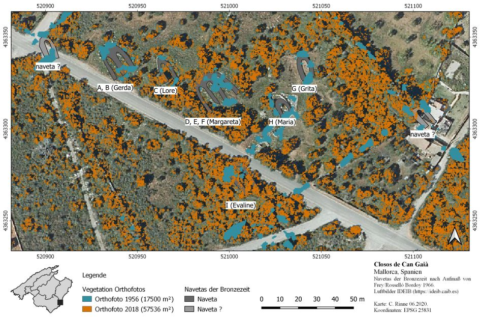

--- 
title: "GIS Einführung mit QGIS"
author: "Christoph Rinne"
email: crinne@ufg.uni-kiel.de
date: "`r format(Sys.time(), '%d. %B %Y')`"
license: "CC-BY 4.0"
header-includes: 
  \renewcommand{\contentsname}{Inhalt} 
  \renewcommand{\figurename}{Abb.}
  \renewcommand{\tablename}{Tab.}
bibliography: QGIS-cours-references.bib
csl: journal-of-archaeological-science.csl
output:
  pdf_document:
    fig_caption: yes
    number_sections: yes
    toc: yes
    df_print: kable
urlcolor: blue
link-citations: yes # make citations hyperlinks
linkcolor: blue
number_sections: yes
lang: de-DE
description: 'Gis-Kurs mit QGIS : Tutorial in Kapiteln'
---

# Karte erstellen

## Einleitung

Neben der Analyse sind Karten ein ganz wesentliches Element der Arbeit mit einem GIS und grundlegend für die Darstellung von Sachverhalten oder die Vermittlung unserer Ergebnisse. Dabei kommen vier wichtige Aspekte mit sehr unterschiedlichen Anforderungen zum Tragen: 

1. Unser fachlicher Anspruch, 
2. die kartografischen Standards, 
3. der grafische als auch ästhetische Anspruch und 
4. die redaktionellen Vorgaben. 

Gute Karten sind eine zeitintensive Herausforderung.  

### Fallbeispiel

Als Fallbeispiel wähle ich nachfolgend den Fundplatz von Closos de Can Gaiá bei Portocolom auf Mallorca (39.4191°N, 3.2443°E). Ein erstes Aufmaß erfolgte durch ein Grabungsteam der Uni Marburg neben deren eigentlichen Arbeiten in der Siedlung von S'Illot (@freyNavetasEsClosos1966a). Die damalige Vermessung wurde durch den Neubau der Straße und den weiteren Landesausbau notwendig, dem bereits ein Teil des Fundplatzes zum Opfer gefallen war. Neben den damals erkannten Baustrukturen ist nach dem Luftbild von 1956 mindestens eine weitere Naveta auf der Straßenkreuzung wahrscheinlich (Hinweis B. Salvà). Der Fundplatz ist heute mit Informationstafeln touristisch erschlossen und kann frei begangen werden. 

Die Daten für diese Übung liegen vor:

- @freyNavetasEsClosos1966a, Abb. 7 (georeferenziert anhand der Luftbilder und in Umrissen digitalisiert),
- das Orthofoto von 2018: https://ideib.caib.es/geoserveis/rest/services/imatges/GOIB_Ortofoto_2018_IB/MapServer/WMTS,
- die im vorangehenden Kapitel erstellten Vegationskarten und
- die Comarcas der früheren Übung als Umrisskarte für eine  kleine Übersichtskarte.

### Ziel der Darstellung

Meine Karte soll den Funplatz und seine Denkmalgeschichte einführen. Ich möchte dafür sowohl die 1966 publizierten Navetas als auch die natürlichen Veränderungen in der Vegetation seit dieser Zeit darstellen. Als Kartengrundlage wähle ich das aktuelle Luftbild, überlager es mit den nachgezeichneten und beschrifteten Navetas und ergänze die Vegetationsraster des vorangehenden Kapitels.

## Karte erstellen

Für ein Projekt können viele Layouts in unterschiedlichen Formaten entworfen und  mit den jeweils sichtbaren Layern "eingefroren" werden. Es ist also möglich, diverse Arbeitsstände in einem Projekt als Abbildung vorzuhalten. Die Verwaltung und Erstellung erfolgt über "Projekt -> Layout Verwaltung". Hier können Sie mit  "Leere Vorlage" ein neues Layout erzeugen. Ich nenne meine Vorlage 'Vegetation-DinA4R'  

### Vorbereitung

Für die Darstellung der Navetas wähle ich eine kategorisierte Farbgebung nach dem Feld tipo, um nach den sicheren (dunkelgrau) und nur vermuteten (hellgrau) Navetas zu differenzieren. Die **Beschriftung  der Navetas** richtet sich nach der Namengebung von 1966. Da in diesem Plan nicht alle Strukturen beschriftet sind, wähle ich für den **Wert** nicht ein einzelnes Feld aus, z.B. "Name", sondern eine *if*-Bedingungen:

```
if ("Name" is  not null, "Name", "tipo")
```

Damit wird der Name angezeigt, sofern einer vorliegt, ansonsten der Typ. Der schwarze Text ist auf dem bunten Hintergrund kaum lesbar. Ich wähle deshalb als **Hintergrund** ein weißes Rechteck. Alternativ kann auch ein Puffer gewählt werden. Da dieser in früheren Versionen in einem resultierenden PDF in einer rechenintensive Konturlinie resultierte, verwende ich diese Option ungern.

Die Position der Schrift in der Mitte der Naveta stört mit sehr, dies können wir im Unterpunkt *Platzierung* ändern. Ich wechsele von "Um Zentrum" zu "Abstand vom Zentrum". Die Zuweisung der Position nach Quadranten um das Zentrum reicht nicht, deshalb wähle ich den "X, Y Versatz". Eine feste Größe von 12 m  für y wird den sehr unterschiedlichen Größen der Navetas nicht gerecht. Aus diesem Grund wähle ich auch hier mit dem **E** am rechten Rand eine Bedingung, die ich "Bearbeite" und komme so zum **Ausdruckseditor**.

```
concat('0,',bounds_height($geometry)*0.8)
```

Das erwartete Format ist eine Zeichnekette mit zwei durch ein Komma getrennten Distanzwerte für x und y (x.x, y.y). Ich starte mit dem zweiten, dem y-Wert: Dieser soll abhängig von der Geometriehöhe sein (*bounds_height(\$geometry)*), die halbe Höhe (y-Achse) reicht aber nicht, deshalb  wähle ich 80% der Höhe. Eine Verschiebung auf x ist nicht nötig, also '0, ' und beide Ausdrücke werden mit *concat()* zu einer Zeichenkette verbunden.

### Elemente der Karte

Die Gestaltung des Layout erfolgt in einem neuen Fenster mit umfangreichen Icon-Leisten (abhängig von den Einstellungen unter "Ansicht"), einem leeren Blatt im größten Teil des Fensters und den Eigenschaften des aktiven Elementes am rechten Rand. Um die Papiergröße und -ausrichtung nachträglich zu verändern müssen Sie 1. im Kontextmenü zum Papier die **Seiteneigenschaften** wählen, die Sie dann 2. rechts auf dem Reiter zu den Elementeigenschaften anpassen können. "Layout -> Seiteneinstellungen" hat an dieser Stelle keine Auswirkung. Elemente im Layout werden rechts oben unter dem Register **Elemente** aufgeführt und können hier u.a. umbenannt werden. Dies ist bei vielen Elementen und Detailkarten sehr hilfreich.

Wechseln Sie rechts auf den Reiter **Führungen** und ergänzen Sie als erstes horizontale Führungen bei 20 mm, 160 mm und 190 mm sowie vertikale Führungen bei 20 mm und 277 mm.

### Karte hinzufügen

Unter dem Menüpunkt "Element hinzufügen (a)" können Sie eine "Karte hinzufügen" auswählen und mit der Maus  aufziehen (Icon: Papierrolle mit grünem Plus). Ist diese Karte markiert, können Sie rechts im Fenster unter dem Reiter **Elementeigenschaften** alle Eigenschaften verändern:  

Setzen Sie unter **Haupteigenschaften** den Maßstab auf 1000. Unter **Layer** folgt die Option, die dargestellten Layer und auch die Layerstile zu sperren. Wenn alle Layer wie gewünscht angezeigt werden, sperren Sie beide Optionen: Layer und Stile. In der Folge werden Änderungen im Projekt im Layout dieser Karte nicht wirksam. Die **Ausdehnung** der Karte mit Zahlen zu beschreiben, ist mühevoll, verwenden Sie dazu lieber "Bearbeiten -> Inhalt verschieben" (Icon: Papierrolle mit blauen Pfeilen).  Ist dieses Icon aktiv, kann der Karteninhalt verschoben werden. Wählen Sie das Icon mit dem Mauszeiger, um erneut andere Elemente auszuwählen.

Sie können für eine Karte mehrere **Gitter** definieren. Fügen Sie mit dem grünen Plus ein neues Gitter hinzu (Gitter 1). Mit einem Doppelklick auf den Namen können Sie diesen auch ändern. Wählen Sie [Gitter ändern]. Es folgen Unterbereiche zu: Erscheinungsbild, Rahmen und Koordinaten zeichnen. Für **Erscheinungsbild** setzen Sie als erstes das Intervall für x und y auf '50'. Probieren Sie nachfolgend die Optionen unter "Gittertyp" und treffen Sie eine Entscheidung. Ich selbst verwende bisweilen "Kreuz", reduziere aber die Kreuzgröße und Linienstärke in den folgenden Feldern.  Oft verwende ich aber nur den  unsichtbaren Rahmen und die Beschriftung (mit Koordinaten). Der **Rahmen** ist ein wichtiges Element, beschriftet informiert er über Maßstab und absolute Lage der Karte. Breite schwarze Ränder erinnern an Trauerkarten und liefern sonst aber keine Information. Ich wähle "Äußere Markierungen", Rahmengröße: 1 mm und Rahmenlinienstärke: 0,12 mm. Ich aktiviere **Koordinaten zeichnen**, setze links und rechts auf "Vertikal aufsteigend" und die Koordinatengenauigkeit auf "0" Nachkommastellen. Anmerkung: Die Karte ragt nun über die Führungslinien hinaus und muss angepasst werden. Achten Sie dabei auf den Maßstab! Wechseln Sie mit dem Pfeilsymbol nach links am oberen Rand dieses Bereiches wieder in die übergeordnete Instanz der Elementeigenschaften.

Abschließend aktivieren Sie die Option **Rahmen**, reduzieren aber die Dicke auf 0,15 mm. Wählen Sie Ihren Kartenausschnitt nach dem Inhalt aber auch nach den Koordinaten, diese sollten nicht über den Rand hinauslaufen, sondern sich harmonisch um die Karte verteilen. Arbeiten Sie ggf. mit einem Versatz der Gitterintervalle.

Sperren Sie nun Layer und Stile dieser Karte.



### Übersichtskarte hinzufügen

Zuerst wechseln ich in das Projekt, blenden die zuvor dargestellten Layer zum Fundplatz "Closos de Can Gaià" aus und nur den Layer "comarcas" als grau gefüllte Polygone für die Darstellung der Insel ein.  Im Layout füge ich eine neue, deutlich kleinere Karte als Übersichtskarte links unten hinzu. Den Maßstab setzen ich auf "3000000", so dass die gesamte Insel Sichtbar ist. Da es sich für mich um ein grafisches Element handelt verzichte ich auf einen Koordinatenrahmen. Dieses Element ist automatisch als "Karte 2" bezeichnet worden.

Bei den Elementeigenschaften ergänze ich unter **Übersichten** eine neue Übersicht, wähle unter Kartenrahmen: Karte 1 (meine erste große Karte) und sehe vorerst nichts wegen der großen Maßstabsdifferenz und dem aktuellen Rahmenstil. Klicken Sie auf das Farbfeld für den Rahmenstil, Sie erkennen das übliche Layout der Symbologie. Markieren Sie das Unterelement "Einfache Füllung". Wählen Sie unterhalb für Füllfarbe und Strichfarbe: Schwarz, Strichbreite: 3 mm, Strichstil: Durchgezogene Linie und Verbindungsstil: Eckig. Mit dem blauen Pfeil nach links am oberen Rand dieser Elementeigenschaften verlassen Sie die Symboleigenschaft. Sperren Sie auch hier Layer und Stile.

### Legende hinzufügen

Markieren Sie die Karte 1 und wählen Sie nachfolgend "Elemente hinzufügen (a) -> Legende hinzufügen). Ziehen Sie die Legende im mittleren Bereich des Layouts auf. Auch für dieses Element können Sie rechts unten die Parameter editieren. 

Die **Legendenelemente** werden *a priori* automatisch verwaltet und entsprechen den aktiven Layern des Projektes. Deaktivieren Sie diese Option und Sie können nachfolgend die Einträge editieren, entfernen oder ergänzen. In unserem Fall sieht der doppelte Eintrag zu der ermittelten Vegetation unschön aus. Editieren Sie den ersten Legendeneinrag zu "Vegetation der Orthofotos", ändern den zugehörigen Unterpunkt von "1" zu "Orthofoto 1956". Für den zweiten Legendeneintrag öffnen Sie das Kontextmenü und wählen dort "verstecken", den zugehörigen Unterpunkt ändern Sie analog zum Vorangehenden von "1" zu "Orthofoto 2018". Ergänzen Sie noch die Werte für die ermittelten Vegetationsflächen bei dem jeweiligen Layer (1956: 17500 m², 2018: 57536 m²). 

Ändern Sie für die Legende bitte noch folgende Parameter: Schriftarten: alle 10 pt, Spalten: 2, Symbol: Größe 5 mm x 3 mm, Zwischenräume: Spaltenabstand auf 6 mm.

### Grafische Elemente

Fügen Sie einen **Maßstab** hinzu. Veringern Sie bei diesem die Leistenhöhe auf 1 mm und wählen Sie "Rechts 5" Segmente. Dadurch erhalten Sie links und rechts jeweils einen schwarzen Balken als Abschluss und die Breite entspricht auch der Unterteilung des Rahmens. Passen Sie ebenfalls die Textgröße an den Stil der Legende oder des Rahmens an.

Ergänzen Sie noch einen Nordpfeil, dies ist ein Unterpunkt des Menüs "Element hinzufügen (a)". Wie das vorgenannte Element "Maßstab" handelt es sich um eine spezifische Information zu einer Karte, es muss also eindeutig zugewiesen sein. Am einfachsten ist es, beides auf der jeweiligen Karte abzulegen.

### Textinformation

Es fehlen noch wichtige Textinformationen, z.B. Titel, Untertitel/Erläuterung, Autor, Jahr, Koordinatensystem und ggf. Quellenangaben. Diese Informationen sind natürlich auch abhängig von Inhalt und Darstellungskontext. Text wird als Beschriftung eingefügt und hat jeweils einen Textstil. Alternativ können Sie den Text als HTML darstellen und mit entsprechenden Auszeichnungen (*tags*) arbeiten. Nachfolgend dazu ein Beispiel:

```
<b>Closos de Can Gaià </b> </br>
Mallorca, Spanien </br>
<small>Navetas der Bronzezeit nach Aufmaß von Frey/Rosselló Bordoy 1966.</br> Luftbilder IDEIB (https://ideib.caib.es)</br></br>
Karte: C. Rinne 06.2020.</br>
Koordinaten: EPSG 25831</small>
```

Zur Erläuterung:
- \<b> ...\</b> : bold / fett 
- \</br> : break / Zeilenumbruch
- \<small> ... \</small> : klein

### Attributtabelle

Ein interessanter Aspekt ist das Hinzufügen einer Attributtabelle im Layout. Hier können Sie sowohl die Spalten auswählen als auch bestimmen, ob alle oder nur die Daten zu den sichtbaren Objekten gelistet werden sollen.
