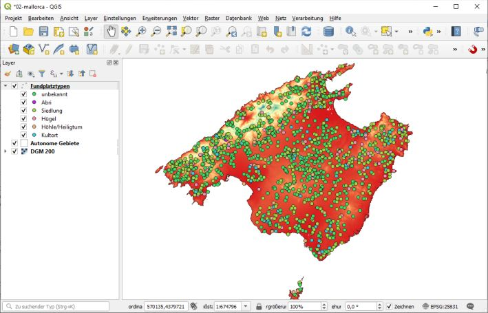

# Einführung

## GIS

Ein **G**ographisches **I**nformations **S**ystem (und bitte nie "... ein GIS-System ...") soll folgende Aufgaben bewältigen: Raumdaten (z.B. Punkte und Vektoren) als auch Sachdaten verwalten, Analysen ermöglichen und Informationen visualisieren. Im Kern ist das also Datenbanksoftware, Statistiksoftware und Grafiksoftware in einem Paket. Das schafft bei der Nutzung performante Übergänge für die Informationen und erleichtert uns die Arbeit. 

Es gab und gibt aber auch deutliche Unterschiede zu den genannten IT-Bereichen. So haben GIS (pl.) im Desktop-Bereich über viele Jahre mit einzelnen Dateien (\*.shp) als Datenquelle gearbeitet und mit jedem Arbeitsschritt eine neue Datei produziert. Ein absolutes *no go* für ein Datenbanksystem. GIS [pl.] entdecken erst langsam den 2.5D oder echten 3D-Bereich, sie sind nicht wirklich mit CAD-Programmen vergleichbar. Die statistischen Optionen stehen den Möglichkeiten in R oder anderen Softwarepaketen deutlich nach. Dennoch, ein GIS ist für die meisten Aufgaben in der Archäologie ein unverzichtbares und oft einfaches Werkzeug. Und im Vergleich zu den Bereichen "Schreiben" und "Grafik" haben wir relativ viele gute freie Software zu Auswahl.

Diese Einführung ist kein Ersatz für das umfangreiche [Handbuch zu QGIS im Internet](https://docs.qgis.org/3.10/de/docs/user_manual/index.html). Erläuterungen u.a. zu den diversen Werkzeug- bzw. Icon-Leisten finden Sie dort unter "[GUI](https://docs.qgis.org/3.10/de/docs/user_manual/introduction/qgis_gui.html)".

| Anmerkung |
|----|
| - Menüpfade oder Abfolgen von Fenstern werden mit schlichten Pfeilen dargestellt: "Datei -> Speichern". |
| - Tastaturkürzel, die ich persönlich gerne Nutze, stehen in Spitzklammern je Taste: \<strg> + \<c>. |
| - Schalter auf Formularen werden in [] gesetzt: [OK] |
| - Zur Darstellung von Befehlen im Text nutze ich die in Markdown übliche Darstellung von Code oder eben Anweisungen an den Computer: ```anweisung```. |
| - Der Text enthält viele Links, die auf Papier nicht funktionieren. Sparen Sie bitte Papier und verzichten Sie auf den Ausdruck. |

## Software

Die folgende Liste ist nicht vollständig und der Versuch, jedes Programm mit einem knappen Satz angemessen zu beschreiben, ist zum Scheitern verurteilt. Dennoch:

- [QGIS / Quantum GIS](https://qgis.org): Ein seit Jahren weit verbreitetes GIS mit nutzerfreundlicher, leicht zugänglicher GUI und einer sehr großen *Community*.

- [Grass](https://grass.osgeo.org/): Ein seit den Anfängen von GIS etabliertes und sich entwickelndes System, in dem vermutlich alles möglich ist.

- [gvSIG](http://www.gvsig.org): Ursprünglich aus Spanien stammend (Sistema Informativo Geográphico) mit Derivaten (*fork*): [gvSIG CC](http://gvsigce.sourceforge.net), [gvSIG OAdigital](http://oadigital.net)  

- [SAGA](www.saga-gis.or): Dieses System ist aus den Anforderungen der Geowissenschaften entstanden und bietet vor allem in diesem Bereich sehr viele Analysemöglichkeiten.

- [ArcGIS](https://www.esri.de/produkte/arcgis) von Esri: der Marktführer im Bereich der proprietären Software, nicht freie Programme sind auch von anderen Anbietern erhältlich

## QGIS herunterladen und installieren

Quelle: https://qgis.org

Ich wähle den Download, nicht die Netzwerkinstallation, und hier die langfristige Version, die meist stabiler läuft:

- Eigenständige QGIS-Installation Version 3.10 (64bit)

Die Installation ist einfach: Komponenten QGIS, keine Daten (Vorgabe). QGIS bietet eine Grundkonfiguration, dazu können viele Optionen aktiviert oder als zusätzliche Werkzeuge (Plugins) installiert werden. Wenn **Ihr Menü anders aussieht** als in meinem Beispiel, sind diese modularen Konfigurationsmöglichkeiten mit Sicherheit die Ursache. Die Einstellungen zu Optionen und Plugins werden im Nutzerprofil eingetragen und bei Updates der Software übertragen, es wird also leicht vergessen, ob etwas Standard ist oder nur schon Gewohnheit. <br>
Es wird viel installiert, u.a. auch Grass und SAGA. Der Grund ist einfach, es wird auf die jeweils gebotenen Werkzeuge zugegriffen, denn "das Rad zweimal zu erfinden" macht keinen Sinn. Dennoch ist vieles doppelt vorhanden, mit leichten Variationen. Wenn Sie nachvollziehbar handeln wollen, notieren Sie bei Bedarf bitte Paket und Version.

## QGIS Grundlegendes

Starten Sie "QGIS Desktop".


So oder so ähnlich sieht es aus. Ich persönlich sehe gerne viel Karte und wenig Werkzeug und blende entsprechend selten verwendete Fenster aus oder minimiere diese. Legen Sie als erstes ein neues Projekt an (z.B. \<strg> + \<n>). Es bleibt die Menüleiste, eine umfangreiche Sammlung an Werkzeugleisten, ein Layer-Fenster und der Daten-Browser auf der linken sowie die Werkzeugkiste auf der rechten Seite. Dazu unscheinbar die Fußleiste mit der sehr wichtigen Info zum Koordinatensystem (EPSG). Unmittelbar rechts daneben öffnet die Sprechblase ein Fenster mit Systemmeldungen. Die bisweilen schnell aufleuchtenden Meldungen von QGIS können hier in Ruhe nachgelesen werden.  Mindestens die Werkzeugkiste blende ich aus, gerne auch den Browser zugunsten der Sichtbarkeit der vielen Layer in meinen Projekten.

### Allgemeine Einstellungen

Unter "Einstellungen -> Optionen" werden Einstellungen für zukünftige Projekte gesetzt. Interessant sind folgende Bereiche:

- Allgemein: 
	- Hier können Sie u.a. schnell die Sprache von QGIS ändern (dazu als erstes die Option "Systemeinstellung überschreiben" aktivieren).
	- Projektdateien: Die Wilkommensseite ausstellen und direkt mit dem letzten oder einem neuen Projekt starten
- KBS: Das KBS (Koordinaten-Bezugs-System) für neue Projekte und neue Layer definieren.
- Datenquellen
	- Objektattribut-Tabellen: -> "Objekte Kopieren als:" </br>
	Sie können die Datentabelle zu einem Layer als Ganzes markieren und kopieren. Der Standard hier ist das Kopieren des Textes und der Geometrie als WKT (*well known text*). WKT ist bei Punkten noch überschaubar und bisweilen hilfreich, bei Polygonen eher unübersichtlich. Einfach mal testen und entscheiden.

### Projekteinstellungen

Unter "Projekt -> Eigenschaften" legen Sie die Parameter des Projektes fest. Hervorzuheben ist:

- Allgemein: 	
	- Projektheimatverzeichnis: es definiert, von wo aus der relative Pfad zu Daten startet. Zudem können Sie entscheiden, ob die Pfade zu den Dateien relativ (.\\ordner\\datei.shp) oder absolut (d:\\ordner\\datei.shp) in der Projektdatei gespeichert werden. Beide Varianten haben Vor- und Nachteile.
	- Die präzise Distanzmessung auf dem Ellipsoid hängt von dem gewälten Ellipsoid ab. Eine Angabe zu den Abweichungen kann ich nicht bieten und rate bei mangelnden Informationen zum Vorgabewert.
	- Die Koordinatenanzeige ist üblich in der Karteneinheit. Sie können hier aber auch Grad erzwingen.
- Metadaten sind immer interessant und wichtig bei einer späteren Nachnutzung. Bei einem privaten Projekt mag das kurzfristig uninteressant erscheinen.
- KBS: Ein sehr wichtiger Parameter. <br>
Das KBS muss dem Projektmaßstab und der Lage angemessen sein. WGS84 (EPSG 4326) passt weltweit, ist aber für ein Projekt im Raum Kiel eher ungeeignet. Hier empfiehlt sich DHDN 3° Streifen Gauß-Krüger (GK) Zone 3 (EPSG 31467). Für ein Projekt in Norddeutschland, hier sind 2 bis 3 Zonen bei GK betroffen, wäre ein UTM sinnvoll. Der rosafarbene Rahmen zeigt die jeweilige Gültigkeit des gewählten Systems an und erleichtert die Entscheidung.<br>
Bei UTM müssen Sie noch zwischen ETRS89 und WGS84 als Ellipsoid wählen. Aktuell ist der Unterschied marginal, aber mit GALILEO wird ETRS89 (European Terrestrial Reference System 89) immer wichtiger. <br> 
In Spanien wurde früh auf ED50 (European Datum 1950) umgestellt und die Abweichung zu dem aktuell üblichen ETRS89 sind immerhin gut 190 m. Die deutsche Teilung hat ähnliche Problem produziert, die bis heute nachwirken (Bessel/Rauenberg vs Krassowsky/Pulkovo). Mit den **EPSG-Codes** ist inzwischen wenigstens eine einheitliche Nomenklatur gegeben. 

# Daten laden und darstellen

## Daten 

Quelle: Internet. Bis auf die Fundplatzdaten stammen die Daten vom Spanischen [Instituto Geográfico Nacional](http://www.ign.es) und hier aus dem [*Centro de descargas*](http://centrodedescargas.cnig.es/CentroDescargas/#) unter "Productos" - "Información geográfica de referencia" und "Modelos Digitales de Elevaciones". Weitere Details sind über die Metadaten bei den Daten selbst zu finden. Die Verfügbarkeit von diesen Daten ist in [INSPIRE](https://inspire.ec.europa.eu/) begründet. Eine kurze Einführung zu diesem Thema finden Sie auf der Seite der deutschen Geodateninfrastuktur [GDI-DE](https://www.gdi-de.org/DE/GDI-DE/INSPIRE/inspire.html?lang=de).
Beachten Sie bitte, dass freie Zugänglichkeit (CC-BY) ist nicht gleichbedeutend mit rechtsfreiem Raum ist. Das Mindeste ist zitieren, Genaueres entnehmen Sie bitte den jeweiligen &copy;-Hinweisen. 

### mallorca-sites.txt

Sehen Sie sich die Daten einmal in einem Editor an (z.B. [Notepad++](https://notepad-plus-plus.org/) oder wählen Sie im Kontextmenü (rechter Mausklick) "Öffnen mit" und dann "Editor"). 

```
Quelle: www.arqueobalear.es/inventario.php (2010)
Nr;Nombre_yac;Regio;Tipo;Tipo_yacim;Periodo;Descubrido;x_utm;y_utm;Calc;Pretal;Tal;Rom;
Islam;perioden
4;Almedrà;Alaró;0;Sense estructures visibles;Romà;J. Aramburu-Zabala;485780;4401350;0;0;0;
1;0;rom,
```

Beachten Sie bitte Folgendes: Die erste Zeile enthält einen Verweis auf die Quelle, die zweite Zeile enthält Spaltennamen, die Spalten selbst sind mit einem ";" getrennt und wir dürfen erwarten, dass in "x_utm" und "y_utm" entsprechende Koordinaten des jeweiligen Fundplatzes als **Punkt** stehen. Versierte Nutzer kontrollieren eben auch noch die Kodierung: UTF-8.

Die Webseite existiert nicht mehr (die Webadresse schon!). Die Daten wurden fast ausnahmslos von J. Aramburu zusammengestellt, die Begriffe sind sowohl auf Spanisch und Katalanisch und die utm-Koordinaten haben in zahlreichen Fällen einen Fehler von bis zu 200 m überwiegend N-S wegen eines nicht dokumentierten Wechsels zwischen ED50 und ETR89. Zudem ist die Liste nicht vollständig, wichtige Fundorte, insbesondere der jüngeren Forschung, fehlen. Für unsere Übung ignorieren wir diese Probleme und nehmen die Daten wie sie sind.

### Líneas límite municipales

Quelle: http://centrodedescargas.cnig.es/CentroDescargas

Verwaltungsgrenzen als **Polygone**: Autonome Regionen, Provinzen und Munizipien (organisatorisch absteigende Reihe). Beachten Sie bitte, dass es sich um politische Grenzen handelt, Portugal und Gibralta fehlen, dafür sind aber Ceuta und Melilla mit dabei.

Format: **Shape-Datei(en)**. SHP ist ein sehr weit verbreitetes Format für Geodaten. Shapefiles bestehen aus mindestens drei, oft aber auch mehr Dateien. Ich verweise allgemein auf  [Wikipedia](https://de.wikipedia.org/wiki/Shapefile) will hier aber kurz hervorheben: \*.shp ist binär und enthält die Geometrie, \*.dbf ist ein dBase-Datei, ein sehr altes Datenbankformat und quasi ein Standard, welches mal abgesehen von Excel auch heute noch in jedem guten Datenbank- und Tabellen-System gelesen werden kann. Sie sollten die Teildateien immer als Ganzes betrachten. 

### Líne de costa

Quelle: http://centrodedescargas.cnig.es/CentroDescargas

**Linien** getrennt nach natürlicher Küste und überbauten Linien im Bereich der Hafenanlagen. Auch hier ohne Portugal und Gibralta. Format: shp (s.o.). 

### Modelo Digital del Terreno - MDT200

Quelle: http://centrodedescargas.cnig.es/CentroDescargas

Höhendaten der Balearen als **Rasterdatensatz**.  Jede Rasterzelle enthält für 200 m x 200 m einen gültigen Höhenwert oder einen Leerwert. Die Anzahl der Zeilen und Spalten definiert die Dimension und die Koordinaten der linken untere Ecke die Lage. Es gibt hierzu Alternativen, z.B. werden bei Surfer-Dateien, die Koordinaten der gegenüberliegenden Ecken und die Anzahl von Spalten und Zeilen definiert, woraus sich die Auflösung je Zelle ergibt. Nach dem sogenannten *header* folgen dann die Daten, die als Matrix oder auch als einfache Liste geschrieben sein können aber stets in der linken oberen Ecke des Rasters beginnen (wie wir lesen). Neben diesem Datenformat ist GeoTIF weit verbreitet.

```
NCOLS 1544
NROWS 985
XLLCENTER 318200
YLLCENTER 4265400
CELLSIZE 200
NODATA_VALUE -999
-999 -999 -999 -999 -999 -999 -999 -999 -999 -999 -999 -999 -999
```

Da die Endung \*.asc lautet (steht für ASCII, ist in Wirklichkeit aber UTF-8 und in diesem Fall ohne Bedeutung), könnten Sie sich die Daten ansehen, es lohnt sich aber nur für die ersten 6 Zeilen (s.o.). Beachten Sie bitte den Dateinamen, der wichtige Informationen vermittelt: "ETRS89" verweist auf das Geoid und "HU31" auf die UTM-Kachel 31 Nord. Anders als bei einem GeoTIFF sind diese Angaben in der Rasterdatei nicht hinterlegt, dies könnte aber als Kommentar geschehen.

## Planen Sie ihr Projekt

Legen Sie für Ihr Projekt einen Ordner an. Verwalten Sie innerhalb dieses Ordners die projektbezogenen Daten. Ich selbst trenne oft nach Dateiformaten (shp, raster, analoge_Karten, text, datenbank), daneben gelegentlich aber auch nach Anbieter. Zudem arbeite ich bisweilen mit digitalen Verweisen ([mklink](https://docs.microsoft.com/de-de/windows-server/administration/windows-commands/mklink)) auf andere Ordner.  

Egal wofür Sie sich entscheiden, seien Sie möglichst stringent auch bei den Dateinamen. Projekte können schnell unübersichtlich werden.

## Starten Sie QGIS

Starten Sie QGIS und legen Sie ein neues Projekt an (\<strg> + \<n>). 

Definieren Sie als erstes das **Koordinatenbezugssystem** (KBS) für Ihr Projekt. Der schnellste Weg ist ein Klick auf die Weltkugel oder "EPSG" rechts in der Fußzeile des QGIS-Fensters. Filtern Sie bitte nach "25831" und wählen Sie dieses aus. Die Definition und der Gültigkeitsraum dieses KBS wird Ihnen zur Kontrolle angezeigt. 

### Daten einfügen
 
Mit \<strg> + \<l> starten Sie die **Datenquellenverwaltung** ( "Layer -> Datenquellenverwaltung").

Die Fundpunkte (mallorca-sites.txt) können mit "**Getrennte Texte**" eingelesen werden. <br>
In dem neuen Fenster bitte Folgendes eintragen: 

  1. Dateiname: rechts mit den [...] die Datei *mallorca-sites.txt* wählen. 
  2. Layername: Fundplätze, 
  3. Kodierung: "UTF-8", 
  4. Dateiformat - Benutzerdefiniert, 
  5. Semikolon (als Trennzeichen), 
  6. Anzahl der zu überspringenden Kopfzeilen: 1,
  7. Erster Datensatz enthält Feldnamen, 
  8. Feldtypen bestimmen, 
  9. Dezimalseparator ist Komma, 
  10. Geometriedefinition - Punkkoordinaten, 10. für x- und y-Feld bitte x_utm und y_utm auswählen, 
  11. Geometrie-KBS: Projekt-KBS: EPSG 25831, 
  12. Beispieldaten visuell kontrollieren und abschließend [Hinzufügen].

Mit "**Vektor**" können Polygone und Linien geladen werden.<br>
Wählen Sie als Quelle bitte: *recintos_autonomicas_inspire_peninbal_etrs89.shp* und bestätigen Sie mit [Hinzufügen].

Mit **Raster** laden wir als nächstes noch das Höhenraster *PNOA_MDT200_ETRS89_HU31_Baleares.asc*. [Hinzufügen] und [Schließen].

Im **Layer-Fenster** am linken Rand können Sie schnell auf die jeweiligen Daten zugreifen und mit diesen arbeiten. 

Speichern Sie das Projekt auf der obersten Ebene in ihrem Projektordner (z.B. als mallorca.qgz).

### Layer darstellen und organisieren

Die Arbeit mit den Layern (Daten) erfolgt am schnellsten im Layer-Fenster.

Layer werden immer in der Reihenfolge im Layer-Fenster dargestellt. Fassen Sie mit der Maus einen einzelnen Layer und verschieben diesen. Üblich ist eine Reihenfolge von Punkt - Linie - Polygon - Raster. Verschieben Sie die aktuellen Layer in diese Reihenfolge.

Das Kontextmenü zu jedem Layer (rechter Mausklick) bietet diverse Optionen.

1. Kontextmenü Fundplätze (Punkte) -> Auf den Layer zoomen.
2. Kontextmenü recintos_ ... (Polygon) -> Layer umbenennen: "Autonome Gebiete".
3. Ebenso bitte PNOA_... umbenennen auf "DGM 200" (MDT steht für *modelo digital terreno*).

Neben dem Raster "DGM 200" sollten Sie ein "?" sehen. "*Mouse over*" öffnet den Hinweis auf ein fehlendes KBS. Klicken Sie auf das "?" und wählen Sie auch für diesen Layer EPSG 25831: ETRS89 und UTM31N (das geht auch über die Layereigenschaften). 

Mit einem Doppelklick auf "Autonome Gebiete" öffnen Sie  die Layereigenschaften und wechseln Sie zu **Symbolisierung**, um die Darstellung zu ändern. Das *drop down* am oberen Fensterrand belassen Sie auf "Einzelsymbol". Im Fenster darunter sehen Sie die **Füllung** als hierarchische Abfolge weiterer Elemente, z.Z. nur eine "Einfache Füllung". Markieren Sie "Einfache Füllung" und ändern Sie für dieses Element "Füllstil" auf "keine Füllung" und  setzen Sie die "Strichfarbe" auf "Schwarz" (Die Farbauswahl ist vielgestaltig, lassen Sie sich etwas Zeit). Klicken Sie erst auf [Anwenden] und wenn Sie den Eindruck haben, die Umsetzung ist OK auf [Schließen].

Nun ändern Sie die **Symbolisierung für den Raster-Layer** "DGM 200" und testen Sie die diversen Optionen. Klicken Sie nach jeder oder einigen Änderungen stets auf [Anwenden], um das Ergebnis zu sehen. 

Variante 1: Darstellungsart: **Einkanalgraustufen**, Grauer Kanal: Kanal 1 (ist aber egal, da kein Farbbild vorliegt, z.B. **R**ot**G**rün**B**lau), Farbverlauf: Weiß nach Schwarz, Min: -0.1, Max: 800, Kontrastverbesserung: Strecken auf MinMax. [Anwenden]. Beachten Sie die Serra de Tramuntana im Nordwesten, wenn Sie die Einstellung auf "Strecken und Zuschneiden" wechseln. Anm.: Sie haben 256 Grauwerte von Weiß bis Schwarz, aktuell werden diese zwischen -0.1 und 800 stetig verteilt, alles darüber wird Schwarz, alles darunter Weiß und eben nicht abgeschnitten. Klappen Sie das folgende Menü Min/Max-Werteeinstellungen für weitere Optionen auf, u.a. für ein Zurücksetzen auf Min/Max der Daten.

Variante 2: Darstellungsart: **Einkanalpseudofarben**. Diese Einstellung hat sehr viele Optionen, diese lasse ich hier beiseite. Zwei wichtige Hinweise: 

- Die Klassengrenzen werden präzise bestimmt und ensprechend auch in der Legende angezeigt: drei oder mehr Stellen nach dem Komma sind vielfach übertrieben und suggerieren bei den hier vorliegenden Werten eine falsche Präzision. Sie sollten  die Werte als auch Beschriftung mit einem Doppelklick markieren und runden. 
- Ergänzen Sie hier bei Beschriftungssuffix ein "m" oder besser direkt beim Layernamen "m über NN". Einheiten sind wichtig.

Das Mittelmeer ist rot, das geht nun gar nicht. Natürlich könnten wir die Skala unten beschneiden, das aber auch die Legende beeinflussen würde. Wechseln Sie zu **Transparenz**. Im *header* der Datei stand ```NODATA_VALUE -999```, entsprechend sehen wir hier -999. Das ist offensichtlich aber nicht sehr genau eingetragen und wir behelfen uns wie folgt: Das Icon "grünes Plus" am rechten Rand ergänzt einen weiteren Transparenzbereich, bei dem wir "Von" "-999" "Nach" "0" eintragen. [Anwenden],  [OK]. Wenn Sie das Ergebnis kontrollieren erkennen Sie zwei Dinge: 1. Im Nordwesten, im feuchten Niederungsgebiet des Raiguer, sind einzelne Zellen nun leer und 2. wird die Küste mit Rasterzellen von 200 m x 200 m nur ungenau nachgezeichnet. Ein Trick für Letzteres: Sie ergänzen bei den autonomen Gebieten eine weitere Füllung, schieben diese nach unten, ändern diese auf einfache Linie, setzen Sie weiß, Strichbreite auf 10 mm und Versatz auf -5. Ist nicht wirklich schön. Wenn's wirklich schön werden soll, hilft nur eins, ein Polygon für das Mittelmeer erzeugen und als Maske oben drauf legen.

Die Optionen der Symbolisierung des Layers Fundplätze (Punkte) ist weitgehend identisch mit Linien- und Polygon-Layern. Wählen Sie im *drop down* am oberen Fensterrand statt "Einzelsymbol" "Kategorisert", Wert: Tipo, klicken Sie auf [Klassifizieren], beschriften Sie wie folgt: 0 - unbekannt, 100 - Abri, 200 - Siedlung, 300 - Hügel, 400 - Höhle/Heiligtum, 410 - Kultort und löschen Sie das letzte Symbol, indem Sie es markieren und unten auf das Icon "rote Minus" klicken. [OK] zum Schließen des Fensters.   
Nennen Sie nun diesen Layer "Fundplatztypen".   

Textbasierte Quellen wie in diesem Fall können in QGIS nicht editiert werden, für die nachfolgende Arbeit exportieren wir diese Daten deshalb in eine Shape-Datei. Dafür wählen Sie im Kontextmenü des Layers "Fundplatztypen" Exportieren -> Objekt speichern als. Ich lege dafür in meinem Projektordner einen neuen Ordner "shp" an und speichere Sie dort im shp-Format mit den Namen "mallorca-sites", KBS: 25831, Kodierung: UTF-8, Geometrie: automatisch und [x] Gespeicherte Daten zur Karte hinzufügen, [OK].

Dem neuen Layer weise ich den bereits erstellten Stil zu. Hierzu Kontextmenü Layer "Fundplatztypen" Stile -> Stil kopieren -> Alle Stilkategorien, Kontextmenü des neuen Layers Stile -> Stil einfügen -> Alle Stilkategorien. Fertig. Löschen Sie den alten Layer "Fundplatztypen" und benennen Sie den neuen Layer genau so.

Die Karte ist nun wunderbar bunt und sowohl visuell als auch didaktisch und methodisch noch eine Katastrophe. 



----

# Attribute und Funktionen

Ziel ist die Einführung in die Arbeit mit der Attributtabelle von Vektordaten (Punkt, Linie, Polygon) und den zahlreichen Funktionen. Nicht alle hier gezeigten Schritte liefern ein tolles oder gar wissenschaftlich relevantes Ergebnis. Auch will ich nicht jede Funktion des Menüs und schon gar nicht der Werkzeugkiste durchhecheln. Vielmehr möchte ich mit weitgehend typischen Fragestellungen und möglichen Lösungswegen auf die Arbeit in GIS eingehen.

Daten: Es wird vorrangig mit dem Punktdatensatz der Fundplätze (mallorca-sites.shp) und dem Geländemodell (DGM 200) aus der Karte der vorangehenden Stunde gearbeitet. Beachten Sie, bei textbasierten Datenquellen sind die Editiermöglichkeiten eingeschränkt. 

## Fundplatztypen - Attributtabelle

Öffnen Sie die Attributtabelle zu dem Layer der Fundplätze, z.B. über das Kontextmenü zu diesem Layer. Diese Tabelle kann bzw. wird mit jedem weiteren Aufruf erneut geöffnet (viele Fenster). Natürlich können wir die Spalten sortieren (Mausklick auf die Kopfzeile). 

### Objekte Auswählen

Wir können einzelne oder mehrere Objekte durch Mausklick auswählen und auf diese in der Karte zoomen (\<strg> + \<j> oder das Icon mit der Lupe in der Symbolleiste). Die Reihe gelber Icons bietet weitere Auswahloptionen.
- Gelbes Viereck mit 'E' öffnet die filterbasierte Auswahl.  
Das folgende Fenster, der **Ausdrucksgenerator**, wird noch oft auftauchen und ist äußerst hilfreich. 
Wir bleiben vorerst auf dem Reiter "Ausdruck". In der linken Spalte können wir Ausdrücke erstellen, wichtige Bausteine wie [=] etc. sehen Sie zur Auswahl direkt darüber. In der mittleren Spalte finden Sie eine Liste diverser optionaler Bestandteile eines Ausdrucks: viele Funktionen, Attribute und Objekteigenschaften. Die Rechte Spalte bietet eine kontextbezogene Hilfe. Ist ihr Ausdruck verständlich (nicht zwingen richtig nach ihrem Verständnis) sehen Sie links unten eine Voransicht.  
Klappen Sie "Felder und Werte" auf, um alle Attribute (Spalten) zu sehen, wählen Sie Tipo_yacim[iento] (Fundplatztyp) 1. mit Doppelklick in den Audruck übernehmen, 2. [Alle eindeutigen]anklicken und 3. in der Liste bis zu "Talaiot" scrollen. Sie sehen zahlreiche Variationen bei denen "Talaiot" stets gleich geschrieben ist. Ergänzen Sie den Ausdruck zu `"Tipo_yacim" like '%Talaiot%'`. Beachten Sie die differenzierte Verwendung von " und ', ebenso das % als sog. *wildcard*. Klicken Sie auf [Objekte wählen], beachten Sie zuvor die optionalen Variationen der *drop-down* Liste. Dann [Schließen] Sie das Fenster.  
In der Karte sind zahlreiche Punkte nun gelb markiert, für die Tabelle wählen Sie unten bei [Alle Objekte anzeigen] bitte [**Alle gewählten Objekte anzeigen**]. Eine Alternative schnell die gewählten zu sehen ist das unscheinbare Icon rechts neben dem "Trichter"-Icon, es sortiert alle ausgewählten Datenreihen nach oben.
- "Trichter"-Icon: Formular Filter</br>    
Der formularbasierte Filter erzeugt zugleich eine Darstellung der Daten in einer Formularansicht. Sie wechseln zwischen Formular- und Tabellenansicht mit den Icons rechts unten in diesem Fenster. In dem formularbasierten Filter kann für jedes Feld ein Eintrag vorgenommen werden und mit einem Schalter am rechten Rand wird die Bedingung (gleich, größer als, enthält etc.) gesetzt.
- Gelbe horizontale Balken: Alle Objekte auswählen
- Gelbes und transparentes Dreieck: Auswahl umkehren
- Gelbes und rotes Viereck: Auswahl löschen (tun Sie dies jetzt bitte).

| Annmerkung |
|----|
| [**Talaiot**](https://de.wikipedia.org/wiki/Talayot) (Kat.) oder auch Talayot (ES) sind monumentale Steintürme in eisenzeitlichen Siedlungen und ein wichtiges Element der mallorcinischen Denkmaltopographie. |
| Einführende Literatur:  @guerreroayusoHistoriaIslasBaleares2006c; @guerreroayusoHistoriaIslasBaleares2006b; @lullCeramicaTalayoticaProduccion2008a; @lullTurmbautenSonFornes2007a; @micoperezCronologiaAbsolutaPeriodizacion2005a; @vanstrydonckMyotragusMetellusaJourney2014 |

### Daten verändern

Das Abakus-Icon (Rechenschieber) öffnet den Feldrechner, der in vielen Aspekten dem Ausdrucksgenerator beim Filtern der Daten (s.o.) entspricht. Ziel des nächsten Schrittes ist es, den Höhenwert aus der Rasterzelle des DGM unter jedem Fundpunkt in eine neue Spalte "z_m" zu schreiben. 

Sind Daten ausgewählt, werden a priori nur diese verändert, es sei denn, Sie entfernen die Markierung oben links. Setzen oder belassen Sie bitte folgende Parameter: [x] Neues Feld anlegen, Ausgabefeldname: z_m, Ausgabefeldtyp: Ganzzahl (integer). Bei der Auflösung der Datengrundlage ist eine Dezimalzahl unnötig, damit entfällt auch die Genauigkeit bei den Nachkommastellen. Wählen Sie aus der mittleren Spalte folgende Funktion: Raster -> raster_value. Ergänzen Sie den Namen des DGM-Layers, "1" für das erste ("Farb"-)Band dieses Layers und "\$geometry" (die Punktgeometrie des Fundplatzes) als Referenz. Insgesamt also `raster_value('DGM 200', 1, $geometry)` . Für unsere Änderung wurde der Layer in den Editiermodus versetzt (Stift-Icon), die Änderungen müssen noch gespeichert (Diskette-Stift-Icon) und das Editieren (Stift-Icon) beendet werden. Dies können Sie auch in der Icon-Leiste der Karte tun. Beachten Sie dabei bitte die Veränderungen in der Icon-Leiste.

Um einige Möglichkeiten aufzuzeigen und weitere Standardaufgaben durchzuführen, möchte ich folgende Aufgabe zur Übung durchspielen:    
Wir haben den Verdacht, dass die Lage mindestens eines Punktes auf der Karte (*$geometry*) und der zugehörige Eintrag in der Tabelle (x_utm, y_utm) nicht übereinstimmen. Wir müssen also die x-Koordinaten aller Punkte aus der Geometrie abfragen, auf eine Ganzzahl runden und mit dem Eintrag der Tabelle vergleichen. Ich gehe aus didaktischen Gründen nicht zwingend den kürzesten Weg.   

1. Wir legen ein neues, virtuelles Feld an, benennen es "Test" und definieren es vorerst als Dezimalzahl. Passen Sie dieses Format bei den weiteren Schritten bitte an das jeweilige Ergebnis an.
2. Unter "Geometry -> \$x" erhalten Sie die x-Koordinaten des Objektes. Ein Umweg wäre also, die Geometrie und hiervon die x-Koordinate abzufragen: ```x($geometry)```. Ein weiterer Umweg wäre die Geometrie als Text abzufragen und die x-Koordinaten herauszuschneiden: ```substr(geomToWKT($geometry),8,6)```. Diese Funktionen können in vielen Kontexten hilfreich sein, ergänzende Erläuterungen erhalten Sie nach der Suche (Lupe!) der jeweiligen Funktion.   
3. Zahlen können mit gerundet werden `round($x)`, die Erläuterung zu dieser Funktion finden Sie unter "Mathematik".
4. Vergleichen können wir durch Subtraktion, alles was nicht 0 ergibt, ist falsch, oder wir vergleichen wirklich und erhalten "Wahr" oder "Falsch". Die erste Option ist einfach, ergänzen Sie die Syntax einfach zu ```round($x) - "x_utm"```. Die zweite Option ist länger, nutzt aber eine klassische ```if()``` Funktion, die Sie unter Bedingungen finden und die nicht wirklich über die Hilfe hinaus erläutert werden muss: ```if(round($x) = "x_utm", 'identisch', 'verändert')```.

Dies waren einige oft benötigte Standardaufgaben, die Ihnen die Funktionsweise und Möglichkeiten des Feldrechners vor Augen geführt haben sollten. Sie können hier jederzeit auf vorhandene Feldwerte zugreifen, einfache Berechnungen durchführen, Texte verändern und vieles mehr.

### Verknüpfte Daten (Join)

Es kommt oft vor, dass wir eine Geometrie haben und wichtige Daten nur in einer weiteren Text-Tabelle stehen. Wenn es ein gemeinsames Feld gibt, können wir diese Daten verbinden. Die nachfolgend verwendeten Daten stammen aus der Arbeit von Micó (@micoperezCronologiaAbsolutaPeriodizacion2005a). Da eine unabhängige Datenquelle vorliegt, gibt es kein gemeinsames eindeutiges ID-Feld, ich muss stattdessen den Namen des Fundplatzes verwenden. Neben dieser typischen textbasierten Verknüpfung (join) beherrschen GIS auch räumliche Verknüpfungen: identisch, innerhalb, auf und außerhalb (s.u.). 

```
# Quelle: Micó Pérez, R., 2005. Cronología absoluta y periodización de la prehistoria [...]
c14ID;site;island;monument;context;county;labcode;bp;std;sample;resource
1;Albufera d'Alcúdia;Mallorca;Sondeo polínico;Z = -19,5m;
Alcúdia/Muro;;32790;;Desconocido;Micó 2005, 24
``` 

Betrachten Sie das vorliegende Datenformat von "sites-c14dat.csv". Die erste Zeile ist ein Kommentar, die zweite Zeile beinhaltet die Spaltennamen, Trennzeichen ist das ";", Dezimaltrennzeichen scheint das "," zu sein, auch wenn es in einem Textfeld steht ("Z = -19,5m"). Fügen Sie die Daten als **getrennten Text** ein (s.o.), achten Sie auf die zu überspringende erste Zeile und wählen Sie "Keine Geometrie". Nur zur Ordnung lege ich im Layerfenster eine Gruppe an (Kontextmenü), benenne diese "Daten", schiebe hier die Tabelle hinein und den gesamten Ordner nach unten.

Öffnen Sie die Eigenschaften zum Layer "Fundplatztypen" und wechseln Sie am linken Fensterrand zu "Verknüpfungen". Fügen Sie mit dem Icon "grünes Plus" eine neue Verknüpfung hinzu, die Parameter sind folgende: Layer verknüpfen: sites-c14dat, Verknüpfungsfeld: site, Zielfeld: Nombre_yac. Optional können Sie unter "Verknüpfte Felder" nicht alle, sondern nur ausgewählte Felder anhängen. Mit "Benutzerfeldnamenpräfix" können Sie statt des Tabellennamens ein kürzeres Präfix für die Spaltennamen angeben.

Öffnen Sie die Attributtabelle, filtern Sie (gelbes Viereck + E) auf ` "sites-c14dat_c14ID" > 0` und sortieren Sie diese Daten nach oben. Beachten Sie bitte folgendes: 1. Es gibt nicht viele Gemeinsamkeiten, 2. Sie sehen noch alle Daten der Fundplatztabelle und nur die Daten der 14C-Tabelle, die einen identischen Fundplatznamen haben (*left join*). Für eine genaue Arbeit müssten wir leider noch Energie investieren. Überlegen Sie für sich, was Sie als Datenlieferant besser machen könnten. Löschen Sie diese Verknüpfung bitte wieder, Sie hilft uns nicht wirklich.

# Raumabfragen und Quellenkritik

## Vorbemerkung

Ziel ist die Einführung in Abfragen, in einfache räumliche Abfragen, die grafische Umsetzung und eine resultierende Deutung aufgrund einer Fragestellung. Auch hier gilt: es geht nicht um die umfassende Darstellung aller Funktionen unter dem Menüpunkt "Vektor", vielmehr möchte ich mit weitgehend typischen Fragestellungen und möglichen Lösungswegen auf die Arbeitsweise in GIS eingehen. Auch ist der Weg bisweilen das Ziel und das Ergebnis durchaus anders zu erreichen.

Die Fragen beginnen mit der Verteilung der Talaiots in den Gemeinden. Das ist so schlicht archäologisch natürlich uninteressant und muss mindestens gegen die Fläche geprüft werden. Für die Frage des Denkmalerhaltes müssten wird noch gegen die überbaute Fläche oder alternativ die Anzahl der Einwohner prüfen und erst dann könnten wir darüber nachdenken, ob die aktuelle Verteilung  erkennbare Regeln und Bezüge zu geomorphologischen Parametern zeigt. Hieraus können wird dann abschließend eine Aussage über menschliches Verhalten in der Vergangenheit ableiten. 

## Daten 

Es wird vorrangig mit dem Punktdatensatz der Fundplätze (mallorca-sites.shp) und dem Geländemodell (DGM 200) gearbeitet. Hinzu kommen die Gemeinden als kleine regionale Verwaltungseinheiten (recintos_municipales_inspire_peninbal_etrs89). Ergänzen Sie diesen letztgenannten Layer bitte, nennen Sie ihn "Gemeinden" und setzen Sie die Symbolik auf "keine Füllung". Später ergänzen wir noch Daten zur Bevölkerungsentwicklung.    

### Attribut filtern

Ziel ist es, aus der großflächigen Menge der Autonomen Gebiete nur die Balearen (Illes Balears) und aus den sehr zahlreichen Gemeinden nur die von Mallorca zu filtern und darzustellen. Für die Autonomen Gebiete Spaniens geht das natürlich am schnellsten über den Namen oder ein anderes spezifisches Feld der Attributtabelle (hier CODNUT2: ES53). Rufen Sie die Eigenschaften des Layers "Autonome Gebiete" auf: Register "Quelle", Bereich "Objektfilter auf Datenanbieter" und bestätigen Sie [Abfrage erstellen]. Tragen Sie unter "Datenanbieter spezifischer Filter" folgenden Ausdruck ein ```"CODNUT2" = 'ES53'```. Alternativ können Sie sich den Ausdruck mit den angebotenen Listen und Schaltern auch zusammenklicken. Wählen Sie [Testen] und bei Erfolg bestätigen Sie [OK] für die Abfrage und [OK] für die Eigenschaften. Zoomen Sie auf den Layer "Autonome Gebiete".

Erstellen Sie auf die gleiche Weise einen Attributfilter für die Fundplätze mit folgender Bedingung: ```"Tipo_yacim" LIKE '%Talaiot%'```. Und passen Sie den Layernamen an: "Talaiots".

Gefilterte Datenbestände haben mehrere Besonderheiten bzw. Vorteile:

- reduzierte Daten ohne die Datenquelle zu ändern oder einen neuen, redundanten Datensatz zu erzeugen und
- spezifische Informationen einer Datenquelle können als getrennte Layer mehrfach eingefügt und in der Abfolge der Darstellung eindeutig priorisiert werden.

## Räumliche Abfragen

### Vektoren zu Vektoren

Räumliche Abfragen sind eine  Kernaufgabe eines GIS, für Vektordaten finden Sie dies unter "Vektor -> Forschungswerkzeuge -> Nach Position selektieren". Ziel ist es, nur die Gemeinden der Balearen zu erhalten, also alle Gemeinden innerhalb der entsprechenden Polygone des Layers "Autonome Gebiete".

Es gibt zwei mögliche Wege: 1. "Autonome Gebiete (gefiltert)" "enthält" "Gemeinden" und 2. "Gemeinden" "sind innerhalb" "Autonome Gebiete (gefiltert)". Beides führt zum Ziel, Variante 1 nach > 200 Sekunden, Variante 2 nach < 4 Sekunden (Zeit variiert nach Rechnerleistung). Diese Info finden Sie im Protokoll auf dem zweiten Reiter des zugehörigen Fensters. Der Unterschied ist gravierend, Gründe kenne ich nicht, vermute aber folgendes: Bei 1. wird für jedes Polygon der Inseln nachgesehen, welche Gemeinden betroffen sind. Wenn Sie genau hinsehen, sind es neben den drei großen Inseln sehr viele kleine Polygone, für die jeweils alle Gemeinden überprüft werden. Bei 2. wird für jede Gemeinde geprüft, ob es in einem Polygon der Autonomen Gebiete liegt, für die Masse ist dies schnell erledigt. Dies hat keine Allgemeingültigkeit, eventuell ist dieser Algorithmus auch nur schlecht programmiert und mit einem anderen Tool geht es eventuell schneller. Lerne: Prüfe erst mit einem kleinen Datensatz und dann mit dem großen.

Für die weitere Arbeit könnten wir diese Daten in eine neue shp-Datei exportieren, das schafft aber redundante Daten. Zudem sind da noch Evissa und Menorca dabei. Ich filter lieber den originalen Datenbestand auf ```"CODNUT3" = 'ES532'```.

### Werkzeugkiste

Öffnen Sie nun die Werkzeugkiste (*toolbox*) mit "Verarbeitung -> Werkzeugkiste" oder \<strg>+\<alt>+\<t>. Hier finden Sie alle Funktionen und ganz oben die "kürzlich verwendeten". Ich persönlich verlaufe mich in den Menüs regelmäßig. Mit den "kürzlich verwendeten", der Suche oder der angebotenen hierarchischen Ablage komme ich viel schneller zum Ziel.  

### Punkte in Polygon

Wir zählen zuerst die Talaiots je Munizipium: "Vektor -> Analyse Werkzeuge -> Punkte in Polygon zählen" oder in der *toolbox* 'zählen' suchen. Letzteres listet dann auch gleich Alternativen oder weitere interessante Funktionen. 

In **Punkte in Polygon zählen** sind die Angaben für Polygon = Gemeinden und Punkte = Talaiots klar. **Gewichtungsfeld** ist interessant, statt Punkte zu zählen wird die Summe des angegeben Feldes berechnet. Als Gedankenspiel: wir haben Gräberfelder und gewichten (summieren) die jeweils aufgeführten Gräber oder Bestatteten. **Klassenfeld** ist auch interessant, dann wird die Vielfalt in dem ausgewählten Feld gezählt, nicht die Menge. In der Archäologie kennen wir das z.B. als einen Index für die Bewertung von 'Reichtum' bei Gräbern (u.a. @siklosiTracesSocialInequality2013a, 31-40). Den Zählfeldnamen ändern wir in "Talaiots". Das Ergebnis wird als temporärer Layer erzeugt und kann bei Bedarf als neue Datei gespeichert werden.
     
**Anmerkung zur Datenhaltung**: An diesem Punkt wird die Arbeit mit shp-Dateien aus der Sicht der Datenbank unelegant oder sogar gefährlich. Will ich das Ergebnis sichern, muss ich speichern und schaffe so einen neuen, also größtenteils redundanten Datensatz. In einer SQL Datenbank würde die gesamte bisherige Arbeit als Abfrage (Anweisung) gespeichert, nicht das Ergebnis. Daraus resultiert kein neuer Datenbestand und ein stets aktuelles Ergebnis auf Grundlage der aktuellen Ausgangsdaten.

**Unsere Frage** zielte auf die Verteilung und die Repräsentanz unseres Datenbestandes. Wir setzen deshalb die Zählung ins Verhältnis zur Fläche und Visualisieren das Ergebnis.
    
Nennen Sie den neuen Layer "**Talaiots je Munizipium**". Da das Ergebnis noch keine Bedeutung hat, machen wir direkt weiter. Öffnen Sie die Attributtabelle und dort den Feldrechner (Abakus). Erstellen Sie ein neues Dezimalfeld mit 3 Nachkommastellen, nennen es "Talaits_qkm" (Talaiots je Quadratkilometer) und verwenden folgende Anweisung: ``` "Talaiots" /($area/1000000)```. Erläuterung: Die Einheit unseres Kooridnatensystems ist Meter, die Fläche ist demnach m², durch die Division erhalten wir km², das Hundertfache des sonst so beliebten ha (Hektar). Wählen Sie bei der Eigenschaft des Layers -> Symbolisierung "Abgestuft", als Wert das neue Feld "Talaiots_qkm" und denken Sie bei der Wahl für den Farbverlauf an die Rot-Grün-Schwäche (ca. 9% der Männer). Wählen Sie "Gleiche Anzahl (Quantile)", bei Klassen "4" und dann [Klassifizieren]. Wechseln Sie auf den Reiter "Histogramm", bestätigen Sie [Werte laden] und betrachten Sie die Häufigkeitsverteilung.     
Anmerkung zur **Statistik**: Vier Quantile (= Quartile) sind eine allgemeine (pauschale) Teilung in 25%-Schritte von mindestens ordinal skalierten Werten, um Verteilungen vergleichen zu können. Ich will nicht vergleichen sondern darstellen und finde, diese pauschalen Klassengrenzen trennen meine Daten nicht dem Datenbestand angemessen. Deshalb ändere ich dies Grenzen und trenne an den erkennbaren Brüchen in den Daten: <0.015 für eigentlich keine, <0.05 wenige, <0.1 ordentliches Mittelfeld, > 0.1 die "Reichen"  und bestätige mit [OK]. Schieben Sie den Punktlayer "Talaiots" über den neuen Layer.

Eine **erste Deutung** einzelner Auffälligkeiten ist möglich. Die Gemeinden sind überwiegend kleine *a priori* politische Einheiten, Sie sind aber zugleich abhängig von einer traditionellen, teils naturräumlichen Gliederung (*comarcas*). Wechseln Sie dafür zwischen DGM (Höhenmodell) und Dichtekarte hin und her. Natürlich fällt das Hochgebirge mit über 1000 m Höhe um den Puig Major (1445 m) aus, deshalb verändere ich die Symbologie für das DGM auf maximal 1000 und bekomme mehr Dynamik in den Rest. Der östliche Abhang der Tramuntana und im Übergang zur Ebene (Raiguer) sehe ich mehrere Agglomerationen, ich vermute einen Zusammenhang zur Hydrologie oder dem Baumaterial (ich notiere zwei weitere Fragen). Die nördliche Mitte (Pla de Mallorca) ist recht regelhaft belegt, wogegen der südliche Abschnitt (Migjorn), insbesondere die Gemeinde Llucmajor, trotz flacher Landschaft erstaunlich leer ist (könnte an moderner Landwirtschaft liegen). Palma hat erstaunlicherweise mehr Talaiots als Llucmajor: Die hohe Bevölkerungszahl und der hier erfolgte Landesausbau sind kein Problem?.    
**Die Frage** zur Bevölkerungsentwicklung und -dichte wird als nächstes thematisiert.

## Übung zum Vorangehenden

Sie sollen das Vorangehende wiederholen und mehr über Mallorca lernen. Deshalb kommen jetzt die *comarcas* (Landschaftszonen) ins Spiel. Lesen Sie dazu z.B. den entsprechenden Abschnitt bei [Wikipedia](https://de.wikipedia.org/wiki/Mallorca#R%C3%A4umliche_Einteilung_in_Landschaftszonen).

1. Importieren Sie die Tabelle "municipio-comarca.txt", nachdem Sie sich die Struktur der Datei angesehen haben.
2. Stellen Sie eine Verbindung (join) zwischen dem Layer "Gemeinden" und der zuvor importierten Tabelle her (NAMEUNIT, municipio).
3. Verändern Sie die Symbologie für den Layer auf "Kategorisiert", Wert ist das neue Feld "municipio-comarca_comarca" (hätten Sie beim *join* umbenennen können!) und zufällige Farben.

Wiederholen Sie das ganze für die Tabelle zu den Bevölkerungszahlen (pop-balears.txt). Betrachten Sie erst die Rohdaten, importieren Sie und finden Sie selbständig die Felder für den *join*.

## Karte mit Diagramm - Die Bevölkerungsentwicklung       

### Anmerkung zur Forschungsgeschichte

Der Erhalt archäologischer Denkmale, zumal dieser monumentalen, obertägig gut sichtbaren Talaiots, ist vor allem durch den Menschen gefährdet. Die Bevölkerungszahl und deren Entwicklung ist demnach durchaus ein wesentlicher Faktor bei der Bewertung des Denkmalbestandes. Daneben ist es aber auch das Bewusstsein für den Denkmalcharakter und die Verknüpfung zur eigene Identität, die den Erhalt beeinflusst. Auf den Balearen beginnt eine erste systematische Erfassung der Archäologie in der ersten Hälfte des 20. Jh. Es sind z.B. die Arbeit von Josep Colomines und Luis Amorós. Das politische Umfeld in dieser Zeit ist von gewaltigen Umbrüchen geprägt, der 2. Spanischen Republik, dem Bürgerkrieg und der frühen Franco-Diktatur. Ab der Mitte des Jahrhunderts prägt dann die zentralistische Organisation der etablierten Diktatur auch die Archäologie und die Entwicklung eines zentralen Registers, Denkmal- und Grabungsamtes. Die zentrale Figur dieser Zeit ist Rosseló Bordoy. Der Tourismus entwickelt sich ab den 1950er Jahren deutlich, er hat auch Auswirkung auf einen zunehmenden Bauboom bis in die 1970er Jahre. Ein massiver Straßenausbau geht damit einher, denn die Eisenbahn des ausgehenden 19. Jh. setzt sich nicht durch. Beachten Sie hierzu die publizierten Fotos der Ausgrabung des DAI auf der Talaiot-Siedlung von S'Illot in den Madrider Mitteilungen und den heutigen Zustand z.B. in Google Earth (39.5687,3.372), es ist nur ein Beispiel von vielen (@freyTalayotSiedelungBeiIllot1964).  Alternativ können Sie im [IDEIB WebGIS](https://ideib.caib.es/visor/)  1. nach S'Illot suchen und 2. bei den Layern (Lista de Capes) ergänzen Sie (Afegir dades) das "Ortofoto 1956".  Warum das? Es ist wichtig für die Bewertung des Denkmalbestandes und unser ganzheitliches Verständnis von Geschichte, Mensch und Umwelt.

### Die Bevölkerungsentwicklung

**Die Bevölkerungsentwicklung** der Balearen reflektiert den Landesausbau, ein wichtiger Aspekt für den Denkmalerhalt, und weist auf die zuvor nicht genannten Unterschiede in der Entwicklung zwischen den Inseln hin, insbesondere Mallorca und Menorca. Beachten Sie die gewaltigen Zuwachsraten (%) und Unterschiede für die Zensus von 1940 bis 1981. Diese Entwicklung beeinflusst Mallorca noch heute und soll nachfolgend grafisch umgesetzt werden.

Insel|1900|1910|1920|1930|1940|1950|1960|1970|1981|1991|2001|2011
----|----:|----:|----:|----:|----:|----:|----:|----:|----:|----:|----:|----:|----
Mallorca|211263|4,6|6,5|9,0|12,6|5,1|7,8|25,5|23,4|6,4|14,8|26,8
Menorca |39178|4,1|2,7|5,7|2,9|0,3|-0,6|16,1|10,9|15,0|15,9|35,7

Tabelle zur Bevölkerungsentwicklung. Einwohner für 1900 und nachfolgende Steigerung (%) zum jeweils vorangehenden Zensus. Quelle der Rohdaten: [INE](https://www.ine.es).

Öffnen Sie die Eigenschaften für den **Layer "Gemeinden** mit angehängten Bevölkerungszahlen. Ziel ist die Darstellung des jüngsten Zensus (2011) als abgestufter Farbverlauf je Polygon mit 4 Klassen. Für die **Symbologie** starte ich wie im vorigen Beispiel  mit den Quantilen, kontrolliere das Histogramm und bilde dann folgende Klassen: bis 7100, bis 12100, bis 54000, bis 403000. Um die niedrigste Klasse gegen die Gemeinden ohne Werte abzugrenzen, erhalten diese einen schwachen Farbwert (10%).

Die **Beschriftung** aller Gemeinden in der Karte kann die Darstellung überfluten, deshalb will ich nur die größere Hälfte beschriften. Wählen Sie bei Beschriftung statt "keine Beschriftung" "Einzelne Beschriftung" und öffnen bei Wert mit [E] den Ausdruckseditor. Dort ergänzen Sie folgenden Ausdruck:

```
if(
  $area>
    (array_get(array_sort(array_agg($area)),
        round((count("NAMEUNIT")/2),0))),
  "NAMEUNIT", "") 
```

"Die größere Hälfte", was hätten Sie von Hand gemacht? 1. Die Daten nach der Fläche aufsteigend sortiert und 2. ab der Mitte alle Werte beschriftet. Genau das passiert im Code. Ich erläutere den  Inhalt der Klammern gemäß den Regeln von von links nach rechts und innen nach außen.

- array_agg($area) : schreibt alle Flächengrößen in eine Liste (array) 
- array_sort () : sortiert unsere Liste ohne weitere Anweisung aufsteigend.
- array_get () : liefert uns aus einem array den Wert des n-ten Elementes
  - Der erste Teil ist die eben erklärte Liste.
  - round((count("NAMEUNIT")/2),0)) : zählt die Anzahl der Namen (Gemeinden), teilt diese durch 2 und rundet das Ergebnis auf 0 Stellen nach dem Komma (Ganzzahl). Ein 1/2 Element kann es bei ungerader Zählung ja nicht geben.
- "NAMEUNIT", "" : ist die Rückgabe der *if*-Bedingung, die das ganze klammert. Die Bedingung ist: die aktuelle Fläche ($area) sei größer als der ausgezählte Grenzwert in der Mitte der Reihe. Wenn das wahr ist, folgt der erste Wert (NAMEUNIT), wenn nicht eine leere Zeichenkette.

Bestätigen Sie den Ausdruckseditor mit [OK]. Wechseln Sie noch zur Platzierung und wählen hier "Frei (langsam)". Die vorangehnde Regel hätten wir auch unter "Regelbasierte Beschriftung definieren können, Rückgabewerte der *if*-Bedingung sollten dann 1 (wahr), 0 (falsch) sein. Hier habe ich aber nicht die Platzierungsoptionen.

Im Register **Diagramme** wähle ich Histogramm und bei den Attributen ergänze ich die Felder pop_1900 bis pop_2011 mit dem [grünen Plus] bei "Zugewiesene Attribute". Die Farbe und der Legendeneintrag sind jetzt leidige Handarbeit. Die Farbe wird automatisch zufällig zugewiesen und stört, ich setze alles auf ein mittleres Grau (40%) und übertrage es mit der Pipette auf die anderen Felder. Die Legendenbeschriftung kürze ich auf das Jahr des Zensus. Unter Darstellung setze ich die Breite auf 1,5. Wichtig wird jetzt der Bereich **Größe**. Anders als bei Kreisdiagrammen (Durchmesser) kann das Histogramm keine feste Größe bekommen sondern wird anhand des größten Wertes eines Attributes skaliert. Wählen Sie das Attribut pop_2011, klicken Sie auf [suchen], weisen Sie der Balkenlänge "100" zu. Wegen der großen Unterschiede im Datenbestand ist diese Skalierung insgesamt schwierig. Wir könnten eine logarithmische Skalierung erwägen, das ginge bei der Zuweisung der Attribute zu Beginn mit dem [E] über dem grünen Plus. Den Ausdrucksgenerator haben Sie schon kennengelernt, der Ausdruck ```log10("pop_2011")``` bereitet Ihnen also keine Probleme. Das muss aber für alle Attribute wiederholt werden. Zudem ist unsere Sehweise für logarithmische Skalierung nicht gut ausgeprägt und zerstört obendrein die Dramatik der Zahlen, deshalb nehme ich davon Abstand.   


Einige Gemeinden haben keine Bevölkerungsdaten und werden deshalb nicht dargestellt. Ich blende das DGM aus, die Autonomen Gebiete (Küstenlinie) ein und ergänze auch noch den Punktlayer der Talaiots. Leider liegen die Balkendiagramme immer oben drauf und überdecken einige Punkte der Talaiots. Die Grafik visualisiert Bevölkerungsentwicklung und Denkmalbestand ganz brauchbar, ein statistischer Beleg ist sie nicht.

Die schnelle **Erläuterung und Deutung**. Wir erkennen nun leicht, dass nicht alle bevölkerungsarmen Gemeinden viele Denkmale haben, es gibt auch bevölkerungsreiche Gemeinden mit vielen Denkmalen (z.B. Alcúdia im Norden). Nun könnten wir ja behaupten, Alcúdia ist als bekannter Touristenort erst ab den 1970er stark gewachsen, da wurde auf Denkmale bereits geachtet. (Letzteres ist übrigens eine unbewiesene Behauptung, bei der einige Archäologen auf der Insel nicht emotionslos bleiben werden.) Wir haben alternativ auch Calvià im Südwesten mit wenigen Talaiots und einer ebenfalls ab den 1970ern explodierenden Bevölkerung. Die Gemeinden Felanitx, Campos und Porreres liegen dicht beieinander und zeigen eine eher moderate Bevölkerungsentwicklung bei sehr unterschiedlichem Denkmalbestand. Mein Fazit ist klar, die Bevölkerungsentwicklung und damit vermutlich der Landesausbau seit 1900 ist kein wesentliches oder bestimmendes Element für den Denkmalerhalt und die heutige Verteilung. Palma möchte ich ausklammern, hier reicht die Entwicklung weiter zurück, der Verlauf ist sicher anders. 

| Anmerkung |
|----|
| Harry Graf Kessler, ein illustrer Zeitzeuge des frühen 20. Jahrhunderts, weilt ab November 1933 für ca. 2 Jahre auf Mallorca und beschreibt u.a. eine dekadent abgehobene Gesellschaft von Zugezogenen und die frühen Anfänge der zuvor dargestellten Entwicklung (@kesslerTagebuchHarryGraf2010). |
  
## Polygone auflösen: Die Landschaftszonen

Ich möchte nun die Umweltaspekte betrachten und beginne mit den *comarcas* als Landschaftseinheiten. Da mir eine entsprechende Karte fehlt, generiere ich diese aus den Gemeinden durch das Auflösen nach Attribut. Diese Attribute haben Sie als Übung im vorangehende Kapitel selbständig verknüpft (s.o.). 

Wählen Sie "Vektor -> Geoverarbeitungswerkzeuge -> Auflösen", Eingabelayer: Gemeinden, Feld(er) auflösen: "com_comarcas" (das Präfix "com_" hatte ich gesetzt), temporär erzeugen und mit [Starte] ausführen. Das Ergebnis ist erneut nur temporär vorhanden, zeigt überflüssige Spalten mit falschen Werten (jeweils den Wert des 1. Datensatzes),  müsste bereinigt und bei Bedarf als eigener, eigentlich redundanter Datensatz (shp) gespeichert werden. Nennen Sie den Layer "comarcas", das dt. Wort ist mir zu lang, wählen Sie eine klassifizierte Symbologie und eine Beschriftung aller Polygone mit dem Feld "com_comarcas". Die neue (technische) GIS-Aufgabe ist damit erledigt.

Die zweite (aktuelle) **Frage** bezog sich auf einen allgemeinen Zusammenhang zwischen der Geomorphologie und der Verteilung der Talaiots. Das will ich eben noch prüfen und zwar mit einem Chi²-Test. Also erneut "Punkte in Polygon zählen" (Zählfeldname: Talaiots) und die Fläche (km²) ergänzen (Feldrechner, neues Feld: a_qkm, $area/1000000). Wir brauchen nachfolgend nur drei Spalten: com_comarca, Talaiots, a_qkm. Das geht über viele Wege. Ich lösche alle überflüssigen Spalten, kopiere die Attributtabelle in die Zwischenablage (\<strg>+\<c>), füge diese in einer Office-Tabelle (Excel) ein und lösche die erste Spalte und kopiere das Ergebnis erneut.

com_comarca|Talaiots|a_qkm
----|----:|----:|
Llevant|42|580
Pla de Mallorca|47|738
Palma|6|209
Serra de Tramuntana|42|832
Migjorn|13|811
Raiguer|29|472

**Exkurs Statistik**:    
Wenn Sie dies wie nun dargestellt selbst nacharbeiten wollen, müssen Sie [R](https://www.r-project.org/) und  [R-Studio](https://rstudio.com/) als Nutzeroberfläche installieren. Es geht aber auch in Excel, übertragen Sie hierfür die bei Siegmund (2020) erläuterten Rechenschritte in Ihre Datentabelle.    
Statistiker hätten *a priori* mit R als Programm mit vielen Paketen (vereinfacht Funktionssammlungen) gearbeitet und hier GIS als auch Statistik in einem Arbeitsumfeld gehabt. Wir müssen nun wechseln. Der Chi²-Test prüft Abhängigkeiten in einer Kreuztabelle. Mathematisch ist er einfach und bei entsprechenden Daten robust. Geprüft wird der Unterschied in den Feldern gegenüber einer unabhängigen (gleichen) Verteilung. In unserem Fall natürlich unter Berücksichtigung der jeweiligen Flächengröße (s. u.a. @shennanQuantifyingArchaeology2001, 65-70; @siegmundStatistikArchaeologieAnwendungsorientierte2020, 201-207). 

Wenn Sie RStudio gestartet haben, öffnen Sie ein neues R-script "File -> New File -> R-script" und fügen folgenden Code ein. Viel erklärt sich aus den engl. Namen der Funktionen, ergänzend nur folgende Hinweise: 

- cbind = column bind, 
- c = concatenate, 
- p steht für die *probability* im Test, hier der Flächenanteil der *comarcas*, 
- ds ist der frei wählbare Name des Datensatzes und 
- ds$Talaiots ist die Variable Talaiots in dem Datensatz ds.

```
# Einlesen der Daten 
ds<-data.frame(
  cbind(
    c(42,47,6,42,13,29),
    c(580,738,209,832,811,472)
  )
)
# Zuweisen von Spalten- und Zeilennamen
colnames(ds)<-c("Talaiots","a_qkm")
rownames(ds)<-c("Llevant","Pla de Mallorca","Palma","Serra de Tramuntana",
                "Migjorn","Raiguer")
# Berechnen der Flächenanteile in Prozent
ds$a_percent<-ds$a_qkm/sum(ds$a_qkm)
# Ausführen des Ch²-Tests
chisq.test(ds$Talaiots, p=ds$a_percent))
```

Das Ergebnis lautet:

```
	Chi-squared test for given probabilities
data:  ds$Talaiots
X-squared = 30.918, df = 5, p-value = 9.724e-06
```

Der Prüfwert p ist sehr klein (0,000009724), die Nullhypothese für keine Unterschiede oder eine zufällige Verteilung dürfen wir ablehnen. Unser Ergebnis ist also kein Zufall, sondern es gibt einen Zusammenhang, den wir weiter hinterfragen können. Ab hier wird es spannend. Auf meinem Papier standen noch die Fragen  nach einem Zusammenhang mit der Verfügbarkeit von Wasser und Baumaterial. Ergänzend möchte ich auch auf die runde und eckige Bauform bei den Talaiots hinweisen, auch hier gibt es in der räumlichen Verteilung Unterschiede. 

# Datenbanken

```{r R-script-load-library-setup-connection, include=FALSE}
library(RSQLite)
t1db<-dbConnect(RSQLite::SQLite(), dbname = ":memory:")
```

```{sql basic-table-drop, connection=t1db, include=FALSE}
DROP TABLE IF EXISTS 'pop_balears';
DROP TABLE IF EXISTS comarcas;
```

```{sql basic-table-create, connection=t1db, include=FALSE}
CREATE TABLE 'pop_balears' (
PK_UID INTEGER PRIMARY KEY AUTOINCREMENT,
"codigo" INTEGER,
"municipio" TEXT,
"zensus_1842" TEXT,
"zensus_1857" TEXT,
"zensus_1860" TEXT,
"zensus_1877" TEXT,
"zensus_1887" TEXT,
"zensus_1897" TEXT,
"zensus_1900" TEXT,
"zensus_1910" TEXT,
"zensus_1920" TEXT,
"zensus_1930" INTEGER,
"zensus_1940" INTEGER,
"zensus_1950" INTEGER,
"zensus_1960" INTEGER,
"zensus_1970" INTEGER,
"zensus_1981" INTEGER,
"zensus_1991" INTEGER,
"zensus_2001" INTEGER,
"zensus_2011" INTEGER);
CREATE TABLE 'comarcas' (
"PK_UID" INTEGER PRIMARY KEY AUTOINCREMENT,
"c_comarca" TEXT, "geom" MULTIPOLYGONE);
```

```{sql basic-table-insert, connection=t1db, include=FALSE}
insert into 'pop_balears'
values (0,34040707001,"Alaró",4112,4588,4879,5317,5877,5838,5982,6044,6061,4323,3900,3807,3718,3659,3253,5023,4050,5273),
(1,34040707002,"Alaior",4722,4605,4282,4982,5163,5070,4909,4992,5073,5013,4891,5082,4978,5217,5656,5027,7108,9450),
(2,34040707003,"Alcúdia",1120,1563,1500,2294,2645,2726,2711,3050,3405,3592,3977,3565,3465,3969,5395,8016,12500,18914),
(3,34040707004,"Algaida",2806,3666,3675,3962,4234,4043,4091,4153,4047,4142,3930,3905,3698,3218,2830,3167,3749,5272),
(4,34040707005,"Andratx",4609,5092,5663,6676,6483,6924,7014,6838,6600,6333,5323,4036,4259,5967,6319,6883,7753,11234),
(5,34040707006,"Artà",4001,6225,4634,5133,5865,5813,5824,5729,5955,5810,6061,5496,5406,5461,5625,5694,6176,7562),
(6,34040707007,"Banyalbufar",488,533,550,571,639,720,708,758,881,913,732,667,580,507,492,448,517,559),
(7,34040707008,"Binissalem",3027,3182,3273,3620,3891,3836,3934,4180,4234,4294,4316,4132,4156,4268,5040,4679,5166,7640),
(8,34040707009,"Búger",1145,1187,1228,1221,1230,1116,1160,1181,1142,1198,1085,1010,1027,1019,1022,907,950,1014);
```


````{sql 'Intro', connection=t1db, tab.cap = 'Einfache Abfrage für ausgewählte Felder einer Tabelle, die ersten  Einträge.'}
select codigo, municipio, zensus_1842, zensus_1900, zensus_1950,  zensus_2011 
from 'pop_balears' limit 6;
```

## Vorbemerkung

In dieser Übung zu GIS mit QGIS sind (mir) zwei besonders störend Probleme aufgefallen:

- Aus Abfragen generierte Sichten oder Darstellungen von Daten müssen als neue Datei mit redundanten Daten gespeichert werden, sonst gehen diese Layer verloren und
- die Datentabellen können nur als Ganzes kopiert, nicht aber mit ausgewählten Attributen kopiert und somit schnell anderweitig verwendet werden.

Dieses Kapitel beginnt mit Übungen zu GeoPackages, SpatiaLite und der DB-Verwaltung in QGIS, am Ende steht dann die Arbeit mit der SpatiaLite-GUI.

### Datenbanksysteme im Data Source Manager 

Insgesamt stellt sich mir die Arbeit mit den Daten in QGIS im Vergleich zu Datenbankmanagementsystemen (DBMS) als unbefriedigend dar. Natürlich gibt es nicht nur ein DBMS und QGIS bietet bei der Datenquellenverwaltung einige Schnittstellen an. Zur Ergänzung sei erwähnt, dass ESRI (ArcGIS) auf Geodatenbanken (*geodatabases*) für den Desktop setzt, die mit MS Access kompatibel sind. 

Es gibt zwei grundlegende Unterschiede bei DBMS: 1. Die für den Desktop und die Nutzung durch eine Person oder einen begrenzten Nutzerkreis in einem eher lokalen Netzwerk gedachten Systeme und davon deutlich unterschieden 2. die für Server als Dienst im Netzwerk für viele Nutzer konzipierten Systeme. Dies ist keine scharfe Grenze, denn Sie können einen SQL-Server auf ihrem PC für persönliche Zwecke betreiben oder eine Access-Datenbank erfolgreich in einem mittelständischen Betrieb einsetzen. Ein wesentlicher Aspekt neben dem System ist auch der Aufbau der Datenbank. Für GIS sind oft spezielle Ergänzungen notwendig, die nicht immer integriert sind, z.B. PostgreSQL mit PostGIS. SQL ist die Programmiersprache für das Strukturieren, Verwalten und Verändern von Daten. SQL ist textbasiert und in dieser Form auch von Menschen lesbar, gut archivierbar und trotz zahlreicher Varianten insgesamt gut interoperabel (vgl. [FAIR](https://www.go-fair.org/fair-principles/)).

- Geopackage: Ein freies und offenes DBMS auf der Basis von [SQLite](https://sqlite.org) für den Desktop. Gegenüber [SpatiaLite](https://www.gaia-gis.it/fossil/libspatialite/index), an das es angelehnt ist, kann es zudem auch Rasterdaten verwalten. Der Nutzer sieht nur eine Datei, die alle Daten beinhaltet.
- SpatiaLite: Ist ein auf SQLite basierendes DBMS mit GIS-Integration speziell für den Desktop. [SQLite](https://sqlite.org) ist frei nutzbar (*public domain*), die GIS-Funktionalität von [SpatiaLite](https://www.gaia-gis.it/fossil/libspatialite/index) ist frei verwendbar und *open-source*. Zur Arbeit mit SpatiaLite bietet QGIS eine integrierte Anwendung, eine ergänzende [SpatiaLite GUI](https://www.gaia-gis.it/fossil/spatialite_gui/index) ist aber empfehlenswert. Im Ergebnis sieht der Nutzer nur eine Datei für Vektordaten und nicht bis zu fünf Dateien je shp-Datei. Rasterdaten müssen aber getrennt verwaltet werden. 
- PostgreSQL: Ein freies DBMS für Server und *open source*. Durch die Erweiterung PostGIS ist es im besonderen Maß für die Arbeit mit Geodaten geeignet. Es ist deshalb in größeren Forschungsprojekten und -verbünden beliebt. Die Wartung des Servers (Hardware), des Postgres-Servers (Dienst) und abgestimmt darauf der PostGIS-Version, sollten in ihrem Aufwand nicht unterschätzt werden. Eine Analyse des Bedarfs, der vorhandenen Kompetenz und Ressourcen ist angebracht.
- MSSQL: Microsoft SQL Server auch mit kostenfrei nutzbaren Versionen.
- Oracle: Ein traditionsreicher Anbieter von DBMS für Server, auch kostenfrei nutzbaren Versionen. 
- DB2: Ist ein DBMS von IBM auch mit einer Community Edition (CE), die  kostenfrei nutzbar ist.  

### Geopackage vs SpatiaLite

Nachfolgend ein knapper Vergleich der beiden genannten Systeme, die eigene Entscheidung hängt sicher auch vom Nutzungskonzept und der eigenen Erfahrung bzw. den Vorlieben ab. Ich konzentriere mich auf die unmittelbaren Aspekte der Anwendung, technische Details werden nicht bewertet. Zudem ist mit einer Weiterentwicklung der Systeme zu rechnen.

|pro Geopackage | contra Geopackage|
|:--------|:--------|
|- Etwas kompaktere Dateigröße, wobei GeoTIF oft <br/> | - Eingeschränkte Funktionalität der SpatiaLite |
|größer ist als textbasierte Raster (ASC, GRD).| GUI, da Vektordaten nur als *view* zur |
|- Rasterdaten: MBTiles sind weit verbreitet.| Verfügung stehen. |
|- Eine Datei für alles.||

|pro SpatiaLite|contra SpatiaLite|
|:--------|:--------|
|- Eine Datei für Vektordaten.|- Keine Rasterdaten möglich.
|- Gute GUI, u.a. mit *spatialview*-Generator.||
|- Integration von GIS-Funktionen.||
|- Integrierte Importfunktionen (dxf, shp, asc, excel).|
|- Anhängen externer Daten (virtuelle Daten).||
|- Bibliotheken für Rasterdaten, Netzwerk, Routing etc.||

Für mich ist die Arbeit mit Abfragen, speziell *spatial view* wichtig. Rasterdaten liegen oft als eine Datei vor, sind als GeoTIF oder ASC/GRD-Datei leicht austauschbar und werden mit dem Raster-Calculator effizient bearbeitet, wobei das Ergebnis jeweils leider in eine neue Datei geschrieben wird. Das Einbinden der Rasterdaten in ein GeoPackage bringt hier keinen Vorteil. Damit ziehe ich SpatiaLite zur Zeit vor. 

## GeoPackages in QGIS

### Erstellen der GPKG-Datei

Die GPKG-Datei wird leicht durch den Export von Layern aus QGIS erstellt. Wir exportieren nachfolgend die gefilterten shp-Dateien (Balearen, "CODNUT2" = 'ES53') und die Tabellen mit Daten in eine GPKG. Achten Sie jeweils auf die Angaben zum Namen und die Projektion. Abschließend folgt das DGM200 (mdt200) mit einem typischen Problem.

Aus dem Kontextmenü des Layer "Autonome Gebiete" (autonomias) wählen Sie "Exportieren -> Objekt speichern als" und im neuen Fenster setzen Sie folgende Parameter: 

- Format: GeoPackage, 
- Dateiname [...]: im Projektordner "mallorca.gpkg", 
- Layername: autonomias (**bitte nicht die Vorgabe**), 
- KBS: EPSG 4258 (original der shp), 
- FID: fid (feature id), 
- Geometry_Name: geom. 

Die **Nomenklatur für die *feature id* (fid) und vor allem die Geometrie (geom) sollte in der Datenbank einheitlich, kurz und aussagekräftig sein**, das erleichtert die spätere Arbeit ungemein. Wiederholen Sie den Vorgang für die Provinzen (Layername: provincias), Gemeinden (Layername: municipios) und die selbst generierten Dateien comarcas der Landschaftszonen (Layername: comarcas) und mallorca-sites (Layername: sites). Exportieren Sie auch die Datentabelle pop-balears in die GPKG.

Exportieren Sie zuletzt die Rasterdatei des Höhenmodelles mdt200 bzw. DGM200 in das Geopackage mallorca. Sie sollten eine Fehlermeldung erhalten:

```
Konnte Raster nicht schreiben. Fehlercode: Datenquellenerstellung
Cannot create new dataset  D:\CAU\Lehre\20SoSe\GIS\Daten\mallorca\mallorca.gpkg:
Only Byte, Int16, UInt16 or Float32 supported
```

Öffnen Sie die Eigenschaften -> Informationen zu diesem Layer, dort finden Sie u.a. "Daten Typ	Float32 - 64 Bit Fließkommazahl". Das scheint auf den ersten Blick korrekt, ist aber das Problem. Float32 (Gleitkommazahl) kann als 64 Bit oder als 32 Bit vorliegen. Die aktuellen Daten sind 64 bit, der Import ist aber nur für 32 bit Daten möglich, in der Konsequenz müssen wir also erst konvertieren. Öffnen Sie die Werkzeugkiste ("Verarbeitung -> Werkzeugkiste" oder \<strg>+\<alt>+\<t>) und suchen Sie "konvertieren". Wählen Sie aus den GDAL-Tools "Umwandeln (Format konvertieren)": Eingabelayer: DGM200, Ausgabedatentyp: Float32, Umgewandelt: In temporäre Datei. Wiederholen Sie den Export in die GPKG mit dieser Datei und achten Sie auf den Layernamen: mdt200. Da angeblich ein unbekanntes KBS vorliegt, weisen wir das beim Layer durch Klick auf das Fragezeichen rechts neben dem Namen nachträglich zu (EPSG 25831).

### Arbeit mit GPKG in QGIS

Für die Nutzung einer Datenbank muss stets erst eine Verbindung zu dieser eingerichtet werden. In QGIS gibt es zwei Wege: 1. über die **Datenquellenverwaltung** und 2. über die **DB-Verwaltung** ("Datenbank -> DB-Verwaltung"). Bei 1. können Sie mit [Neu] eine DPKG auswählen und anbinden, im *drop-down* vorhandene Verbindungen selektieren und mit [Verbinden] öffnen. Bei 2. wird über das Kontextmenü (rechter Mausklick) zum DBMS eine neue Verbindung eingerichtet. Alle vorhanden Verbindungen werden angezeigt und durch das Öffnen verbunden. Der gleichzeitige Zugriff über beide Wege ist möglich. In beiden Fällen können Daten aus der DPKG in das Projekt übernommen werden, bei 1. durch [Hinzufügen], bei 2. durch *drag 'n drop* oder mit Doppelklick. Damit enden die Gemeinsamkeiten. 

**DB-Verwaltung von QGIS** ("Datenbank -> DB-Verwaltung") bietet schneller mehr Informationen zum jeweiligen Datenbestand und erlaubt zudem das Importieren neuer Daten sowie die Arbeit mit SQL-Anweisungen. Bei der Datentabelle "pop-balears" fallen zwei Punkte auf: 1. Nach den "Allgemeinen Informationen" sind die Spalten 1842 bis 1920 als Text und nicht als Zahl gespeichert. 2. Das "-" im Namen führt zu Missverständnissen, bedingt Anführungszeichen und führt somit zu mehr Tipparbeit. Dazu folgende Übungen.

### Einfache SQL-Anweisungen

Mit \<F2> oder "Datenbank -> SQL-Fenster" öffnen Sie ein Fenster für SQL-Anweisungen. In der oberen Hälfte werden Anweisungen geschrieben und in der unteren Hälfte sehen Sie das Ergebnis. Das kleine Icon [SQL] oben links öffnet den SQL-Anweisungseditor, der die Konstruktion komplexerer Anweisungen erleichtern soll. Diesen Editor nutzen wird jetzt nicht. Schreiben Sie folgende SQL-Anweisungen nacheinander in die obere Hälfte des SQL-Fensters und betätigen Sie jeweils [Ausführen]:

- ```select * from sites;``` 
- ```select * from 'pop-balears';```
- ```select municipio, 1950, '2011' from 'pop-balears';```

Die letzte Abfrage liefert folgendes Ergebnis:

| municipio | 1950 | '2011' |
|----|----|----|
| Alaró | 1950 | 2011 |
| Alaior | 1950 | 2011 | 
| Alcúdia | 1950 | 2011 | 

Ohne Hochkomma um den Tabellennamen "pop-balears" führt die zweite Anweisung wegen des "-" zu einer Fehlermeldung. Wir können einzelne Felder wie "municipio" direkt abfragen, nur bei den Zensus die mit dem jeweiligen Jahr benannt sind bekommen wir als Ergebnis die Zahl selbst, egal ob mit oder ohne Hochkomma. 

Um erfolgreich weiterzuarbeiten löschen Sie bitte "pop-balears" über das Kontextmenü in der Datenbank. Importieren Sie über "Tabelle -> Layer/Datei importieren" die Datei "pop_balears.csv", achten Sie auch auf den Namen in der Datenbank "pop_balears" und setzen Sie einen Haken für die Zeichencodierung "UTF-8". Führen Sie danach folgende Abfrage aus:

```{sql 'SQL Abfrage mit where', connection=t1db, message=FALSE, tab.cap = 'Abfrage für einzelne Attribute der Tabelle, Bedingung: Gemeindename beginnt mit A.'}
select codigo, municipio, zensus_1842, zensus_1900, zensus_1950,  zensus_2011 
from 'pop_balears' 
where municipio like "A%";
```

Und zum Abschluss:  

```{sql 'Geometriefunktion',  connection=t1db,  eval=FALSE, message=TRUE, warning=FALSE, include=TRUE, tab.cap = 'Beispiel für eine Abfrage mit GIS-Funktionen.'}
select c_comarca, st_area(st_transform(geom, 25831))/100000 as a_qkm 
from comarcas;
```

Was haben Sie gelernt?

1. SQL-Anweisungen sind nicht grundsätzlich kompliziert, aber es gibt wichtige Syntaxregeln und Namenskonventionen, z.B. Ziffern am Anfang von oder "-" in Namen sind schlecht. Wenig beachtet, aber das ";" steht am Ende der Anweisung.
2. Wir können Daten filtern, die Syntax entspricht auffallend den Anweisungen bei Layern in QGIS.
3. Wir können gezielt Spalten (Attribute) auswählen.
4. Es gibt Funktionen, die unsere Daten verändern.

Dies sind allgemein gültige Regeln, nicht nur für die Datenbankverwaltung in QGIS. Wechseln wir nun aber zu SpatiaLite und zur SpatiaLite-GUI.

## SpatiaLite und SpatiaLite-GUI

Wie eingangs erläutert, beruht SpatiaLite ebenfalls auf SQLite, es kann keine Rasterdaten speichern, hat eine deutlich längere Entwicklung hinter sich und bietet eine eigene GUI (graphical user interface). SpatiaLite-Datenbanken können wie DPKG durch den Export von Layern in QGIS erzeugt, gefüllt und nach der Verbindung mit QGIS-Bordmitteln genutzt werden. Bis zu diesem Punkt ergibt sich kein Mehrwert für die Nutzung. SpatiaLite erlaubt es, ***spatial views*** zu erstellen, das sind gespeicherte Abfragen mit Geometrie, die wie andere Objekte in QGIS genutzt werden können. **Das redundante Erstellen neuer Daten und der Verlust von temporär erstellten Daten wird damit vermieden**.

### SpatiaLite installieren
Laden Sie sich bitte von der [Website](http://www.gaia-gis.it/gaia-sins/) die Dateien für SpatiaLite herunter. Unten links sehen Sie die "MS Windows binaries".

1. Wählen Sie hier bei "current stable version"  Ihre Windowsversion 32bit oder 64bit.
2. Sie sehen eine lange Liste von kleinen Dateien. Laden Sie einfach alle der Reihe nach herunter, auch wenn wir aktuell nicht alle brauchen.
3. Zum Entpacken dieser Dateien empfehle ich die freie Software [7-zip](https://www.7-zip.de/). 
4. Legen Sie im Ordner "Program Files" einen neuen Ordner "spatialite" an und kopieren Sie alles dort hinein (Adminrechte). Das Programm wird nicht installiert, d.h. im Betriebssystem eingebunden, der Ordner kann also überall liegen.
5. Wenn Sie es zukünftig öfter nutzen wollen und mehr Komfort wünschen, können Sie die Datei "spatialite_gui.exe" mit dem Eintrag "An Start anheften" aus dem Kontextmenü in das Startmenü der Programme eintragen.

Zu SpatiaLite gibt es zahlreiche ergänzende Infos:

- SpatiaLite: http://www.gaia-gis.it/gaia-sins/
- SpatiaLite-GUI: https://www.gaia-gis.it/fossil/spatialite_gui/index
- SpatiaLite Wiki: https://www.gaia-gis.it/gaia-sins/spatialite_topics.html
- SpatiaLite Cookbook: http://www.gaia-gis.it/gaia-sins/spatialite-cookbook-5/index.html
 
### SpatiaLite GUI

Starten Sie die SpatiaLite-GUI und erstellen Sie mit "Files -> Create a New ..." eine neue SQLite Datenbank im Projektordner, Name: mallorca.sqlite. Diese Datenbank wird unmittelbar geöffnet und verändert die GUI (s. u.). In der Iconleiste sind einige Symbole ausgegraut, wenn Sie nicht alle Teilanwendungen (Dateien) heruntergeladen und im selben Ordner abgelegt haben. 


Importieren Sie nacheinander die shp-Dateien der Verwaltungsgrenzen (autonomias, municipios) und die des Projektes (sites, comarcas): "Files -> Advanced -> Load Shapfile" (nutzen Sie nachfolgend das entsprechende Icon in der Iconleiste). Nach der Auswahl der shp-Datei erscheint ein Fenster, in dem Sie jeweils angepasst folgende Parameter setzen:

- Autonimias: Table name: autonomias, GeomColumn name: geom, SRID: 4258 (EPSG-Code wird leider nicht automatisch ausgelesen, steht in \*.prj), Charset Encoding: UTF-8 (wird leider nicht automatisch ausgelesen, finden Sie in \*.cpg), der Rest bleibt nach Vorgabe.
- Municipios (Gemeinden): Table name: municipios, GeomColumn name: geom, SRID: 4258, Charset Encoding: UTF-8
- Comarcas (Landschaftszonen): Table name: comarcas, GeomColumn name: geom, SRID: 25831, Charset Encoding: UTF-8.

Der Import von Text-Tabellen ist leider nicht so komfortabel wie in QGIS, z.B. bei zu überspringende Zeilen am Dateianfang. Nutzen Sie deshalb die neue Datei "pop_balears.csv" für den Import: Table Name: pop_balears, First line ....: Haken setzen, Text separator quotes: None, Column separator: Comma, Charset encoding: UTF-8 und [OK]. 
Falls Sie möchten, können Sie die Abfragen von oben wiederholen, achten Sie aber auf die veränderten Namen: ```select municipio, zensus_1842, zensus_1930 from pop_balears```.

### *view* & *spatial view* 

Kommen wir zum zweiten wichtigen Aspekt für die Verwendung von SpataLite: gespeicherten Abfragen (*view*) mit Geometrie. Ich greife auf die frühere Abfrage zurück, wobei ich die Geometrie zur Darstellung weglasse: Wieviele Talaiots befinden sich in jeder Gemeinde? 

Ich beginne mit der Auswahl der Gemeinden von Mallorca (codnut3='ES532'). Dazu nutze ich dieses Mal den "Qerry/View Composer" (Files -> Advanced -> Querry..."). Register Main: Main Table: municipios, darunter bitte alle Felder markieren, Register Filter: Filter #1, Enable, Column to be filtered: codnut3, Comparison operator: =, Value: ES532, Reiter View: Create Spatial View, View name: municipios_532, Geometry Column: geom. Im Ergebnis sollten Sie einen neuen Eintrag in Ihrer DB haben, wenn nicht, führen Sie über das Kontextmenü der DB ein "refresh" durch. Verbinden Sie in QGIS im Data Source Manager die SQLite DB erneut und bestätigen Sie im aktuellen Projekt municipios_532 [Hinzufügen]. Die zuvor erstellte SQL-Anweisung erzeugt nicht nur die gefilterte Sicht auf den Datenbestand, sondern trägt zugleich die notwendigen Informationen in den Tabellen zur Verwaltung der Geometrien ein (unter Internal Data). Erst dadurch wird die *view* zur *spatial view* und in QGIS nutzbar.

Ich wiederhole den Vorgang für meine Fundplätze und Filter auf 'Talaiot...'. Main table: sites und darunter alle Spalten markieren, Filter # 1 enable, Column to be filtered: Tipo_yacim, Comparison operator: like, Value: Talaiot%, View type: Create Spatial View, View_name: talaiots, Geometry column: geom. 

Nun müssen wir beiden Datenbestände räumlich verbinden, die Funktion dafür lautet: st_within(). Leider geht dies nicht mit dem *composer*.

```{sql 'Spatial View', eval=FALSE, message=FALSE, connection=t1db, include=TRUE, tab.cap = 'Abfrage mit *spatial join* und Gruppierungsfunktion.'}
create view talaiots_in_municipios as
select m.pk_uid, m.nameunit, count(t.Nr) as Talaiots 
from municipios_532 as m
join talaiots as t on st_within(t.geom, st_transform(m.geom, 25831))
group by m.pk_uid;
```

1. Zeile: Erstellen der *view* talaiots_in_municipium als
2. Zeile: Es wird eine Auswahl an Feldern getroffen, dabei steht "m." für Felder aus *municipios* und "t." steht für Felder aus *talaiots*. Die Funktion count() zählt die Menge der eingetragenen Datensätze und erhält die Spaltenüberschrift "Talaiots".
3. Zeile: Als primäre Datenquelle wird *municipios_532* angegeben, die als "m" abgekürzt bezeichnet wird.
4. Zeile: Beschreibt die Verknüpfung der primären Datenquelle (m) zu *talaiots*, etikettiert als "t", mit der Funktion "st_within(t.geom, m.geom)". Dies verbindet alle Fundplatzeinträge (sites) mit der Gemeinde (municipios) in der diese liegen. Da unterschiedliche KBS vorliegen, muss vorab eine Transformation für durchgeführt werden: "st_transform()".
5. Zeile: Dieser Ausdruck gruppiert das Ergebnis nach der ID (pk_uid) der Gemeinden und bewirkt das Zählen der Funktion count() über 1 hinaus bis zur entsprechenden Menge an Talaiots je Gemeinde.

Die Abfrage braucht etwas Zeit (bei mir 6 Sek.), bitte warten Sie. Bis hierher hätte das auch in einem Rutsch ohne die ersten beiden *views* ausgeführt werden können. Die beiden *views* sind aber durchaus auch sinnvoll anderweitig einsetzbar. Da das Ergebnis nur eine Tabelle ist, müssen wir diese erneut mit unseren *municipios* und deren Geometrie verbinden und als *spatial view* speichern. Starten Sie den *composer*. Main table: talaiots_in_municipios und darunter alle Felder auswählen, Table #2 enable: municipios, Felder: PK_UID, geom, [Inner] Join, Join match #1: PK_UID zu PK_UID, View: Creat Spatial View, View name: talaiots_municipios, Geometry Column Table #2 geometries: geom.
 
Verbinden Sie die DB in QGIS erneut, fügen Sie die Daten zum Projekt hinzu und warten Siebis der Vorgang abgeschlossen ist (ca. 12 Sek. bei mir). Das ist natürlich ärgerlich, zumal dies auch bei der Zuweisung der Symbologie (kategorisiert) erneut auftritt. Die Daten sind aber 1. nicht redundant hinterlegt, 2. wirken sich Änderungen an den Fundplätzen direkt auf das Ergebnis aus, die Darstellung ist also stets aktuell und 3. ist die Anweisung in der DB dauerhaft gespeichert und damit dokumentiert. 

# Raum & Distanz

## Einleitung

Analysen zu archäologischen Fundplätzen und ihrem Umfeld hat es auch vor der *Computer-Revolution* in der Archäologie in den 1980ern und den modernen GIS, ab den 1990ern, gegeben. Ein schönes Beispiel für klassische Techniken der Umfeldanalyse ist die Arbeit von Linke  [@linkeFruhesBauerntumUnd1976a]. Die Ursprünge in unserem Fach liegen in der **Siedlungsarchäologie**, in der Fundstellen, das Umfeld und Informationen zur Vegetation oder das Klima verknüpft und möglichst quantitativ in ihrer Bedingtheit analysiert werden. Hier gibt es eine umfangreiche Literatur, von der ich nur eines nennen will [@jankuhnEinfuhrungSiedlungsarchaologie1977a]. Die uns heute geläufigen theoretischen Grundlagen (zum Beispiel zur Zentralität), die Methoden und auch die Technik kommen aber aus der Geographie, insbesondere der Kultur- und Sozialgeographie [@christallerZentralenOrteSuddeutschland1933a; @haggettEinfuhrungKulturUnd1973a]. Mit Blick auf Raum und Distanz möchte ich aus der "Findungsphase" im Fach mit Bezug auf das Thema "Raum um die Fundplätze" auf Arbeiten von Zimmermann verweisen [@zimmermannWieVieleBandkeramiker2003a; @zimmermannLandschaftsarchaologieIIUberlegungen2004a] und für Analysen auf der Basis der Distanz auf etwas ältere Arbeiten [@siegmundTriangulationAlsMethode1992a; @zimmermannTesselierungUndTriangulation1992a]. Die Verfügbarkeit von Hard- und Software hat zu einem großen Spektrum diverser Interpolationsverfahren geführt, die Punktinformationen in die Fläche übertragen. Eine gute Zusammenfassungen zu diesem Themenkomplex  finden Sie bei  Herzog [@herzogSimulationsexperimenteZurSiedlungsdichte2007a]. Daneben gibt es zahlreiche spezielle Entwicklungen und Phasen spezifischer Fragestellungen im Fach (z.B. **Aktivitätsareale** , **Archäoprognose**, **Least cost**), auf die ich hier nur hinweisen möchte [@kunowArchaoprognoseBrandenburgII2007; @czieslaSiedlungsdynamikAufSteinzeitlichen1990; @herzogBerechnungOptimalenWegen2013a]. Nach einer gewissen Konsolidierung im Fach ist meiner Ansicht nach aktuell wieder eine Beschleunigung zu erkennen, die durch bessere technischen Möglichkeiten, neue Methoden der Informationsverarbeitung und mit der Programmiersprache R den alten, vorgenannten Ansätzen, neue Perspektiven im Fach eröffnet [@nakoinzModellingHumanBehaviour2016].  Dieser extrem verkürzte Abriss zu GIS in der Archäologie blendet zahlreiche Fragestellungen und vor allem die internationale, oft englischsprachige Literatur aus. Letztere finden Sie aber mit etwas Routine und spezifischen Stichworten in den Repositorien der Fachliteratur.

## Umkreisanalyse

### Vorbemerkungen

Der Gedanke, das Umfeld einer Siedlung als Aktivitäts- und Nutzungsareal für soziale und ökonomische Bedürfnisse zu betrachten, liegt auf der Hand. Damit ergibt sich als erstes die Frage nach dem Radius um die Siedlung. Weitere Fragen ergeben sich aus dem verfügbaren Raum und den möglichen Nachbarn: Wie viel Platz habe ich eigentlich? Welche Siedlung ist gleichzeitig? Diese und weitere, eher archäologische Fragen werden von Linke diskutiert [@linkeFruhesBauerntumUnd1976a, 24]. Weitere Fragen ergeben sich aus der Geographie, z.B. durch Berge und Flüsse, die unsere Mobilität beeinflussen. Diese Fragen sind nicht neu und inzwischen oft behandelt [u.a. @herzogBerechnungOptimalenWegen2013a]. Die jeweilige Antwort beeinflusst als grundlegende Entscheidung das Ergebnis der Analyse. Diese Voraussetzungen (Parameter) sollten anhand der jeweils vorliegenden Daten und der eigenen Fragestellung angemessen als auch nachvollziehbar dargelegt werden.


Um die Technik der Umkreisanalyse von Linke auf unsere Daten anzuwenden, will ich die Frage zur Lage der Talaiots im Geländerelief betrachten: ist diese exponiert, im mittleren Hangbereich oder eher in Tallage? Mein Ansatz ist der Vergleich der Höhenlage des Talaiot zum Umfeld. Dabei sind folgende Angaben zu ermitteln: 1. Die Reliefenergie im Umfeld und 2. die Lage des Talaiot zum Umfeld. Für die Frage der Kreisgröße berücksichtige ich als erstes die Auflösung unseres DGM von 200 m je Rasterzelle und entscheide mich, mangels einfach zu begründender Maße für einen Start mit r = 1 km.

### Umsetzen in QGIS

Als Daten verwende ich den originalen Rasterdatensatz des DGM 'PNOA_MDT200_ETRS89_HU31_Baleares.asc' und aus der SpatiaLite Datenbank die erstellte *view* mit den gefilterten talaiots ```CREATE VIEW "talaiots" AS select * from sites where Tipo_yacim like 'Talaiot%'```.    

Die Berechnung und Darstellung des Umkreises kann 1. in QGIS erfolgen, wahlweise in eine temporäre Datei oder eine neue shp-Datei, oder 2. in SpatiaLite. Ersteres ist schnell und einfach, letzteres kann wegen der veränderten Geometrie (Punkt zu Polygon) nicht mehr als *spatial views* ausgeführt werden, sondern führt mit ```create table <name> as select ...``` ebenfalls zu redundanten Daten. Wesentlicher Vorteil: die Erstellung ist mit der SQL-Anweisung unmissverständlich nachvollziehbar. Die Analyse ist ansonsten identisch.

#### Puffer erstellen

Im Menü von QGIS wählen Sie "Vektor -> Geometrieverarbeitung -> **Puffer**" oder suchen in der *toolbox* nach 'puffer' womit Sie auch weitere Varianten finden. Wir nutzen den einfachen 'Puffer', setzen Sie hier folgende Parameter: "Eingabelayer": talaiots, "Abstand": 1000, belassen Sie den Rest auf den Vorgaben und erstellen einen temporären Layer. Wiederholen Sie den Vorgang, setzen Sie diesmal aber Segmente auf 100. Vergleichen Sie das Ergebnis bei einer großen Auflösung und lesen Sie dazu die Erläuterung rechts im Fenster zum Algorithmus. Starten Sie zum Vergleich auch nochmals die Funktion 'Vektoren puffern' aus der GDAL *toolbox* und vergleichen Sie die Angaben und das Ergebnis. Bei letzterer haben Sie mehr Optionen bezgl. der Auflösung sich überlagernder Puffer und keine Angaben zur Approximation an den Kreis. Die Auflösung des Kreises in Liniensegmente erfolgt aber dennoch. Bei der automatisch ermittelten Segmentzahl im vorgannten Fall werden 30 Segmente pro Viertelkreis erstellt. 

#### Rasterstatistik je Vektor (Kreis)

Im Ergebnis haben wir viele Kreise. Suchen Sie in der *toolbox* nach '**Zonenstatistik**' (zonal stat) und starten Sie diese. Wählen Sie folgende Parameter: "Rasterlayer": das Geländemodell (DGM 200 alias mdt 200), "Rasterkanal": Kanal 1, "Zonenvektorlayer": Puffer, "Ausgabespaltenpräfix": s_ (die Vergabe ist frei wählbar, sollte kurz sein und nicht mit einer Zahl starten) und bei "Zu berechnende Statistken": Wählen Sie bitte alle aus, bis auf 'Summe' und 'Alle'. Im Ergebnis haben Sie bei der Attributtabelle des Verktolayers für jede gewählte Statistik eine neue Spalte. Die Reliefenergie ist per Definition die Höhendifferenz in einer Flächeneinheit, Sie ist damit unabhängig von der absoluten Höhe über dem Meer.  Zu den ermittelten Werten nachfolgend eine sehr knappe Erläuterung:

- Anzahl: Anzahl der betroffenen Zellen
- Summe: Summe der Zellwerte
- Eindeutige Werte: Anzahl der unterschiedlichen Werte
- Mittelwert: der Durchschnitt der gültigen Zellwerte
- Median: Der Wert in der Mitte der aufsteigend sortierten Zellwerte
- Standardabweichung: Der Durchschnitt der Differenz jedes Zellwertes zum  Mittelwert aller Zellwerte.
- Minimalwert: der kleinste Wert in einer Zelle
- Maximalwert: der größte Wert in einer Zelle
- Bereich: Differenz zwischen den beiden vorgenannten Min. und Max.
- Minderheit: am seltensten vorkommende Wert 
- Mehrheit: am häufigsten auftretende Wert
- Varianz: das Quadrat der Standardabweichung (Summe der quadrierten Differenzen, Teil der Berechnung).

Es gibt hier zahlreiche Werte, die einen Hinweis auf die Reliefenergie geben, vor allem:

- Bereich: Die Differenz zwischen dem kleinsten und größten Wert, wobei ein einzelner Gipfel das Ergebnis deutlich  beeinflusst (z.B. der Kilimandscharo). In so einem Fall liegen der Mittelwert und der Median weiter auseinander.
- Standardabweichung: Gibt es viele Hügel und Täler sind viele Werte über ein breites Mittelfeld verteilt, die Standardabweichung ist demnach groß bzw. breit.

Wollten wir uns einen Überblick über ein Attribut, also eine der zuvor erläuterten Zahlen, von allen Umkreisen verschaffen, können wir aus dem Menü mit "Vektor -> Analyse-Werkzeuge -> Grundstatistik .." grundlegende statistische Angaben für das jeweils gewählte Attribut abfragen. Hier begegnen uns dieselbe Werte, dazu einige weitere Angaben: 

- Anzahl: Anzahl der betroffenen Datensätze
- Eindeutige Werte: Anzahl der unterschiedlichen Werte
- Fehlende Leerwerte (NULL): Anzahl von Zeilen ohne Information
- Minimalwert: der kleinste Wert in einer Zeile
- Maximalwert: der größte Wert in einer Zeile
- Bereich: Differenz zwischen den beiden vorgenannten Min. und Max
- Summe: Summe der Werte
- Mittelwert: der Durchschnitt der gültigen Werte
- Median: der Wert in der Mitte der aufsteigend sortierten Werte
- Standardabweichung: der Durchschnitt der Differenz jedes Wertes zum  Mittelwert aller Werte
- Variationskoeffizient: Standardabweichung dividiert durch den Mittelwert. Durch diese Normierung ist dieses Maß unabhängig von der Größe der Werte.  Ist der Wert größer als 1 ist die Streuung größer als der Mittelwert.
- Minderheit: am seltensten vorkommender Wert 
- Mehrheit: am häufigsten auftretender Wert 
- Erstes Viertel: der 25%-Grenzwert der aufsteigend sortierten Werte. 
- Drittes Viertel: der 75%-Grenzwert der aufsteigend sortierten Werte.
- Interquartilabstand (IQR): Abstand zwischen dem 2. und dem 3. Quartil
	
#### Visualisierung & Überblick

Kartieren Sie einige der vorgenannten Werte (Bereich, Standardabweichung, Variationskoeffizient und Interquartilabstand). Für die Werte von "Bereich" (range) wähle ich die Farbskala RdGy und fünf Klassen mit gleicher Anzahl (Quantile). Es verwundert nicht, dass die sehr hohen Werte in der Tramuntana zu finden sind und die niedrigen Werte in den zentralen Ebenen von Mallorca. 

Der Wechsel auf die Standardabweichung bei Beibehaltung der grafischen Parameter verändert das Bild nur ein wenig, am ehesten noch im mittleren Höhenbereich. Das Problem sind die Klassengrenzen. Betrachten Sie die Histogramme für beide Attribute und verschieben Sie die Grenzwerte nach ihrer Interpretation der "Gipfel" und "Täler" in der Verteilung. Mit Blick auf die vorangehende Erläuterung scheint Folgendes sichtbar: einzelne Gipfel verzerren das Bild. Aus diesem Grund tendiere ich zur Standardabweichung als Indikator einer allgemeine Reliefenergie, die allgemein üblichen Maximaldifferenz scheint mir für unsere Frage weniger geeignet. 

### Exponiert oder im Tal?

Ich vergleiche als erstes den Höhenwert der Position des Taliot mit dem Median des Umfeldes (z_m - median). Auch für diesen Wert erstelle ich eine abgestufte Symbologie mit fünf Klassen, kontrolliere direkt das Histogramm und verschiebe die Grenzwerte entsprechend den erkennbaren Abschnitten der Verteilung. Die daraus resultierende Karte zeigt keine räumliche Differenzierung, lediglich die Talaiots im Mittelfeld (+/- 6 m zum Median) liegen sicher aufgrund der fehlenden Reliefenergie in den Ebenen.


Als nächstes möchte ich die Höhenlage des Talaiot mit dem oberen Bereich der umliegenden Höhenwerte vergleichen. Eigentlich würde ich gerne das 3. Quartil (75%) als Schwellwert nehmen, aber der wird mir von der Zonenstatistik leider nicht geboten. Wir sollten also einen Weg finden, ohne das *tool* Zonenstatistik rechnen zu können. Ich behelfe mir, indem ich die Standardabweichung zum Mittelwert als zugehörigen Zentralwert addiere (mean + stdev) und diese Summe dann vom Höhenwert des Talaiot abziehe (z_m - (mean + stdev)). Auch hier wähle ich zur Darstellung in der Karte eine abgestufte Symbologie mit fünf Klassen die ich mir im Histogramm direkt ansehe und die Grenzen entsprechend der sichtbaren Verteilung anpasse. Im Ergebnis sehe ich in der Karte ein breit gestreutes Mittelfeld und die "niedrigen" Lagen finden sich aufgrund der Topographie natürlich in der Tramuntana. Eher unerwartet ist die recht gleichmäßige Verteilung der exponierten Talaiots, die oberhalb der oberen Standardabweichung liegen. Hier sollten wir uns die weiteren Eigenschaften ansehen. Liegen hier besonders monumentale Konstruktionen vor, die eine Deutung als Standorte von zentraler Bedeutung bestärken?


### Puffer in SpatiaLite

Leider ist es nicht möglich, dynamische Geometrien in einer *spatial view* zu verarbeiten. Da hierbei neue Geometrien erstellt werde, kann für diese natürlich nicht auf ein originäres Objekt wie bei den *spatial views* verwiesen werden. Für die Puffer zu unseren Punkten müssen wir einen anderen Weg beschreiten. Die mit der SQL-Anweisung zusammengestellten Daten werden einfach in eine neue Tabelle geschrieben. Die Syntax hierzu ähnelt derjenigen der zuvor erstellten Sichten (*views*). 

```{sql 'create table statement', eval=FALSE, message=FALSE, connection=t1db, include=TRUE}
create table talaiots_1km as
SELECT "talaiots"."PK_UID" as pkuid,
"talaiots"."Nr" as nr,
"talaiots"."Nombre_yac" as nombre_yac,
"talaiots"."z_m" as z_m,
ST_Buffer("talaiots"."geom", 1000) as r1km
FROM "talaiots"
```

Im Ergebnis haben Sie eine Tabelle mit einer Geometriespalte, die aber noch nicht als Geometrie in der Datenbank registriert ist. Dies ist in der SpatialLite GUI aber sehr einfach möglich. Öffnen in der  Tabelle links im Hierarchiebaum das Kontextmenü zur Geometriespalte "r1km" und wählen Sie "recover geometry column". Im folgenden Fenster müssen Sie die Parameter der Geometrie angeben: SRID (EPSG-Code), Geometrietyp und Dimension. Für den soeben erstellten Puffer sind dies: 25831, POLYGON, XY. Danach stehen die Daten als Geometrietabelle zur Verfügung. Alternativ können Sie die genannten Informationen auch als Anfügeabfrage in den relevanten Tabellen "von Hand" einfügen.

Leider  werden bei der folgenden Zonenstatistik die Spalten für die zu berechnenden Werte zwar angelegt aber nicht gefüllt. Da die Spalten angelegt werden, liegt kein Schreibschutz vor und beide Datenquellen haben das selben Koordinatensystem. Warum dies also nicht funktioniert kann ich z.Z. nicht erklären. Der Weg ist nach meinem Verständnis deutlich eleganter als die erste Variante, scheitert aber leider vor dem Ziel aus mir nicht verständlichen Gründen. Eventuell sehen Sie ja einen Fehler.

## Thiessen-Polygon, Voronoi-Diagram und Interpolation

Thiessen-Polygone (alternativ Delaunay-Triangulation) sind eine Dreiecksvermaschung, bei der innerhalb des Umkreises zum gebildeten Dreieck kein weiterer Punkt liegt. Die Fundplätze bilden dabei die Knotenpunkte der Strecken. Um die Fundplätze in das Zentrum einer Fläche zu bringen und so die Informationen des Punktes in die umliegende Fläche zu übertragen, wird auf jede Kante die Mittelsenkrechte gebildet und bis zum Schnittpunkt mit einer anderen Mitttelsenkrechten verlängert. Es entsteht ein dualer Graph, der durch erneutes Bilden der Mittelsenkrechten wieder zum Ausgangsmodell führt.

Bei diesem Verfahren gibt es methodische Probleme, zu denen noch spezifische der Archäologie zu ergänzen sind. Das grundlegende archäologische Problem gleich vorweg: Im Unterschied zu gezielt verteilten und erhobenen Messwerten in der Geographie sind archäologische Nachweis-Daten durch viele Faktoren beeinflusst: Aktivität von Ehrenamtlichen, Erhaltung, Vegetation, Landschaftsnutzung etc. Wir müssen also mit dem Fehlen relevanter Informationen rechnen. 

Ein methodisches Problem der Triangulation ist der Randeffekt des Netzes. Da hier die jeweiligen Nachbarn fehlen, werden besonders lange Strecken gebildet. Auch ignoriert die geradlinige Verbindung zwischen den Punkten weitere beeinflussende Faktoren der unterstellten räumlichen Nähe: Gebirgszüge, Steilhänge, Flüsse etc. Wird in dem abgeleitete Voronoi-Diagram mit dem Punkt im Zentrum  die Information unverändert auf die Fläche übertragen, entstehen an den Grenzen zum benachbarten Feld Sprünge in den Information statt fließende Übergänge. Aufgrund dieser Nachteile sind zahlreiche weitere Interpolationsverfahren entwickelt worden. Ein weit verbreitetes ist das *inverse distance weighting* (**IDW**). Die hierbei gewählte Gewichtung muss angemessen sein und kann durch eine Potenz variiert werden. Das in der Geographie ebenfalls gerne genutzte *kriging*  bietet noch mehr Justierungsmöglichkeiten, wodurch sich z.B. bei Höhenmodellen sehr gute Approximationen an die Wirklichkeit erzielen lassen. Diese letztgenannten Berechnungen werden nicht nur rechnerisch komplexer, sondern vor allem im Rahmen einer auf archäologischen Argumenten beruhenden Modellbildung schwieriger begründbar. Für die Anwendung in der Archäologie lesen Sie hierzu zum Einstieg bitte [@herzogSimulationsexperimenteZurSiedlungsdichte2007a]. Jüngere Darstellung mit komplexen, interdisziplinär ausgearbeiteten und begründeten Modellierungen von Informationen in die Fläche finden Sie u.a. bei Daniel Knitter [@nakoinzRegressionInterpolation2016; @knitterLandUsePatterns2019].

## Thiessen-Polygone und triangulierte Distanzen

### Vorgehen in QGIS

Wie zu Beginn dieses Kapitels erwähnt sind die triangulierte Distanzen ein schlichtes aber durchaus interessantes Maß [@siegmundTriangulationAlsMethode1992a; @zimmermannTesselierungUndTriangulation1992a]. Wir können dies bei unserem vorliegenden Datensatz zu den Talaiots mal durchspielen. Dabei haben wir aus der archäologischen Perspektive bestimmte Vorteile. Durch die klare Begrenzung des Untersuchungsgebietes als Insel sind Kanteneffekte zwar zu erwarten, entsprechen aber der unabdingbaren Realität auch wenn die "Wege" an einige Stellen über das Wasser führen. Der monumentale Charakter und der relativ späte Landesausbau mit dem vorhandenen Bewusstsein für diesen Denkmaltyp hat zu einer erwartbar guten Kenntnis (nicht zwingend Erhaltung) geführt. Wir können zudem mehrstufig Arbeiten und die gesamte Insel mit den Landschaftsgebieten (*comarcas*) oder der zuvor herausgestellten Lage vergleichen.

Der Weg ist mehrstufig. Wenn Sie ausschließlich in QGIS arbeiten wollen, müssen Sie folgende Schritte durchlaufen:

1. Starten Sie QGIS mit GRASS-Erweiterung (anderes Icon im Startmenü), nutzen Sie nacheinander die folgenden Funktionen aus der Werkzeugkiste und speichern Sie das jeweilige Ergebnis temporär.
2. v.delaunay (die QGIS eigene Delaunay-Triangulation kann die *spatial view* 'talaiots' nicht verarbeiten). Zumindest bei meiner Version von v.delaunay konnte kein Liniengraph, sondern nur die Polygone ausgegeben werden.
2. Polygone zu Linien: Im Ergebnis haben Sie eine Polylinie um jedes Dreieck.
3. Linien sprengen: Im Ergebnis haben Sie einzelne Linien. Fast jede Linie im Netz ist aber doppelt vorhanden, für jedes angrenzende Dreieck einmal.
4. Doppelte Geometrien löschen: Sie erhalten alle Distanzen einmalig.
5. Ergänzen Sie mit dem Feldrechner eine Spalte für die Linienlänge ($length).
6. Exportieren Sie alle Längenmaße für eine statistische Analyse, z.B. in R. 

Für eine erste Übersicht zu den eben ermittelten Streckenlängen öffnen Sie die Symbologie, wählen die abgestufte Darstellung, bestätigen [Klassifizieren] für eine Farbzuweisung der Bereiche, wechseln zum Reiter "Histogramm" und wählen abschließend [Werte laden]. Mit der Zahl hinter "Histogrammkästchen" können Sie die Anzahl der Balken für eine feinere Auflösung erhöhen. 

### Vorgehen in SpatiaLite

Mit SQL wird der Weg wegen der komplexen Syntax in zwei Schritten durchgeführt. Nutzen Sie die SpatiaLite GUI und führen Sie folgende SQL-Anweisung aus:

```{sql 'Delaunay-Triangulation in SpatiaLite', eval=FALSE, message=FALSE, connection=t1db, include=TRUE}
create table talaiot_dist as
select st_DelaunayTriangulation(st_collect(geom),1) as geom
from talaiots;
```

Die Rückgabe der Abfrage ist ein Objekt vom Typ *Multilinestring*, das für die weitere Bearbeitung in eine Tabelle geschrieben wird. Die verwendete Funktion st_DelaunayTriangulation erwartet **ein** Geometrieobjekt, dieses wird mit der Funktion *st_collect()* aus allen Geometrien in der Spalte 'geom' der Abfrage erstellt. Die Funktion st_DelaunayTriangulation gibt mit der Option *edges_only* die Kanten statt der Polygone aus. Die Übergabe dieses Parameters erfolgt ausschließlich durch 0 (falsch) oder 1 (wahr).

Die neue Tabelle 'talaiot_dist' enthält genau eine Geometrie (geom) vom Typ *Multilinestring*, also eine Geometriekollektion, für das wir die Anzahl der enthaltenen Elemente abfragen.

```{sql 'Anzahl der Elemente in der *GeomCollection* abfragen.', eval=FALSE, message=FALSE, connection=t1db, include=TRUE}
select NumGeometries(geom)
from talaiot_dist;
```

Die nachfolgende Abfrage wird als Sicht gespeichert und hat zwei Abschnitte, die mit *WITH RECURSIVE* zusammengefasst werden. Im ersten Abschnitt gibt es zudem noch eine Unterabfrage.

```{sql 'ReKursion für einen Zähler und Abfrage der Länge des jeweiligen Elementes.', eval=FALSE, message=FALSE, connection=t1db, include=TRUE}
create view talaiot_dist_length as
WITH RECURSIVE
  cnt(x) AS (
     SELECT 1
     UNION ALL
     SELECT x+1 FROM cnt
      LIMIT (select NumGeometries(geom) from talaiot_dist)
  )
SELECT st_length(GeometryN(geom, x)) as l FROM cnt, talaiot_dist;
```

Der erste Teil erzeugt einen Zähler 'cnt' (count) für ein Element 'x', diesem wird mit *as* eine Schleife in der Form einer *UNION ALL*-Abfrage zugewiesen. Das erste Element dieser *UNION-ALL* wird mit '1' gesetzt, eine weitere *select*-Abfrage  addiert für jedes weitere x +1. Mit *LIMIT* wird ein Grenzwert gesetzt der diesen Vorgang beendet. Dieses *LIMIT* wird durch eine Unterabfrage ermittelt, die mit der Funktion *NumGeometries()* die Anzahl der Elemente in dem Multistring der Triangulation abfragt (s.o.). 

Das zweite Element ist eine Schlichte Abfrage über zwei Tabellen, den erzeugten Zähler cnt mit dem Element x und die Tabelle mit der einen Geometrie vom Typ *Multilinestring*. Abgefragt wird nun die Länge (*st_length()*) für jedes x-te Element des *Multilinestring* (*GeometryN()*). Nach der Aktualisierung der Datenbank (*refresh*) steht die Sicht zur Verfügung, kann über das Kontextmenü z.B. in eine CSV-Datei exportiert und für eine statistische Analyse verwendet werden. 

### Deutung des Ergebnnisses

```{R include=FALSE}
l<-c(41352, 14586, 16399, 16588, 20102, 3555, 63906, 39984, 15652, 1211, 1388, 1414, 177, 1507, 1133, 2029, 7534, 9479, 23142, 32011, 4775, 36646, 4840, 4120, 2700, 1715, 1210, 13519, 13189, 9833, 9207, 6280, 8860, 10465, 12752, 7392, 3272, 6622, 262, 6520, 632, 6321, 291, 6311, 9272, 9748, 538, 10204, 2843, 12703, 4565, 1796, 3461, 2728, 2797, 5279, 7192, 10383, 15857, 4295, 3119, 3666, 1281, 2147, 2658, 1570, 4220, 36006, 39529, 25492, 15657, 10280, 5918, 7031, 4943, 10154, 30179, 17065, 13353, 3720, 11239, 3835, 9446, 8588, 2360, 3314, 4654, 2248, 6754, 9171, 7765, 1726, 829, 851, 1788, 2851, 2663, 3022, 4404, 3300, 3626, 2513, 522, 2532, 4252, 4341, 19411, 8548, 14284, 4703, 12520, 9635, 5142, 843, 4409, 3286, 1281, 488, 1595, 2606, 3518, 1323, 1091, 659, 4019, 961, 4278, 2990, 5978, 3973, 6725, 4765, 5760, 4918, 8307, 7940, 6587, 8467, 7648, 1252, 8154, 4615, 4411, 5500, 4104, 4086, 891, 664, 385, 484, 7774, 7566, 4420, 2863, 1749, 1910, 1360, 1702, 2830, 2863, 3618, 3231, 1464, 2863, 3476, 1845, 4246, 6046, 5371, 390, 1217, 1577, 444, 1994, 10461, 8818, 5185, 8668, 15709, 9693, 21714, 17117, 14993, 2236, 657, 2798, 6247, 5360, 6909, 10895, 5702, 7492, 9708, 10725, 9794, 5563, 1201, 16120, 13456, 13150, 6976, 10394, 8997, 8193, 3776, 1503, 3069, 2314, 7563, 2589, 7120, 3788, 7466, 7736, 6537, 6166, 4782, 1963, 491, 5091, 5068, 4921, 2425, 682, 1902, 1330, 1677, 1746, 1426, 1883, 2890, 3043, 4154, 4531, 2292, 2464, 1891, 8023, 3982, 8591, 8881, 6476, 5210, 4007, 3794, 354, 4840, 3164, 7282, 7729, 9181, 4917, 7022, 4893, 8480, 6483, 5480, 6507, 6524, 1150, 1558, 1261, 1916, 1724, 885, 2823, 2760, 2960, 1820, 1544, 398, 1261, 771, 1091, 1000, 158, 901, 2531, 2314, 1705, 1714, 1511, 3301, 1253, 2990, 6158, 6922, 6482, 5592, 6973, 4718, 7749, 4074, 5752, 6622, 1886, 7213, 8726, 9984, 4452, 3080, 1628, 1871, 3742, 3122, 2390, 963, 2906, 793, 3197, 9626, 9217, 10980, 2427, 1541, 2588, 2179, 460, 2085, 1972, 2434, 2956, 1216, 1589, 2013, 2261, 451, 5986, 5986, 6168, 5434, 6262, 3723, 7012, 13473, 13865, 10396, 9361, 1603, 803, 2400, 13384, 12950, 11460, 2581, 6906, 6407, 9436, 9517, 5947, 7560, 2957, 6926, 4013, 3226, 5236, 5494, 7034, 3446, 3633, 3851, 5569, 6407, 6855, 7499, 7257, 6450, 6240, 1855, 5934, 2786, 4596, 3392, 3169, 707, 2786, 5330, 5200, 3344, 5658, 2757, 5187, 6524, 5911, 2460, 3776, 3677, 211, 2458, 2621, 5283, 4208, 840, 5440, 5871, 6673, 6154, 2234, 1151, 1162, 1931, 1565, 5508, 738, 2269, 269, 2350, 1039, 3189, 4466, 3732, 2734, 4059, 10311, 10045, 2445, 9202, 8801, 954, 1273, 1486, 1520, 10237, 10364, 7728, 7050, 1704, 1106, 1032, 2842, 1162, 1272, 873, 1436, 6972, 4621, 10610, 7422, 10132, 10322, 9020, 7142, 2764, 637, 2227, 4645, 3790, 9418, 7008, 9380, 7424, 4584, 1722, 3018, 1718, 5714, 4817, 3204, 5728, 6759, 4395, 4373, 1118, 3816, 711, 3972, 6080, 4074, 5168, 2398, 3259, 2959, 891, 1115, 1938, 1350, 3250, 3154, 3118, 955, 2745, 1632, 2830, 2740, 2623, 559, 1769, 7404, 7564, 303, 8915, 4829, 1347, 2181, 1230, 1605, 3057, 4334, 5344, 2026, 4792, 1562, 4301, 1443, 4828, 572, 5153, 5806, 7086, 6783, 5940, 4812, 939, 1948, 1161, 1097, 206, 4313)
```

```{R 'Histogram of the triangulated length', fig.height = 4, echo=TRUE}
hist((l/1000)[l<30000], breaks=seq(0,30,1), 
     main='Triangulierte Distanzen', xlab = 'Distanz (km)', ylab = 'Häufigkeit') 
```

Der vorangehende Code rechnet die Meter-Distanzen in Kilometer um (l/1000), zuvor wird auf Distanzen unter 30000 m gefilter ([l<30000]). Die Schrittweite (*breaks*) wird als Sequenz (seq()) von 0 bis 30 km mit Intervallen von 1 km festgelegt.  Abschließend werden noch der Titel und die Beschriftungen der x- und y-Achse hinzugefügt.

Das Histogramm  der triangulierten Distanzen zeigt einen deutlichen Gipfel bei 2 - 3 km, eine leichte Schulter bei 5 km nachfolgend leichte aber auch unscharfe Häufungen bei den Vielfachen von 5 km. Das Histogramm weist auf Agglomerationen von Talaiots in einem Abstand von 2-3 km hin, diese könnten sich dann in Abständen von ca. 5 km wiederholen. Dazwischen klaffen aber auch Lücken, die wegen des Vielfachen von 5 km möglicherweise durch fehlende Gruppen verursacht worden sein könnten. Letzteres ist lediglich aus der Wiederholung der Distanz abgeleitet und kann auch andere Gründe haben.  

# Rasterdaten

## Einleitung

Rasterdaten stellen eine deutlich anders gestaltete Datenform als Vektordaten dar. Grundlage ist eine Rasterzelle mit definierter Dimension, die jeweils einen Wert repräsentiert. Jede Zelle liegt orthogonal im Koordiatensystem und ist quadratisch, lediglich Surfer nutzt auch rechteckige Zellen. Die Definition eines flächigen Datenbestandes ist damit recht einfach möglich, impliziert aber zugleich ein größeres Datenvolumen gegenüber Vektordaten. Stark heterogene Werte wie Höhenangaben werden effizienter und deshalb öfter als Raster dargestellt. Im Unterschied werden lineare Strukturen oder Flächen, z.B. Flüsse oder Bebauung, als Vektoren effizienter abgebildet. Hinzu kommen eingescannte Pläne, die Linien zeigen aber nur als Raster vorliegen. 

Rasterdaten liegen oft als GeoTIF vor. Wesentlicher Unterschied zum "normalen" TIF ist 1. der veränderte Wertebereich der Zellen, so sind auch negative Zahlen möglich, und 2. die implizite Information zur geographischen Lage. Ein alternatives Format ist das GRD-Format, dieses kann als Text, wie das aktuelle Höhenmodell, oder auch binär kodiert vorliegen. 

Die Werte der Rasterzellen können mit benachbarten Zellen des selben Rasters oder mit überlagernder Zellen anderer Raster verrechnet werden.  Damit lassen sich viele neue Modelle und abgeleitete Daten erstellen, so z.B. Hangneigung, Exposition oder Abflussmodelle.

## Fallbeispiel

Das Fallbeispiel für Rasterdaten ist eine kleine geomagnetische Prospektion auf dem Fundplatz von Closos de Can Gaià bei Portocolom auf Mallorca (39.4191°N, 3.2443°E). Der Fundplatz ist einer der wenigen auf Mallorca mit mehreren schiffsförmigen Wohnbauten der Bronzezeit (Navetas), die hier in einfacher, doppelter und sogar dreifacher Ausführung vorkommen. Die Prospektion erfolgte 2010 im Rahmen eines ERASMUS-Austausches. Über die Jahre haben auf diesem Fundplatz zahlreiche Untersuchungen stattgefunden @freyNavetasEsClosos1966a; @serveraDatacionsRadiocarboniquesAls2005a; @belenguerariasIndustriaOssiaDels2005; @fornesMasQueCasa2009a; @rinneProspeccionesGeofisicasEls2012a; @rinnePlanimetriaElsClosos2013a; @picornell-gelabertLandscapePracticesEveryday2017. Der Fundplatz ist heute mit Informationstafeln touristisch erschlossen und kann frei begangen werden. 

Die geophysikalische Prospketion erfolgte mit einem 1-Sonden-Gradiometer (Bartington) in Feldern von *a priori* 10 m Kantenlänge und einer Messdichte von 0,25 m auf 0,125 m entlang ausgelegter Maßbänder. Die Felder sind aufgrund der dichten Vegetation, überwiegend Macchie, stark gegliedert. Damit ist auch die gesamte Beurteilung beeinträchtigt. Die abschließende Einmessung der Felder konnte nur mit einem einfachen GPS erfolgen, hierfür wurden alle Feldkanten und ein Teil der benachbarten Straße mit einer hohen Messdichte (1 Hz) langsam abgeschritten. In Kombination mit den Luftbildern [IDEIB](http://www.caib.es/sites/sitibsa/ca/ideib-81258/) kann die abschließende Lagegenauigkeit der Prospektionsfelder auf unter 1 m geschätzt werden.

Die Daten für diese Übung liegen vor:

- pp_magnetik_2010.txt: Feldecken als Liste mit Feldnummer, Rechts- und Hochwert (EPSG: 25831) als TAB-getrennte Spalten.
- closos_1.grd, ... : Felder 1 bis 4 als Surfer Grid (Textformat) mit einer Interpolation der ursprünglichen Messwerte auf 0,10 x 0,10 m.

Zudem werden folgende WMS (*web map services*) Luftbilder des IDEIB genutzt (diese Serveradressen können sich ändern):
- 2018: https://ideib.caib.es/geoserveis/rest/services/imatges/GOIB_Ortofoto_2018_IB/MapServer/WMTS
- 1956: https://ideib.caib.es/geoserveis/rest/services/imatges/GOIB_Ortofoto_1956_IB/MapServer/WMTS

Laden Sie Bitte als erstes die Punktliste pp_magnetik_2010.txt. Öffnen Sie dazu den Data Source Manager (\<strg> + \<l>), wählen Sie "Getrennte Text" und setzen Sie nachfolgend die notwendigen Parameter. Danach zoomen Sie bitte auf diese Punkte, z.B. über das Kontextmenü.  Wählen Sie für die spätere Unterscheidung der Felder eine kategorisierte Symbologie auf Basis der Spalte "FeldNr".


## WMS - Web Map Services

Sie finden Daten wie das verwendete Höhenmodell nicht nur zum *download* im Internet sondern auch als interaktive Webdienste. Besonders weit verbreitet sind WMS für Rasterdaten, z.B. Karten oder Orthofotos, und WFS (*web feature services*) für Objektdaten. Für die Nutzung müssen Sie die Serveradresse des Dienstes bei QGIS eintragen, ggf. ergänzt um eine Anmeldeinformation für den Server. Nach dem Einbinden des Dienstes in das Projekt wird bei jeder Aktualisierung des Bildschirmes, z.B. zoomen, eine Anfrage an der Server gestartet und der benötigte Ausschnitt heruntergeladen. Dies impliziert eine gute Netzwerkanbindung und ggf. Wartezeit.

WMS-Dienste tragen Sie über den *Data Source Manager* (\<strg> + \<l>) ein. Wählen Sie im zugehörigen Fenster [Neu], übertragen Sie die URL aus der Datenliste (s.o.) in das entsprechende Feld, vergeben Sie einen strukturierten Namen, z.B. SP-IB-OrthoFoto2018 oder SP-IB-OrthoFoto1956 und bestätigen Sie mit [OK]. Nachdem Sie den Dienst eingetragen haben wählen Sie [Verbinden], im Reiter "Teilsets" können Sie je nach Dienst einzelne Elemente markieren und gezielt hinzufügen. Für die Luftbilder gibt es jeweils nur ein Element, welches Sie bitte hinzufügen.

**WMS-Karten können in QGIS lokal gespeichert werden**.  Wählen Sie hierfür aus dem Kontextmenü des jeweiligen Layers "Exportieren -> Speichern als" und neuen Fenster "Rasterlayer speichern unter..." tragen Sie folgende Parameter ein: Ausgabemodus: Rasterrohdaten, Format: GeoTIFF, deaktivieren Sie für diesen Fall "VRT erzeugen", wählen Sie einen Speicherort und Dateinamen, KBS: 25831, Ausdehnung: [Kartenausschnittausdehnung], Auflösung: jeweils 0.2 (beachte Sie die Anzahl der abhängigen Spalten und Zeilen) und bestätigen Sie abschließend mit [OK].  Anschließend steht der gewählte Kartenauschnitt lokal zur Verfügung, die weitere Arbeit wird damit 1. etwas schneller und 2. können die Daten im Rasterrechner genutzt werden. Anmerkung: Server begrenzen üblicherweise die Anzahl und den Umfang der Zugriffe. 

## Georeferenzieren

Neben digitalen Primärdaten (Höhenmodell, Luftbild, geophysikalische Messdaten) liegen oft Altdaten in Form eingescannter Pläne vor. Diese digitale Daten ohne geographischen Bezug müssen erst georeferenziert werden. Hierbei findet, ja nach Anforderung, eine mehrstufige Veränderung über eine zunehmende Anzahl an Parametern statt. Bei der **Lineare Transformation** stehen Ausgangs- und Zielraster (Matrizen) über eine lineare Funktion in Beziehung. Hierbei übliche Transformationen sind das Skalieren und Schieben. Demnach ist diese Tranfsormation für orthogonale, in sich stimmige Rasterdaten wie Grabungspläne in einem lokalen Koordinatensystem geeignet. Die **Helmert Transformation** verändert die Daten über sieben Parameter, eine allgemeine Verschiebung des Ursprungs sowie Skalierung und Rotation für jede der drei Achsen des dreidimensionalen Raumes. Sie ähnelt damit der Linearen Transformation, behandelt die Achsen aber unabhängig und kann damit Verzerrungen ausgleichen. **Polynomiale Transformationen** liegen als Transformationen erster, zweiter und dritter Ordnung vor.  Die erste Ordnung (affine) erlaubt gleichfalls Rotation, Verschiebung und Skalierung unter Beibehaltung der Proportion der Achsen. Die zweite Ordnung erlaubt auch Krümmungen und damit die Korrektur perspektivischer Verzerrungen von Luftbildern. Diese Transformation wird oft eingesetzt. Die weiteren Transformationen bieten komplexere Veränderungen der Daten bei geringerer Abweichung an den Referenzpunkten. Eine höhere Genauigkeiten der dazwischen oder am Bildrand liegenden Daten ist nicht zwingend gegeben.

### Georeferenzierung in QGIS

QGIS nutzt hier die **Erweiterung GDAL-Georeferenzierung**, diese ist installiert, muss aber unter den Erweiterungen noch aktiviert werden. Danach steht das Werkzeug unter "Raster -> Georeferenzierung" zur Verfügung. Aktivieren Sie vor der Georeferenzierung den **Fang** zum präzisen Markieren der Referenzpunkte über "Ansicht -> Werkzeugkästen -> Einrastwerkzeugleiste". Damit erscheint ein Magnet-Icon in der Symbolleiste, über das Sie die notwendigen Einstellungen vornehmen können.

Im Fenster der Georeferenzierung öffnen Sie als erstes ein neues Raster (\<strg> + \<o>) und starten Sie mit **closos_1.grd**. Über "Einstellungen -> Rastereigenschaften" können Sie die Darstellung des Raster verändern, gerade bei Magnetikdaten kann dies für das erkennen von Feldgrenzen und bei vorliegenden Leerwerten in den Feldecken hilfreich sein. Deaktivieren Sie für das vorliegende Raster unter Transparenz den "Leerwert".

Unter "Einstellungen -> Transformationsparameter" werden die Transformationsparameter eingestellt. Diese sind für das geladene Raster: 

- Transformationstyp: Polynomial 1. 
- Abtastmethode: Es ist das Interpolationsverfahren für die neu zu berechnenden Zellen. "Nächster Nachbar" bewertet die Proximität und führt zu vergleichsweise härteren Kanten als "Kubisches Spline". Die genuine Messung ist keine Punktmessung, sondern Ergebnis eines Messbereiches mit diversen magnetischer Feldern, Proximität und Intensität spielen hier gleichfalls eine Rolle. Jede Interpolation führt zu einer Veränderung der Daten und sollte deshalb kritisch hinterfragt werden. Wählen Sie "Nächster Nachbar". 
- Ziel-KBS: EPSG:25831. 
- Ausgaberaster: Ein Name wird vorgegeben, kann aber geändert werden. 
- Passpunkte speichern: Ist eher vorteilhaft. 
- Falls nötig 0 für Transparenz verwenden: Ein wichtiger Punkt. Die "0" ist bei den vorliegenden Messwerten ein gültiger Wert und darf deshalb nicht als "Leerwert" definiert werden. Auch bei S/W- und Graustufenbildern ist "0" (Schwarz) ein gültiger Wert. Bei Farbbildern  ist "0" für alle Kanäle eher selten und ein guter Wert für Fehlende Werte. In unserem Rasterdatensatz ist 1.70141e+38 als Leerwert bereits definiert, wählen Sie keine zusätzliche Transparenz. 
- Zielauflösung setzen: Wird keine Änderung eingetragen, wird die Auflösung des Eingangsrasters gewählt. 
- Wenn fertig in QGIS laden: Meist die gewünschte Aktion.

Wählen Sie nun "Bearbeiten -> Punkt hinzufügen" (\<strg> + \<a>) und markieren Sie nacheinander einen Punkt im Raster und dann den korrespondierenden Referenzpunkt in der Karte. Die Referenzpunkte in der Karte können in einem neuen Fenster wahlweise von Hand eingetragen oder mit [Aus Kartenansicht] in der Karte markiert werden. Wiederholen Sie den Vorgang für die vier Ecken, nutzen Sie beim Raster das Scrollrad der Maus zum Zoomen. Rote Linien zeigen die projektive Verschiebung der Punkte, dies kann ein Hinweis auf mögliche Fehler sein, irritiert bisweilen aber auch nur. Die additiv geführte Punktliste gibt berechnete Fehlerwerte aus und erlaubt das aktivieren oder deaktivieren einzelner Punkt. 

Mit dem Öffnen eines neuen Rasters (\<strg> + \<o>) oder dem Schließen des Fensters können die Messpunkte gespeichert werden. Wiederholen Sie den Vorgang für die verbleibenden Raster. Wählen Sie jeweils mindestens 3 Punkte. Beachten Sie, dass Feld 3 um 90° gedreht ist. 

## Rasterdaten & Rasterrechner

### Magnetikdaten

Setzen Sie für alle vier Prospektionsflächen die Symbologie im Farbverlauf auf "Weiß nach Schwarz", Min: -15, Max: +15 und Kontrastverbesserung: "Strecken auf MinMax". Damit werden die verfügbaren Graustufenwerte zwischen -15 nT (nano Tesla) und +15 nT verteilt, die jeweils außerhalb liegenden Werte werden Weiß oder Schwarz dargestellt. 

Betrachten Sie die Flächen einen Augenblick, Sie erkennen unschwer die sehr heterogenen und kontrastreichen Daten im Norden und jenseits der Straße im Süden sowie die eher "weicheren" Werte zwischen den Navetas. Dies wird durch den Untergrund verursacht. Es handelt sich um Kalkstein in dessen zahlreichen Klüften und Kavernen toniges Sediment abgelagert ist. Der Kalk liefert kein, der tonige Boden ein deutliches Signal und im Ergebnis entsteht das von uns zu erkennende Bild. Im Umkehrschluss steht zwischen den Navetas der Kalkfelsen nicht unmittelbar an der Oberfläche an. 

Vor allem im Feld 1 sind einige rundliche Anomalien eher positiver (dunkler) Messwerte zu erkennen. Markieren Sie bei den Layern das Messfeld 1 und prüfen Sie die Messwerte mit der Objektabfrage (?-Icon) aus der Menüleiste. Die Messwerte liegen überwiegend zwischen 7 und 16 nT nur bei der Anomalie mit weißem Rand werden 50 nT erreicht. 

**Aufgabe**: Wir vermuten potentielle Gruben bei 7 nT bis 16 nT und wollen diese hervorheben. Ziel ist es alle Messwerte in diesem Bereich auf "1" (Wahr) zu setzen, alle anderen auf nicht definiert. Damit ist nachfolgend auch die Vektorisierung  der herausgestellten Strukturen möglich. Starten Sie den **Rasterrechner** ("Raster -> Rasterrechner"). Oben links haben Sie die verfügbaren Layer und jeweils vorhandenen Bänder (Farbkanäle), oben rechts notwendige Parameter und unten viel Platz für die Berechnungsformel.

Fügen Sie mit einem Doppelklick das Band 1 des Messfeldes 1 zum Ausdruck hinzu (closos_1_modifiziert\@1). Tragen Sie oben rechts den Namen für die Ausgabedatei ein, z.B. closos_1_7-16nT. Für die Ausdehnung dieser Datei klicken Sie auf [Gewählte Layerausdehnung] und das entsprechende KBS der Ursprungsdatei oder des Projektes. 

Der Rasterrechner kennt keine *if-than-else*-Syntax. Sie sehen aber folgende Operatoren: ">", "<", "/" (Division) und "und", mehr brauchen wir nicht. Ist eine Bedingung wahr, ist der Rückgabewert 1 sonst 0. Ergänzen Sie den Ausdruck zu ```("closos_1_modifiziert@1">6)```, am unteren Rand steht dann "Ausdruck gültig" (leider nicht das Ergebnis). Schreiben Sie nun folgendes:

```
(("closos_1_modifiziert@1">6) and ("closos_1_modifiziert@1"<17)) /
(("closos_1_modifiziert@1">6) and ("closos_1_modifiziert@1"<17))
```
Was steht da? Es ist ein Bruch mit identischem Zähler und Nenner, jeweils zwei Bedingungen mit einem "und" verknüpft. Sind beide Bedingungen wahr ist der Rückgabewert 1 ansonsten 0. Sind beide Bedingungen wahr steht da also 1/1 (= 1) ansonsten 0/0 (nicht definiert). Das ist alles. Wählen Sie für den neuen Layer bei der Symbologie bitte "Paletten-/Eindeutige Werte", [Klassifizieren] und [OK]. Führen Sie das gleiche auch für Fläche 3 durch. *Markieren Sie links den richtigen Layer bevor Sie rechts [Gewählte Layerausdehnung] auswählen!* Das Bild ist deutlich heterogener und zeigt, dass dieses pauschale Verfahren Grenzen hat. Mein weiterer *workflow* ist dann Vektorisieren, Länge und Umfang ins Verhältnis setzen um die Regelhaftigkeit der Anomalie bewerten zu können, Flächenstatistik für jede Anomalie berechnen lassen und abschließend  auf Grundlage dieser Werte entscheiden, ob ein Befund vorliegt oder nicht.

| Anmerkung |
|----|
|Wenn **Fehler** auftreten prüfen Sie bitte als erstes die Layernamen, *copy & paste* kann die Ursache sein. |

### Luftbilder und Vegetation

Augenscheinlich hat die Vegetation im Bereich der Fundstelle seit 1956 deutlich zugenommen. Das ist ein "alter Hut" und hängt mit den fehlenden Schaf- und Ziegenherden zusammen. Ich möchte diese Erkenntnis  nachvollziehbar quantifizieren. Wir müssen also bei dem Orthofoto von 1956 die sehr dunklen bis schwarzen Pixel zählen (Schwellwert sei <50) und hieraus die Fläche ableiten. Bei dem Farbfoto die eher grünen Flächen (RGB = Rot, Grün, Blau!). Der erste Fall ist nach der vorangehenden Übung trivial, lösen Sie den bitte eigenständig. Der zweite Fall braucht etwas Denksport und einfache Farbenlehre. Falls Sie mein erster schneller Ansatz interessiert:

```
(("orthoaktuell@2">50) and ("orthoaktuell@2" < 110) and 
("orthoaktuell@3">50) and ("orthoaktuell@3" < 110) and 
("orthoaktuell@1" < ("orthoaktuell@2"*0.8))) /
(("orthoaktuell@2">50) and ("orthoaktuell@2" < 110) and 
("orthoaktuell@3">50) and ("orthoaktuell@3" < 110) and 
("orthoaktuell@1" < ("orthoaktuell@2"*0.8)))
```
Nach einer kurzen Überprüfung der Werte liegen Grün und Blau annähernd paritätisch zwischen 50 und 110 während Rot stets etwas niedriger liegt bis maximal 80% des Blau- oder Grünwertes. Im Ergebnis stehen also über und unter dem Bruch identische Ausdrücke mit jeweils drei verknüpften Bedingungen. Im Projekt können Sie mit "Rasterlayerstatistik" die Summe der Pixel abfragen und erhalten damit die Anzahl der Pixel da in jeder zelle ja "1" steht. In der Information zum Layer finden Sie die Pixelgröße: 0.2000203817314166743 * 0.2000264054513337941. Aus dem Produkt aller Werte ergibt sich die jeweils ermittelte Fläche an Vegetation:

- 1956: 17500 m²
- 2018: 57536 m²

Anmerkung: Ich verwende das Resultat im nächsten Abschnitt zur Kartenerstellung und verzichte deshalb an dieser Stelle auf eine Abbildung. 

# Karte erstellen

## Einleitung

Neben der Analyse sind Karten ein ganz wesentliches Element der Arbeit mit einem GIS und grundlegend für die Darstellung von Sachverhalten oder die Vermittlung unserer Ergebnisse. Dabei kommen vier wichtige Aspekte mit sehr unterschiedlichen Anforderungen zum Tragen: 

1. Unser fachlicher Anspruch, 
2. die kartografischen Standards, 
3. der grafische als auch ästhetische Anspruch und 
4. die redaktionellen Vorgaben. 

Gute Karten sind eine zeitintensive Herausforderung.  

### Fallbeispiel

Als Fallbeispiel wähle ich nachfolgend den Fundplatz von Closos de Can Gaiá bei Portocolom auf Mallorca (39.4191°N, 3.2443°E). Ein erstes Aufmaß erfolgte durch ein Grabungsteam der Uni Marburg neben deren eigentlichen Arbeiten in der Siedlung von S'Illot (@freyNavetasEsClosos1966a). Die damalige Vermessung wurde durch den Neubau der Straße und den weiteren Landesausbau notwendig, dem bereits ein Teil des Fundplatzes zum Opfer gefallen war. Neben den damals erkannten Baustrukturen ist nach dem Luftbild von 1956 mindestens eine weitere Naveta auf der Straßenkreuzung wahrscheinlich (Hinweis B. Salvà). Der Fundplatz ist heute mit Informationstafeln touristisch erschlossen und kann frei begangen werden. 

Die Daten für diese Übung liegen vor:

- @freyNavetasEsClosos1966a, Abb. 7 (georeferenziert anhand der Luftbilder und in Umrissen digitalisiert),
- das Orthofoto von 2018: https://ideib.caib.es/geoserveis/rest/services/imatges/GOIB_Ortofoto_2018_IB/MapServer/WMTS,
- die im vorangehenden Kapitel erstellten Vegationskarten und
- die Comarcas der früheren Übung als Umrisskarte für eine  kleine Übersichtskarte.

### Ziel der Darstellung

Meine Karte soll den Funplatz und seine Denkmalgeschichte einführen. Ich möchte dafür sowohl die 1966 publizierten Navetas als auch die natürlichen Veränderungen in der Vegetation seit dieser Zeit darstellen. Als Kartengrundlage wähle ich das aktuelle Luftbild, überlager es mit den nachgezeichneten und beschrifteten Navetas und ergänze die Vegetationsraster des vorangehenden Kapitels.

## Karte erstellen

Für ein Projekt können viele Layouts in unterschiedlichen Formaten entworfen und  mit den jeweils sichtbaren Layern "eingefroren" werden. Es ist also möglich, diverse Arbeitsstände in einem Projekt als Abbildung vorzuhalten. Die Verwaltung und Erstellung erfolgt über "Projekt -> Layout Verwaltung". Hier können Sie mit  "Leere Vorlage" ein neues Layout erzeugen. Ich nenne meine Vorlage 'Vegetation-DinA4R'  

### Vorbereitung

Für die Darstellung der Navetas wähle ich eine kategorisierte Farbgebung nach dem Feld tipo, um nach den sicheren (dunkelgrau) und nur vermuteten (hellgrau) Navetas zu differenzieren. Die **Beschriftung  der Navetas** richtet sich nach der Namengebung von 1966. Da in diesem Plan nicht alle Strukturen beschriftet sind, wähle ich für den **Wert** nicht ein einzelnes Feld aus, z.B. "Name", sondern eine *if*-Bedingungen:

```
if ("Name" is  not null, "Name", "tipo")
```

Damit wird der Name angezeigt, sofern einer vorliegt, ansonsten der Typ. Der schwarze Text ist auf dem bunten Hintergrund kaum lesbar. Ich wähle deshalb als **Hintergrund** ein weißes Rechteck. Alternativ kann auch ein Puffer gewählt werden. Da dieser in früheren Versionen in einem resultierenden PDF in einer rechenintensive Konturlinie resultierte, verwende ich diese Option ungern.

Die Position der Schrift in der Mitte der Naveta stört mit sehr, dies können wir im Unterpunkt *Platzierung* ändern. Ich wechsele von "Um Zentrum" zu "Abstand vom Zentrum". Die Zuweisung der Position nach Quadranten um das Zentrum reicht nicht, deshalb wähle ich den "X, Y Versatz". Eine feste Größe von 12 m  für y wird den sehr unterschiedlichen Größen der Navetas nicht gerecht. Aus diesem Grund wähle ich auch hier mit dem **E** am rechten Rand eine Bedingung, die ich "Bearbeite" und komme so zum **Ausdruckseditor**.

```
concat('0,',bounds_height($geometry)*0.8)
```

Das erwartete Format ist eine Zeichnekette mit zwei durch ein Komma getrennten Distanzwerte für x und y (x.x, y.y). Ich starte mit dem zweiten, dem y-Wert: Dieser soll abhängig von der Geometriehöhe sein (*bounds_height(\$geometry)*), die halbe Höhe (y-Achse) reicht aber nicht, deshalb  wähle ich 80% der Höhe. Eine Verschiebung auf x ist nicht nötig, also '0, ' und beide Ausdrücke werden mit *concat()* zu einer Zeichenkette verbunden.

### Elemente der Karte

Die Gestaltung des Layout erfolgt in einem neuen Fenster mit umfangreichen Icon-Leisten (abhängig von den Einstellungen unter "Ansicht"), einem leeren Blatt im größten Teil des Fensters und den Eigenschaften des aktiven Elementes am rechten Rand. Um die Papiergröße und -ausrichtung nachträglich zu verändern müssen Sie 1. im Kontextmenü zum Papier die **Seiteneigenschaften** wählen, die Sie dann 2. rechts auf dem Reiter zu den Elementeigenschaften anpassen können. "Layout -> Seiteneinstellungen" hat an dieser Stelle keine Auswirkung. Elemente im Layout werden rechts oben unter dem Register **Elemente** aufgeführt und können hier u.a. umbenannt werden. Dies ist bei vielen Elementen und Detailkarten sehr hilfreich.

Wechseln Sie rechts auf den Reiter **Führungen** und ergänzen Sie als erstes horizontale Führungen bei 20 mm, 160 mm und 190 mm sowie vertikale Führungen bei 20 mm und 277 mm.

### Karte hinzufügen

Unter dem Menüpunkt "Element hinzufügen (a)" können Sie eine "Karte hinzufügen" auswählen und mit der Maus  aufziehen (Icon: Papierrolle mit grünem Plus). Ist diese Karte markiert, können Sie rechts im Fenster unter dem Reiter **Elementeigenschaften** alle Eigenschaften verändern:  

Setzen Sie unter **Haupteigenschaften** den Maßstab auf 1000. Unter **Layer** folgt die Option, die dargestellten Layer und auch die Layerstile zu sperren. Wenn alle Layer wie gewünscht angezeigt werden, sperren Sie beide Optionen: Layer und Stile. In der Folge werden Änderungen im Projekt im Layout dieser Karte nicht wirksam. Die **Ausdehnung** der Karte mit Zahlen zu beschreiben, ist mühevoll, verwenden Sie dazu lieber "Bearbeiten -> Inhalt verschieben" (Icon: Papierrolle mit blauen Pfeilen).  Ist dieses Icon aktiv, kann der Karteninhalt verschoben werden. Wählen Sie das Icon mit dem Mauszeiger, um erneut andere Elemente auszuwählen.

Sie können für eine Karte mehrere **Gitter** definieren. Fügen Sie mit dem grünen Plus ein neues Gitter hinzu (Gitter 1). Mit einem Doppelklick auf den Namen können Sie diesen auch ändern. Wählen Sie [Gitter ändern]. Es folgen Unterbereiche zu: Erscheinungsbild, Rahmen und Koordinaten zeichnen. Für **Erscheinungsbild** setzen Sie als erstes das Intervall für x und y auf '50'. Probieren Sie nachfolgend die Optionen unter "Gittertyp" und treffen Sie eine Entscheidung. Ich selbst verwende bisweilen "Kreuz", reduziere aber die Kreuzgröße und Linienstärke in den folgenden Feldern.  Oft verwende ich aber nur den  unsichtbaren Rahmen und die Beschriftung (mit Koordinaten). Der **Rahmen** ist ein wichtiges Element, beschriftet informiert er über Maßstab und absolute Lage der Karte. Breite schwarze Ränder erinnern an Trauerkarten und liefern sonst aber keine Information. Ich wähle "Äußere Markierungen", Rahmengröße: 1 mm und Rahmenlinienstärke: 0,12 mm. Ich aktiviere **Koordinaten zeichnen**, setze links und rechts auf "Vertikal aufsteigend" und die Koordinatengenauigkeit auf "0" Nachkommastellen. Anmerkung: Die Karte ragt nun über die Führungslinien hinaus und muss angepasst werden. Achten Sie dabei auf den Maßstab! Wechseln Sie mit dem Pfeilsymbol nach links am oberen Rand dieses Bereiches wieder in die übergeordnete Instanz der Elementeigenschaften.

Abschließend aktivieren Sie die Option **Rahmen**, reduzieren aber die Dicke auf 0,15 mm. Wählen Sie Ihren Kartenausschnitt nach dem Inhalt aber auch nach den Koordinaten, diese sollten nicht über den Rand hinauslaufen, sondern sich harmonisch um die Karte verteilen. Arbeiten Sie ggf. mit einem Versatz der Gitterintervalle.

Sperren Sie nun Layer und Stile dieser Karte.


### Übersichtskarte hinzufügen

Zuerst wechseln ich in das Projekt, blenden die zuvor dargestellten Layer zum Fundplatz "Closos de Can Gaià" aus und nur den Layer "comarcas" als grau gefüllte Polygone für die Darstellung der Insel ein.  Im Layout füge ich eine neue, deutlich kleinere Karte als Übersichtskarte links unten hinzu. Den Maßstab setzen ich auf "3000000", so dass die gesamte Insel Sichtbar ist. Da es sich für mich um ein grafisches Element handelt verzichte ich auf einen Koordinatenrahmen. Dieses Element ist automatisch als "Karte 2" bezeichnet worden.

Bei den Elementeigenschaften ergänze ich unter **Übersichten** eine neue Übersicht, wähle unter Kartenrahmen: Karte 1 (meine erste große Karte) und sehe vorerst nichts wegen der großen Maßstabsdifferenz und dem aktuellen Rahmenstil. Klicken Sie auf das Farbfeld für den Rahmenstil, Sie erkennen das übliche Layout der Symbologie. Markieren Sie das Unterelement "Einfache Füllung". Wählen Sie unterhalb für Füllfarbe und Strichfarbe: Schwarz, Strichbreite: 3 mm, Strichstil: Durchgezogene Linie und Verbindungsstil: Eckig. Mit dem blauen Pfeil nach links am oberen Rand dieser Elementeigenschaften verlassen Sie die Symboleigenschaft. Sperren Sie auch hier Layer und Stile.

### Legende hinzufügen

Markieren Sie die Karte 1 und wählen Sie nachfolgend "Elemente hinzufügen (a) -> Legende hinzufügen). Ziehen Sie die Legende im mittleren Bereich des Layouts auf. Auch für dieses Element können Sie rechts unten die Parameter editieren. 

Die **Legendenelemente** werden *a priori* automatisch verwaltet und entsprechen den aktiven Layern des Projektes. Deaktivieren Sie diese Option und Sie können nachfolgend die Einträge editieren, entfernen oder ergänzen. In unserem Fall sieht der doppelte Eintrag zu der ermittelten Vegetation unschön aus. Editieren Sie den ersten Legendeneinrag zu "Vegetation der Orthofotos", ändern den zugehörigen Unterpunkt von "1" zu "Orthofoto 1956". Für den zweiten Legendeneintrag öffnen Sie das Kontextmenü und wählen dort "verstecken", den zugehörigen Unterpunkt ändern Sie analog zum Vorangehenden von "1" zu "Orthofoto 2018". Ergänzen Sie noch die Werte für die ermittelten Vegetationsflächen bei dem jeweiligen Layer (1956: 17500 m², 2018: 57536 m²). 

Ändern Sie für die Legende bitte noch folgende Parameter: Schriftarten: alle 10 pt, Spalten: 2, Symbol: Größe 5 mm x 3 mm, Zwischenräume: Spaltenabstand auf 6 mm.

### Grafische Elemente

Fügen Sie einen **Maßstab** hinzu. Veringern Sie bei diesem die Leistenhöhe auf 1 mm und wählen Sie "Rechts 5" Segmente. Dadurch erhalten Sie links und rechts jeweils einen schwarzen Balken als Abschluss und die Breite entspricht auch der Unterteilung des Rahmens. Passen Sie ebenfalls die Textgröße an den Stil der Legende oder des Rahmens an.

Ergänzen Sie noch einen Nordpfeil, dies ist ein Unterpunkt des Menüs "Element hinzufügen (a)". Wie das vorgenannte Element "Maßstab" handelt es sich um eine spezifische Information zu einer Karte, es muss also eindeutig zugewiesen sein. Am einfachsten ist es, beides auf der jeweiligen Karte abzulegen.

### Textinformation

Es fehlen noch wichtige Textinformationen, z.B. Titel, Untertitel/Erläuterung, Autor, Jahr, Koordinatensystem und ggf. Quellenangaben. Diese Informationen sind natürlich auch abhängig von Inhalt und Darstellungskontext. Text wird als Beschriftung eingefügt und hat jeweils einen Textstil. Alternativ können Sie den Text als HTML darstellen und mit entsprechenden Auszeichnungen (*tags*) arbeiten. Nachfolgend dazu ein Beispiel:

```
<b>Closos de Can Gaià </b> </br>
Mallorca, Spanien </br>
<small>Navetas der Bronzezeit nach Aufmaß von Frey/Rosselló Bordoy 1966.</br> Luftbilder IDEIB (https://ideib.caib.es)</br></br>
Karte: C. Rinne 06.2020.</br>
Koordinaten: EPSG 25831</small>
```

Zur Erläuterung:
- \<b> ...\</b> : bold / fett 
- \</br> : break / Zeilenumbruch
- \<small> ... \</small> : klein

### Attributtabelle

Ein interessanter Aspekt ist das Hinzufügen einer Attributtabelle im Layout. Hier können Sie sowohl die Spalten auswählen als auch bestimmen, ob alle oder nur die Daten zu den sichtbaren Objekten gelistet werden sollen.

# Literatur
